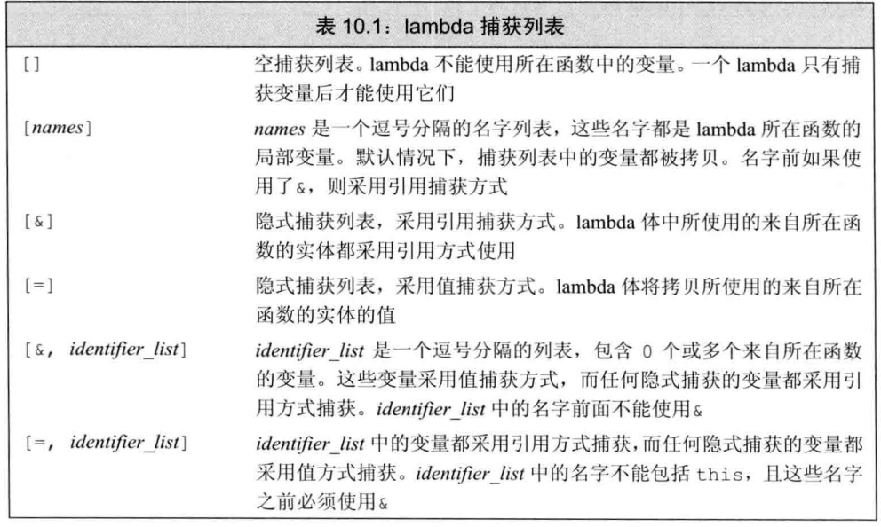
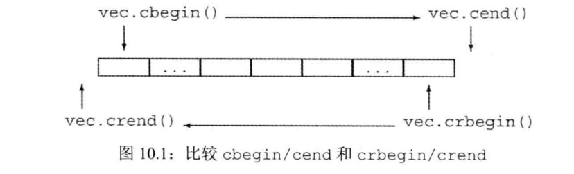

### chapter10 泛型算法

#### 10.1 概述

* 大多数算法都定义在头文件`algorithm`中，标准库还在头文件`numeric`中定义了一组数值泛型算法
* 泛型算法的一个重要编程假定：<font color=red>算法永远不会改变底层容器的大小</font>。算法可能改变那容器中保存的元素的值，也可能在容器内移动元素，但永远不会直接添加或删除元素

#### 10.2 初识泛型算法

* 理解算法的最基本的方法就是了解它们`是否读取元素`、`改变元素`或是`重排元素顺序`(见例子一).
  * 常见的只读算法有`accumulate()`等
  * 常见的写容器元素的算法有`fill()`,`fill_n()`,`copy()`等
  * 常见的重排容器元素的算法有`sort()`等
* 那些只接受 一个单一迭代器来表示第二个序列的算法，都假定第二个序列至少与第一个序列一样长

```cpp
//例子一:常见范型算法
int sum=accumulate(vec.cbegin(),vec.cend(),0);              //和的初值被设置为0

string sum=accumulate(v.cbegin(),v.cend(),"");              //由于string定义了+运算符所以可以通过accumulate将所有string拼接起来

fill(vec.begin(),vec.end(),0);                              //将每个元素重置为0

fill_n(vec.begin(),vec.size(),0);                           //函数fill_n接受一个单迭代器，一个计数值和一个值  fill_n(dest,n,val)

vector<string> words;
sort(words.begin(),words.end());


//例子二：消除重复单词
vvoid elimDups(vector<string> &words){
    //按字典序排序words,以便查找重复单词
    sort(words.begin(),word.end());
    //unique重排输入范围，使得每个单词只出现一次
    //排序在范围的前部，返回指向不重复区域之后一个位置的迭代器
    auto end_unique=unique(words.begin(),words.end());
    //使用vector操作erase删除重复单词
    //标准库算法不会改变容器的大小，所以这里要使用vector自身的操作
    words.erase(end_unique,words.end());
}
```

#### 10.3 定制操作

* `lambda`表达式表示一个可调用的代码单元，其形式为`[capture list](parameter list) -> return type { function body }`
  * `lambda`表达式只能使用尾置返回来指定返回类型
  * `lambda`表达式不能有默认参数
  * `lambda`表达式如果没有指定捕获列表，则只能直接使用定义在当前函数之外的名字（局部`static`变量和在它所在函数之外声明的名字）
* 与传值参数类似，采用值捕获的前提是变量可以拷贝。与参数不同，<font color=red>被捕获的变量的值是在`lambda`创建时拷贝，而不是调用时拷贝</font>(见例子二)
* 除了隐式捕获，还可以让编译器根据`lambda`体中的代码来推断我们要使用哪些变量
  * `&`告诉编译器采用捕获引用凡是,`=`则表示采用值捕获方式(具体见下表)
* <font color=red>默认情况下，如果一个`lambda`体包含`return`之外的任何语句，则编译器假定此`lambda`返回`void`</font>,此时需要使用尾置返回来指定返回类型
* `bing`是一个通用的函数适配器，定义在头文件`functional`中，调用`bind`的一般形式为`auto newCallable=bind(callable,arg_list)`
  * `arg_list`中的参数可能包含形如`_n`的名字，数值`n`表示生成的可调用对象中参数的位置,名字`_n`都定义在一个名为`placeholders`的命名空间中,`placeholders`也定义在头文件`functional`中(见例子三)
  * 如果我们希望传递给`bind`一个对象而又不拷贝它，就必须使用标准库`ref`函数



```cpp
//例子一：使用lambda表达式的例子
void biggies(vector<string> &words,vector<string>::size_type sz){
    //打印words中所有大于等于sz的字符串
    elimDups(words);                                //将words按字典序排序，删除重复单词
    //按长度排序，长度相同的单词维持字典序
    stable_sort(words.begin(),words.end(),
                [](const string &a,const string &b)
                { return a.size()<b.size(); });
    //获取一个迭代器，指向第一个满足size()>=sz的元素
    auto wc=find_if(words.begin(),words.end(),
                    [sz](const string &a)
                    { return a.size()>=sz; });
    //计算满足size>=sz的元素的数目
    auto count=words.end()-wc;
    cout<<count<<" "<<count<<" of lenght "<<sz<<" or longer"<<endl;
    //打印长度大于等于给定值的单词，每个单词后面接一个空格
    for_each(wc,words.end(),
                [](const string &s){ cout<<s<<" "; });
    cout<<endl;
}

//例子二：捕获的值是在lambda创建时拷贝
void fcn1(){
    size_t v1=42;
    //将v1拷贝到名为f的可调用对象
    auto f=[v1](){ return v1; }
    v1=0;
    auto j=f();         //j为42;f保存了我们创建它时v1的拷贝
}

void fcn2(){
    size_t v1=42;
    //对象f2包含v2的引用
    auto f2=[&v1]() { return v1; }
    v1=0;
    auto j=f2();        //j为0；f2保存v1的引用，而非拷贝
}

//例子三:bind 函数适配器
using std::placeholders::_1;
bool check_size(const string &s,string::size_type sz){
    return s.size()>=sz;
}
auto wc=find_if(words.begin(),words.end(),bind(check_size,_1,sz));

//使用ref传引用
ostream& print(ostream &os,const string &s,char c){
    return os<<s<<c;
}
//因为ostream不能拷贝只能传引用
for_each(words.begin(),words.end(),bind(print,ref(os),_1,' '));

```

#### 10.4 再探迭代器

* 除了为每个容器定义的迭代器之外，标准库还在头文件`iterator`中还定义了额外几种迭代器:
  * `插入迭代器`:这些迭代器被绑定到一个容器上，可用来向容器插入元素
  * `流迭代器`:这些迭代器被绑定到输入或输出流上，可用来遍历关联的IO流
  * `反向迭代器`:这些迭代器向前而不是向后移动。除了`forward_list`之外的标准库容器都有反向迭代器
  * `移动迭代器`:这些专门的迭代器不是拷贝其中的元素，而是移动它们
* `插入迭代器`是一种迭代器适配器，它接受一个容器，生成一个迭代器，能实现向给定容器添加元素,插入迭代器有三种类型，差异在于元素插入的位置（见例子一）:
  * `back_inserter`:创建一个使用`push_back`的迭代器
  * `front_inserter`:创建一个使用`push_front`的迭代器
  * `inserter`创建一个使用`insert`的迭代器，次函数接受第二个参数，这个参数必须是一个指向给定容器的迭代器。元素将被插入到给定迭代器所表示的元素之前。
* `istream_iterator`读取输入流,`ostream_iterator`向一个输出流写数据，这些迭代器将它们对应的流当做一个特定类型的元素序列来处理（见例子二）
* `反向迭代器`就是在容器中从尾元素向首元素反向移动的迭代器
  * 递增一个反向迭代器(`++it`)会移动到前一个元素；
  * 递减一个反向迭代器(`--it`)会移动到下一个元素；




```cpp
//例子一:插入迭代器
list<int> lst={1,2,3,4};
list<int> lst2,lst3;        //空list
//拷贝完成之后,lst2包含4,3,2,1
copy(lst.begin(),lst.end(),front_inserter(lst2));
//拷贝完成之后,lst3包含1,2,3,4
copy(lst.begin(),lst.end(),inserter(lst3,lst3.begin()));

//例子二:iostream迭代器

istream_iterator<int> in_iter(cin);         //从cin读取int
istream_iterator<int> eof;                  //istream尾后迭代器,eof被定义为空的istream_iterator可以作为尾后迭代器使用
while(in_iter!=eof){
    //后置递增运算读取流，返回迭代器的旧值
    //解引用迭代器，获得从流读取的前一个值
    vec.push_back(*in_iter++);
}

istream_iterator<int> in(cin),eof;
cout<<accumulate(in,eof,0)<<endl;           //计算从标准输入读取的值的和

ostream_iterator<int> out_iter(cout," ");
for(auto e:vec)
    *out_iter++=e;              //将元素写到cout
cout<<endl;

copy(vec.begin(),vec.end(),out_iter);       //调用copy来打印vec中的元素
cout<<endl;

//例子三：反向迭代器
sort(vec.begin(),vec.end());                //按"正常序"排序vec
//按逆序排序：将最小元素放在vec的末尾
sort(vec.rbegin(),vec.rend());
```

#### 10.5 泛型算法结构

| 迭代器类别 | 特征 | 支持的操作 | 典型代表 |
| :----: | :----: | :----: | :----: |
| 输入迭代器 | 只读，不写；单遍扫描,只能递增 | `==`,`!=`,`++`,`*`,`->` | find,accumulate要求输入迭代器 |
| 输出迭代器 | 只写，不读；单遍扫描,只能递增 | `++`,`*` | ostream_iterator |
| 前向迭代器 | 可读写；多遍扫描，只能递增 | `==`,`!=`,`++`,`*`,`->` | replace要求前向迭代器 ,forward_list上的迭代器时前向迭代器 |
| 双向迭代器 | 可读写；多遍扫描，可递增递减 | `==`,`!=`,`++`,`--`,`*`,`->` | reverse要求双向迭代器 |
| 随机访问迭代器 | 可读写；多遍扫描，支持全部迭代器运算 | `==`,`!=`,`++`,`--`,`*`,`->`,`iter[n]` | array,deque,string和vector的迭代器都是随机访问迭代器 |


* 算法所要求的迭代器操作可以分为`5个迭代器类别`,如上表所示.
  * 对于算法中每个迭代器参数来说，其能力必须与规定的最小类别至少相当
* 算法遵循一套命名的重载规范:
  * `_if`版本的算法按指定条件执行，比如`find_if`
  * `_copy`区分拷贝元素的版本和不拷贝元素的版本（见例子一）

```cpp
//例子一
reverse(beg,end);           //原地翻转
reverse_copy(beg,end,dest); //将翻转结果拷贝到dest

//从v1中删除奇数元素
remove_if(v1.begin(),v1.end(),
                        [](int i){ return i%2; });
//将偶数元素从v1拷贝到v2;v1不变
remove_copy_if(v1.begin(),v1.end(),back_inserter(v2),
                        [](int i){ return i%2; });
```

#### 10.6 特定容器算法

* 对于`list`和`forward_list`，应该优先使用成员函数版本的算法而不是通用算法

```cpp
//例子一：list和forward_list成员函数版本的算法
lst.merge(lst2)             //将lst和lst2合并，lst和lst2必须有序
lst.remove(val)             //移除val
lst.remove_if(pred)         //移除令一元谓词为真的每个元素
lst.reverse()               //反转lst中元素的顺序
lst.sort()                  //lst排序
lst.unique()                //调用erase删除同一值的连续拷贝
```