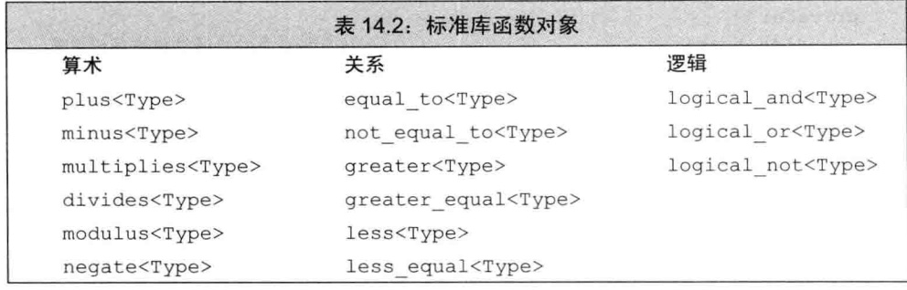

### chapter14 重载运算与类型转换

#### 14.1 基本概念

* 对于二元运算符来说，左侧运算对象传递给第一个参数，而右侧运算对象传递给第二个参数
  * 如果一个运算符函数是成员函数，则它的第一个（左侧）运算对象绑定到隐式的`this`指针上
  * 对于一个运算符函数来说，它或者是类的成员，或者至少含有一个类类型的参数
  * <font color=red>对于重载的运算符来说，其优先级和结合律与对应的内置运算符保持一致；重载运算符的返回类型通常情况下应该与其内置版本的返回类型兼容</font>
* 将运算符定义为成员函数还是普通的非成员函数的相关准则:
  * 赋值`=`、下标`[]`、调用`()`和成员访问箭头`->`运算符必须是成员
  * 复合赋值运算符一般来说应该是成员，但并非必须，这一点与赋值运算符略有不同
  * 改变对象状态的运算符或者与给定类型密切相关的运算符，如递增、递减和解引用运算符，通常应该是成员
  * 具有对称性的运算符可能转换任意一端的运算对象，例如算术、相等性、关系和位运算符等，因此它们通常应该是普通的非成员函数

#### 14.2 输入和输出运算符

* 输出运算符尽量减少格式化操作
  * 通常，输出运算符应该主要负责打印对象的内容而非控制格式，输出运算符不应该打印换行符
  * 如果我们希望为类自定义IO运算符，则必须将其定义成非成员函数
* 输入运算符必须处理可能失败的情况，而输出运算符不需要
  * 如果在发生错误前对象已经有一部分被改变，则适时地将对象置为合法状态显得异常重要

```cpp
//例子一：重载Sales_data的输出运算符
ostream &operator<<(ostream &os,const Sales_data &item)
{
    os<<item.isbn()<<" "<<item.units_sold<<" "
        <<item.revenue<<" "<<item.avg_price();
    return os;
}

//例子二：重载Sales_data的输入运算符
istream &operator>>(istream &is,Sales_data &item)
{
    double price;
    is>>item.bookNo>>item.units_sold>>price;
    if(is)
        item.revenue=item.units_sold*price;
    else
        item=Sales_data();                      //输入失败：对象被赋予默认的状态
    return is;
}
```

#### 14.3 算术和关系运算符

* 我们把算术和关系运算符定义成非成员函数以允许对左侧或右侧的运算对象进行转换
  * 如果类定义了算术运算符，则它一般也会定义一个对应的复合赋值运算符(比如调用`operator+=`来定义`operator=`比较高效，是因为用`operator+=`会避免使用一个临时对象，从而更加有效)
* 如果类定义了`operator==`，则这个类也应该定义`operator!=`
* 相等运算符和比较运算符中的一个应该把工作委托给另外一个，这意味着其中一个运算符应该负责实际比较对象的工作，而另外一个运算符则只调用那个真正工作的运算符

```cpp
//例子一：重载operator==和operator!=
bool operator==(const Sales_data &lhs,const Sales_data &rhs)
{
    return lhs.isbn() == rhs.isbn() &&
            lhs.units_sold == rhs.units_sold &&
            lhs.revenue == rhs.revenue;
}
bool operator!=(const Sales_data &lhs,const Sales_data &rhs)
{
    return !(lhs==rhs);
}
```

#### 14.4 赋值运算符

* 复合赋值运算符不非得是类的成员，不过我们还是倾向于把包括复合赋值在内的所有赋值运算符都定义在类的内部

```cpp
//例子一：重载operator=
//详细代码见《C++ primer》第十三章中定义的StrVec
StrVec &StrVec::operator=(initializer_list<string> il){
    auto data=alloc_n_copy(il.begin(),il.end());
    free();
    elements=data.first;
    first_free=cap=data.second;
    return *this;
}

//例子二：重载operator+=
Sales_data& Sales_data::operator+=(const Sales_data &rhs){
    units_sold+=rhs.units_sold;
    revenue+=rhs.revenue;
    return *this;
}
```

#### 14.5 下标运算符

* 下标运算符必须是成员函数
* 下边运算符通常以所访问元素的引用作为返回值
  * 同时，我们最好同时定义下标运算符的`常量版本`和`非常量版本`,当作用于一个常量对象时，下标运算符返回常量引用以确保我们不会给返回的对象赋值

```cpp
//例子：重载operator[]
class StrVec{
    public:
        //非常量版本
        std::string& operator[](std::size_t n)
        { return elements[n]; }
        //常量版本
        const std::string& operator[](std::size_t n) const
        { return elements[n]; }
    private:
        std::string *elements;                  //指向数组首元素的指针
};
```

#### 14.6 递增和递减运算符

* c++语言并不要求递增和递减运算符必须是类的成员，但是因为它们改变的正好是所操作对象的状态，所以建议将其设定为成员函数
* 定义递增和递减运算符的类应该同时定义前置版本和后置版本
  * 后置版本接受一个额外的（不被使用）`int`类型的形参。当我们使用后置运算符时，编译器为这个形参提供一个值为0的实参
  * <font color=red>为了与内置版本保持一致，后置运算符应该返回对象的原值（递增或递减之前的值），返回的形式是一个值而非引用</font>

```cpp
//例子：重载递增和递减运算符
class StrBlobPtr{
    public:
        //前置版本的递增和递减运算符
        StrBlobPtr& operator++();
        StrBlobPtr& operator--();
        //后置版本的递增和递减运算符
        StrBlobPtr operator++(int);
        StrBlobPtr operator--(int);
};

//前置版本：返回递增/递减对象的引用
StrBlobPtr& StrBlobPtr::operator++()
{
    //如果curr已经指向了容器的尾后位置，则无法递增它
    check(curr,"increment past end of StrBlobPtr");
    ++curr;
    return *this;
}

StrBlobPtr& StrBlobPtr::operator--()
{
    //如果curr是0，则继续递减它将产生一个无效下标
    --curr;
    check(curr,"decrement past begin of StrBlobPtr");
    return *this;
}

//后置版本：递增/递减对象的值但是返回原值
StrBlobPtr StrBlobPtr::operator++(int)
{
    //此处无须检测有效性
    StrBlobPtr ret=*this;
    ++*this;
    return ret;                             //返回之前记录的状态
}

StrBlobPtr StrBlobPtr::operator--(int)
{
    //此处无须检查有效性
    StrBlobPtr ret=*this;
    --*this;
    return ret;                             //返回之前记录的状态
}
```

#### 14.7 成员访问运算符

* 箭头(`->`)运算符必须是类的成员。解引用运算符通常也是类的成员，经过并非必须如此
* 箭头运算符的执行过程如下所示:
    1. 如果`point`是指针，则我们应用内置的箭头运算符
    2. 如果`point`是定义了`operator->`的类的一个对象，则调用该类的`operator->`函数。其中，如果该结果是一个指针，则执行第1步；如果该结果本身含有重载的`operator->`,则重复调用当前步骤

```cpp
//例子：重载成员访问运算符
class StrBlobPtr{
    public:
        std::string& operator*() const
        {
            auto p=check(curr,"dereference past end");
            return (*p)[curr];              //(*p) 是对象所指的vector
        }
        std::string* operator->() const
        {
            //将实际工作委托给解引用运算符
            return & this->operator*();
        }
};
```

#### 14.8 函数调用运算符

* 函数调用运算符必须是成员函数，一个类可以定义多个不同版本的调用运算符，相互之间应该在参数数量或类型上有所区别
* 标准库定义了组表示算符运算符、关系运算符和逻辑运算符的类（见下表）
* 标准库中定义函数模板`function`,定义在头文件`functional`中(见例子三)
* 不能(直接)将重载的名字存入function类型的对象中(见例子四)



```cpp
//例子一：重载函数调用运算符
class PrintString{
    public:
        PrintString(ostream &o=cout,char c=' '):
            os(o),sep(c) { }
        void operator()(const string &s) const { os<<s<<sep; }
    private:
        ostream &os;                        //用于写入的目的流
        char sep;                           //用于将不同输出隔开的字符
};

PirntString printer;                        //使用默认值，打印到cout
printer(s);                                 //在cout中打印s,后面跟一个空格
PrintString errors(cerr,'\n');
errors(s);                                  //在cerr中打印s，后面跟一个换行符

//例子二：使用标准库中的函数对象
plus<int> intAdd;                           //可执行int加法的函数对象
negate<int> intNegate;                      //可对int值取反的函数对象

int sum=intAdd(10,20);                      //等价于sum=30
sum=intNegate(intAdd(10,20));               //等价于sum=-30
sum=intAdd(10,intDegate(10));               //等价于sum=0

//例子三：使用function函数模板

//普通函数
int add(int i,int j) { return i+j; }
//lambda，其产生一个未命名的函数对象类
auto mod=[](int i,int j) { return i%j; };
//函数对象类
struct divide{
    int operator()(int denominator,int divisor){
        return denominator/divisor;
    }
};
//定义运算的对应关系
map<string,function<int(int,int)>> binops={
    {"+",add},
    {"-",std::minus<int>()},
    {"/",divide()},
    {"*",[](int i,int j){ return i*j; }},
    {"%",mod}
};

binops["+"](10,5);                          //等价于调用add(10,5)
binops["-"](10,5);                          //使用minus<int>对象的调用运算符
binops["/"](10,5);                          //使用divide对象的调用运算符

//例子四:不能(直接)将重载的名字存入function类型的对象中
int add(int i,int j) { return i+j; }
Sales_data add(const Sales_data &,const Sales_data&);
map<string,function<int(int,int)>> binops;
binops.insert({"+",add});                   //错误：哪个add?
binops.insert({"+",[](int a,int b){ return add(a,b); }});       //正确：使用lambda来指定我们希望使用的add版本

```

#### 14.9 重载、类型转换与运算符

* `类型转换运算符`是类的一种特殊成员函数，它负责将一个类类型的值转换成其他类型，其形式如下`operator type() const`
  * 转换构造函数和类型转换运算符共同定义了`类类型转换`,这样的转换有时也被称为用户定义的类型转换
  * 在实践中，类很少提供类型转换运算符；对于类来说，定义向`bool`的类型转换还是比较普遍的现象
    * 向`bool`的类型转换通常用于条件部分，因此`operator bool`一般定义成`explicit`的
  * 可以给重载的类型转换运算符加上关键字`explicit`,使得只能使用`显式的类型转换运算符`,当表达式被用作条件，则编译器将显式的类型转换自动应用于它,以下情况会自动转换
    * `if`,`while`及`do`语句的条件部分
    * `for`语句头的条件表达式
    * 逻辑非运算符`!`,逻辑或运算符`||`,逻辑与运算符`&&`的运算对象
    * 条件运算符`?:`的条件表达式

```cpp
//例子一：定义类型转换运算符的简单例子
class SmallInt{
    public:
        SmallInt(int i=0):val(i)
        {
            if(i<0 || i>255)
                throw std::out_of_range("Bad SmallInt value");
        }
        operator int() const { return val; }
    private:
        std::size_t val;
};

SamllInt si;
si=4;                                       //首先将4隐式地转换成SmallInt,然后调用SmallInt::operator=
si+3                                        //首先将si隐式地转换成int,然后执行整数的加法


```

#### 总结

| 运算符类型 | 成员类型or非成员类型 | 备注 |
| :----: | :----: | :----: | :----: |
| `<<`   |  `必须`为非成员(友元)函数 | 尽量减少格式化操作 |
| `>>`   |  `必须`为非成员(友元)函数 | 需要处理可能读取失败的情况 |
| 算术运算符(`+`,`-`,`*`,`/`等) | 建议为非成员(友元)函数 | 推荐使用复合赋值运算符来定义算术运算符 |
| 相等运算符(`==`,`!=`) | 建议为非成员(友元)函数 | 使用其中一个调用另一个，实际工作的只有一个运算符 |
| 关系运算符(`<`,`>`等) | 建议为非成员(友元)函数 | 注意要定义`逻辑可靠`的关系运算符 |
| 赋值运算符(`=`) | `必须`为成员函数 | 返回左侧运算对象的引用 |
| 复合赋值运算符(`+=`,`-=`等) | 建议为成员函数 | 返回左侧运算对象的引用 |
| 下标运算符(`[]`) | `必须`为成员函数 | 同时定义`常量版本`和`非常量版本` |
| 递增(`++`)和递减(`--`)运算符 | 建议为成员函数 | 需要同时定义`前置`和`后置`版本,后置版本返回一个值而非引用 |
| 箭头(`->`)运算符 | `必须`为成员函数 | 重载的箭头运算符必须返回类的指针或者自定义了箭头运算符的某个类的对象 |
| 解引用(`*`)运算符 | 建议为成员函数 | 返回对象的引用 |
| 函数调用(`()`)运算符 | `必须`是成员函数 | 重载函数调用运算符会使得对象的`行为像函数一样` |
| 类型转换运算符(`operator type() const`)| `必须`是成员函数 | 不能声明返回类型，形参列表必须为空，`通常应该是const` |