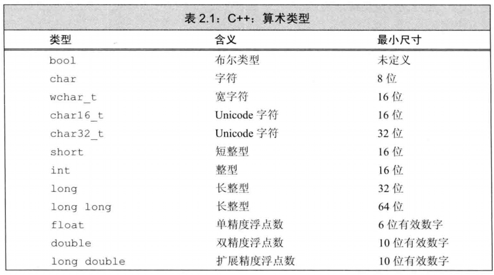

### chapter2 变量和基本类型

#### 2.1 基本内置类型



* `c++`内置数据类型包括:`算术类型`和`空类型`两种.其中算术类型也可以划分为`整型(包括字符和布尔类型在内)`和`浮点型`.除去布尔型和扩展的字符型之外，其他整型可以划分为`带符号的(signed)`和`无符号的(unsigned)`.
* 关于`隐式类型转换`有以下几点需要注意(见例子一):
  * 当把浮点型赋给整数类型时，结果值仅保留浮点数中小数点之前的部分
  * 当赋给无符号类型一个超出它表示范围的值时，结果是初始值对无符号类型表示数值总数取模后的余数.
  * 当赋给带符号类型一个超出它表示范围的值时，结果是`未定义的`.
* 形如`42`的值被称为`字面值常量`,字面值常量的形式和值决定了它的数据类型(见例子二)
  * 以`0`开头的整数代表八进制数，以`0x`或`0X`开头的代表十六进制数
  * 浮点型字面值表现为一个小数或以科学计数法表示的指数，其中指数部分用`E`或`e`标识
  * 有单引号括起来的一个字符称为`char型字面值`,双引号括起来的零个或多个字符则构成`字符串型字面值`.编译器在每个字符串的结尾处添加一个空字符(`'\0'`)，因此字符串字面值的实际长度要比它的内容多1

```cpp
//例子一:隐式类型转换注意点

int i=42;
//i的值为3
i=3.14;
//假设char占8比特，c的值为255
unsigned char c=-1;
//假设char占8比特，c2的值时未定义的
signed char c2=256;

//例子二:字面值常量

20      //十进制
024     //八进制
0x14    //十六进制
0.      //小数
.001    //小数
0e0     //指数型浮点数

09      //无效的八进制
```

> <font color=red>注意:</font>如果表达式里既有带符号又有无符号类型，当带符号类型取值为负时会出现异常结果，这是因为带符号数会自动地转换为无符号数.

#### 2.2 变量

* 当对象在创建时获得了一个特定的值，我们说这个对象被`初始化`了.<font color=red>初始化不是赋值,初始化和赋值是两个完全不同的操作</font>.
* 如果是内置类型的变量未被显示初始化，它的值由定义的位置决定:
  * 定义于任何函数体之外的变量被初始化为0
  * 定于在函数体内部的内置类型将不被初始化，一个未初始化的内置类型变量的值是未定义的,如果试图拷贝或以其他形式访问此类值将引发错误
* 为了支持分离式编译，c++语言将声明和定义区分开来:
  * `声明(declaration)`使得名字为程序所知，一个文件如果想使用别处定义的名字必须包含对那个名字的声明
  * `定义(definition)`负责创建与名字相关联的实体
  * <font color=red>变量能且只能被定义一次，但是可以被多次声明</font>
* 如果想声明一个变量而非定义它就在变量名前添加关键字`extern`，而且不要显式地初始化，任何包含了显式初始化的声明即成为定义.(见例子二)
* c++的标识符由`字母,数字和下划线`组成，其中必须由字母或下划线开头
  * c++也为标准库保留了一些名字，用户自定义的标识符不能连续出现两个下划线，也不能以下划线紧连大写字母开头
  * 此外，定义在函数体外的标识符不能以下划线开头

```cpp
//例子一：变量的初始化
double salry=wage=9999.99;  //错误，wage未定义

//例子二：变量的声明
extern int i;   //声明i而非定义i
int j;          //声明并定义j
extern double pi=3.1416     //定义

```

#### 2.3 复合类型

* `复合类型`是指基于其他类型定义的类型，比如`引用`和`指针`
  * 一条声明语句由一个`基本数据类型`和紧随其后的一个声明符列表组成.
* `引用`为对象起了另外一个名字，<font color=red>引用必须被初始化,引用的初始值必须是一个对象，同时因为引用本身不是一个对象，所以不能定义引用的引用</font>
* `指针`是“指向”另外一种类型的复合类型,与引用相比有以下不同点:
  * 指针本身就是一个对象
  * 指针无需在定义时赋初值，其初始化规则和内置类型初始化规则一样
* 因为引用不是对象，没有实际地址，所以<font color=red>不能定义指向引用的指针</font>.
* `空指针`不指向任何对象，可以使用`nullptr`,`0`,`NULL`来初始化指针为空指针，c++11推荐使用`nullptr`.
* `void*`是一种特殊的指针类型，可用于存放任意对象的地址，由于不知道一个`void*`指针存放的到底是个什么类型的对象，所以不能直接操作`void*`指针所指的对象
* 要理解变量的类型到底是什么，最简单的办法是**从右向左**阅读变量的定义，离变量名最近的符号对变量的类型有最直接的影响

```cpp
//例子一：引用
int ival=1024;
int &refVal=ival;   //refVal是ival的引用
int &refVal2;       //报错：引用必须被初始化

int &refVal3=10;    //报错：引用类型的初始值必须是一个对象
double dval=3.14;
int &refVal4=dval;  //报错：这里的引用类型的初始值必须是int型对象

int i=0,&r1=i; double d=0, &r2=d;
r2=r1;              //正确：引用的初始值必须是double，但可以将int赋值给该引用
r1=2;               //正确

//例子二：指针
int i=0;
int *p1=0;      //正确：p1初始化为空指针
int *p2=i;      //错误：不能将int赋给指针
int *p3=&i;

//例子三：指向指针引用
int *p;
int *&r=p;      //r是一个对指针p的引用
```

#### 2.4 const 限定符

* 使用`const`限定符可以使得定义的变量，它的值不能被改变
  * 因为`const`对象一旦创建后其值就不能再改变，所以`const`对象必须初始化
  * 默认情况下,`const`对象被设定为仅在文件内有效，当多个文件中出现了同名的`const`变量时，其实等同于在不同文件中分别定义了独立的变量
  * 如果想在多个文件间共享`const`对象，即只在一个文件中定义`const`对象，而在其他多个文件中声明并使用它，解决的办法是<font color=red>对于`const`对象不管是声明还是定义都添加`extern`关键字</font>(见例子二)
* 可以把引用绑定到`const`对象上，就像绑定到其他对象一样，我们称之为`对常量的引用(简称为常量引用)`,对常量的引用不能被用作修改它所绑定的对象
  * 允许为一个常量引用绑定非常量的对象、字面值，甚至是一个表达式；但不允许将常量引用赋值给非常量引用
* `指向常量的指针(pointer to const)`不能用于改变其所指对象的值，要想存放常量对象的地址，只能使用指向常量的指针
* `常量指针(const pointer)`必须初始化，而且一旦初始化完成，则它的值就不能再改变了
* `顶层const`表示指针本身是个常量，而用`底层const`表示指针所指的对象是一个常量
  * 当执行对象拷贝操作时，顶层const对拷贝操作不会产生什么影响，当底层const的限制不能忽视
* `常量表达式(const expression)`是指**值不会改变**并且在**编译过程**就能得到计算结果的表达式
  * c++11新标准规定，运行将变量声明为`constexpr`类型以便编译器来验证变量的值是否是一个常量表达式,声明为`constexpr`的变量一定是一个常量，而且必须用常量表达式初始化.

```cpp

//例子一:const限定符
const tint j=42;
const int k;        //报错：k是一个未经初始化的常量

//例子二:多个文件共享const对象
//file_1.cc
extern const int bugfSize=fcn();
//fiel_2.cc
extern const int bufSize;   //与file_1.cc中定义的bufSize是同一个

//例子三：对常量的引用
const int ci=1024;
const int &r1=ci;       //正确，引用及其对象的对象都是常量
const int &r2=42;       //正确
int &r3=r1*2;           //错误：是一个普通的非常量引用

//例子四：指针和const
const double pi=3.14;
double *ptr=&pi;        //错误：ptr是一个普通指针
const double *cptr=&pi; //正确:cptr可以指向一个双精度常量

int errNumb=0;
int *const curErr=&errNumb; //curErr将一直指向errNumb
const double *const pip=&pi;    //pip是一个指向常量对象的常量指针

//例子五：顶层const和底层const
int i=0;
int *const p1=&i;       //不能改变p1的值，这是一个顶层const
cosnt int ci=42;        //不能改变ci的值，这是一个顶层const
cosnt int *p2=&ci;      //运行改变p2的值，这是一个底层const
const int *const p3=p2; //靠右的const是顶层const,靠左的底层const
const int &r=ci;        //用于声明引用的const都是底层const

i=ci;   //正确：拷贝ci的值，ci是一个顶层const，对此操作没有影响
p2=p3;  //正确：p2和p3指向的对象类型相同,p3顶层const的部分不影响

int *p=p3;    //错误：p3包括底层const的定义，而p没有
p2=p3;        //正确：p2和p3都有底层const
p2=&i;        //正确：int*能转换成const int*

//例子六：constexpr和常量表达式
const int max_files=20;   //max_files是常量表达式
const int limit=max_files+1;  //limit是常量表达式

constexpr int mf=20;      //20是常量表达式
constexpr int limit=mf+1; //mf+1是常量表达式
constexpr int sz=size();  //只有当size是一个constexpr函数时才是一条正确的声明语句
```

#### 2.5 处理类型

* `类型别名`是一个名字，它是某种类型的同义词.c++可以有两种方法可用于定义类别别名，传统的方法是使用关键字`typedef`，c++11新标准规定了一种新的方法，使用`别名声明`来定义类型的别名
* c++11新标准引入了`auto`类型说明符，用它就能让编译器替我们去分析表达式所属的类型.显然，<font color=red>auto定义的变量必须有初始值</font>.
  * 当引用被用作初始值时，真正参与初始化的其实是引用对象的值，此时编译器以引用对象的类型作为`auto`的类型
  * `auto`一般会忽略掉`顶层const`,同时`底层const`则会被保留下来,如果希望推断出的`auto`类型是一个`顶层const`,需要明确指出(见例子二)
* c++11新标准引入了`decltype`,它的作用是选择并返回操作数的数据类型
  * 如果`decltype`使用的表达式是一个变量，则`decltype`返回该变量的类型(包括顶层const和引用在内)
  * 如果`decltype`使用表达式不是一个变量，则decltype返回表达式结果对应的类型
  * <font color=red>切记:</font>decltype((variable))（注意是双层括号）结果永远是引用，而decltype(variable)的结果只有当variable本身就是一个引用时才是引用

```cpp
//例子一：类型别名
typedef double wages;   //wages是double的同义词
typedef wages base,*p;  //base是double的同义词，p是double*的同义词
using SI=Sales_item;    //SI是Sales_item的同义词

//例子二：auto类型说明符
int i=0,&r=i;
auto a=r;               //a是一个整数

const int ci=i,&cr=ci;
auto b=ci;              //b是一个整数，顶层const别忽略
auto c=cr;              //c是一个整数，cr是ci的别名，ci本身是一个顶层const
auto d=&i;              //d是一个整型指针
auto e=&cr;             //e是一个指向整数常量的指针，对常量对象取地址是一种底层const!!!ßßßß

const auto f=ci;        //ci的推演类型是int,f是const int,这里明确指出是一个顶层const

//例子三：decltype类型指示符
decltype(f()) sum=x;    //sum的类型就是函数f的返回类型

const int ci=0,&cj=ci;
decltype(ci) x=0;       //x的类型是const int
decltype(cj) y=x;       //y的类型是const int &,y绑定到变量x
decltype(cj) z;         //错误：z是一个引用，必须初始化

int i=42,*p=&i,&r=i;
decltype(r+0) b;        //正确：加法的结果是int,因此b是一个（未初始化的）int
decltype(*p) c;         //错误：解引号运算返回的是引用类型，这里c是int&,必须初始化
decltype((i)) d;        //错误:(i)表达式得到是引用，d是int&,必须初始化
decltype(i) e;          //正确:e是一个（未初始化的）int
```

> <font color=red>注意:</font>需要指出的是，引用从来都作为其所指对象的同义词出现，只有用在`decltype`处是一个例外

#### 2.6 自定义数据结构

* c++程序经常会使用到的预处理功能是`头文件保护符`,头文件保护符依赖于预处理变量:
  * 预处理变量有两种状态：已定义和未定义
  * `define`指令把一个名字设为预处理变量，`#ifdef`当且仅当变量已定义时为真,`#ifndef`当且仅当变量未定义时为真.一旦检测结果为真，则执行后续操作直至遇到`#endif`指令为止

```cpp
//例子：头文件保护符
#ifndef SALES_DATA_H
#define SALES_DATA_H
#include<string>
struct Sales_data{
  std::string bookNo;
  unsigned units_sold=0;
  double revenue=0.0;
};
#endif
```

