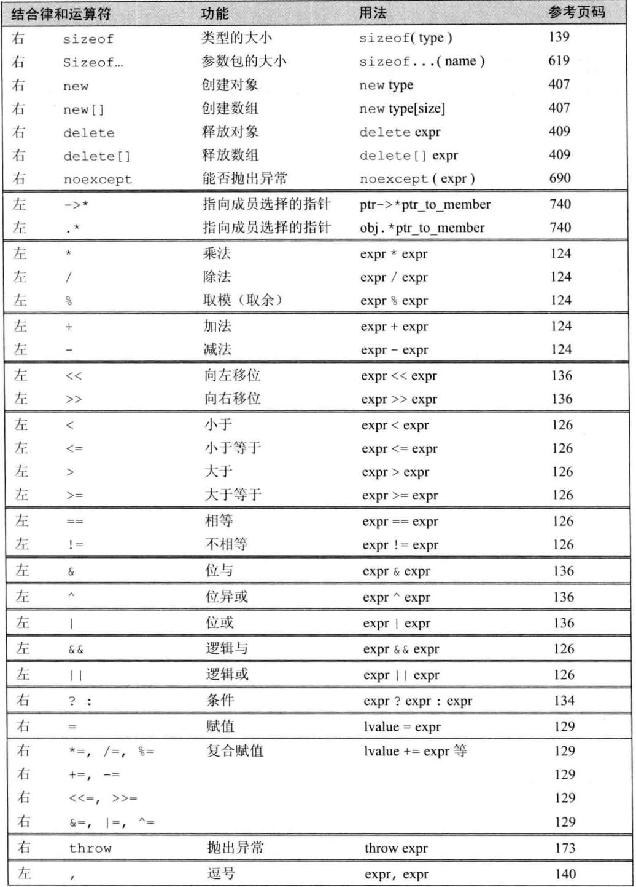

### chapter4 表达式

#### 4.1 基础

* 要理解表达式，就要理解`运算符的优先级`、`结合律`、以及`运算对象的求值顺序`
* c++的表达式要不然是`右值`,要不然就是`左值`
  * <font color=red>当一个对象被用作右值的时候，用的是对象的值（内容）;当对象被用作左值的时候，用的是对象的身份（在内存中的位置）</font>
  * 如果表达式的求值结果是左值，`decltype`作用于该表达式（不是变量）得到一个`引用类型`
* 运算符的优先级见上表，同一组内的运算符优先级相同，组的位置越靠前组内的运算符优先级越高
* 有4种运算符明确规定了运算对象的求值顺序:
  * 第一种是逻辑与`&&`运算符，它规定先求左侧运算对象的值，只有当左侧运算对象的值为真时才继续求右侧运算对象的值
  * 另外三种分别是逻辑或`||`运算符，条件`?:`运算符和逗号`,`运算符
* <font color=red>运算对象的求值顺序与优先级和结合律无关</font>,在一条形如`f()+g()*h()+j()`的表达式中:
  * 优先级规定,`g()`的返回值和`h()`的返回值相乘
  * 结合律规定,`f()`的返回值先与`g()`和`h()`的乘积相加，所得结果再与`j()`的返回值相加
  * **对于这些函数的调用顺序没有明确规定**


#### 4.2 算术运算符

* 算术运算符都满足`左结合律`,意味着当优先级相同时按照从左向右的顺序进行组合
* 关于算术运算符有以下几点需要特别注意:
  * 布尔值不应该参与运算(见例子一)
  * 参与取余运算的运算对象必须是整数类型,且求余运算根据`(m/n)*n+m%n=m`计算，即`m%n=m-(m/n)*n`
* 逻辑与和逻辑或都是短路求值，相等性运算符未定义求值顺序

```cpp
//例子一
int i=1024;
int k=-1;       //k是1024
bool b=true;
bool b2=-b;     //b2是true!
```

#### 4.3 逻辑和关系运算符

* 逻辑与运算符和逻辑或运算符都是先求左侧运算对象的值再求右侧运算对象的值，当且仅当左侧运算对象无法确定表达式的结果时才会计算右侧运算对象的值，这种策略称为`短路求值`.
* 进行比较运算时除非比较的对象是布尔类型，否则不要使用布尔字面值`true`和`false`作为运算对象(见例子一)

```cpp
//例子一:
if(val==true)       //只有当val等于1时条件才为真!,true转化为1进行比较
{
    /*...*/
}
```

#### 4.4 赋值运算符

* 赋值运算符的左侧运算对象必须是一个可修改的`左值`
* 赋值运算的结果是它的左侧运算对象，并且是一个左值
* c++11新标准运行使用花括号括起来的初始值列表作为赋值语句的右侧运算对象
* 赋值运算符满足右结合律，这一点与其他二元运算符不太一样,且赋值运算符优先级较低，所以在条件语句中，赋值部分通常应该加上括号

#### 4.5 递增和递减运算符

* 后置版本的递增和递减运算符也会将运算对象加1（或减1），但是返回的结果是运算对象改变之前那个值的副本
  * <font color=red>建议:</font>除非必须，否则不用递增递减运算符的后置版本

```cpp
//例子一：在一条语句中混用解引用和递增运算符
auto pbeg=v.begin();
//输出元素直至遇到第一个负值为止
while(pbeg!=v.end()&&*pbeg>=0)
    cout<<*pbeg++<<endl;        //输出当前值并将pbeg向前移动一个元素
//       ^^^^^^^^
//       后置版本的递增运算符优先级大于解引用运算符
//  cout<<*++pbeg<<endl;
//  若写成上面这样，这将会从第二个元素开始取值，并且最后对v.end()进行取值，结果是未定义的
```

#### 4.6 成员访问运算符

* 成员访问运算符的优先级特别高，使用的时候要特别注意!!!

```cpp
string s1="a string",*p=&s1;
auto n=s1.size();
*p.size();      //报错：*(p.size()),p是一个指针，它没有名为size的成员
```

#### 4.7 条件运算符

* 当条件运算符的两个表达式都是左值或者能转换成同一种左值类型时，运算的结果是左值；否则运算的结果是右值
* 条件运算符满足右结合律，意味着运算对象按照从右向左的顺序组合
* 条件运算符的优先级非常低，因此当一条长表达式中嵌套了条件运算子表达式时，通常需要在它两端加上括号

#### 4.8 位运算符

* `左移运算符<<`在右侧插入值为0的二进制位。`右移运算符>>`的行为则依赖于其左侧运算对象的类型：
  * 如果该运算对象是无符号类型，在左侧插入值为0的二进制位
  * 如果该运算对象是带符号类型，在左侧插入符号位的副本或值为0的二进制位，**如何选择要视具体环境而定**
* 如果运算对象是“小整型”，则它的值会被自动提升(如图所示)


```cpp
//例子一：使用位运算符的经典例子
/*
    假设班级中有30个学生，老师每周都会对学生进行一次小测试，测试的结果只有通过
    和不通过两种。
    为了更好地跟踪测验的结果，我们用一个二进制代表某个学生在一次测验中是否通过，
    显然全班的测验结果可以用一个无符号整数来表示
*/
unsigned long quiz1=0;            //我们把这个值当成是位的集合来使用
//1UL << 27;                      //生成一个值，该值只有第27位为1
quiz1 |= 1UL<<27;                 //表示学生27通过了测验
quiz1 &= ~(1UL<<27);              //表示学生27没有通过测验
bool status= quiz1 & (1UL <<27);  //判断学生27是否通过了测验?
```

> <font color=red>注意:</font> 关于符号位如何处理没有明确的规定，所以强烈建议仅将位运算符用于处理无符号类型

#### 4.9 sizeof运算符

* `sizeof`运算符返回一条表达式或一个类型名字所占的字节数，`sizeof`运算符满足右结合律
* `sizeof`运算符的结果部分地依赖于其作用的类型:
  * 对`char`或者类型为`char`的表达式执行`sizeof`运算，结果得1
  * 对引用类型执行`sizeof`运算得到被引用对象所占空间的大小
  * 对指针执行`sizeof`运算得到指针本身所占空间的大小
  * 对解引用指针执行`sizeof`运算得到指针所指的对象所占空间的大小，指针不需有效
  * 对数组执行`sizeof`运算得到整个数组所占空间的大小，`sizeof`运算不会把数组转换成指针来处理
  * 对`string`对象或者`vector`对象执行`sizeof`运算只返回该类型固定部分的大小，不会计算对象中的元素占用了多少空间

```cpp
//例子
Sales_data data,*p;
sizeof(Sales_data);             //存储Sales_data类型的对象所占的空间大小
sizeof data;                    //data的类型的大小，即sizeof(Sales_data)
sizeof p;                       //指针所占的空间大小
sizeof *p;                      //p所指类型的空间大小，即sizeof(Sales_data)
sizeof data.revenue;            //Sales_data的revenue成员对应类型的大小
sizeof Sales_data::revenue;     //另一种获取revenue大小的方式
```

#### 4.10 逗号运算符

* `逗号运算符`含有两个运算对象，按照从左向右的顺序依次求值
  * 对于逗号运算符来说，首先对左侧的表达式求值，然后将求值结果丢弃掉
  * 逗号运算符真正的结果是右侧表达式的值。如果右侧运算对象是左值，那么最终的求值结果也是左值

#### 4.11 类型转换

* c++提供了四种强制类型转换:
  * `static_cast`:任何具有明确定义的类型转换，只要不包含底层`const`,都可以使用`static_cast`
  * `const_cast`:只能改变运算对象的底层`const`
  * `reinterpret_cast`:通常为运算对象的位模式提供较低层次上的重新解释
  * `dynamic_cast`:用于支持运行时类型识别

```cpp
//例子
const char* cp;
char *q=static_cast<char*> (cp);         //错误：static_cast不能转换掉底层const性质
static_cast<string>(cp);                 //正确：字符串字面值转换成string类型
const_cast<string>(cp);                  //错误：const_cast只改变常量属性

void *p=&d;                              //正确：任何非常量对象的地址都能存入void*
double *dp=static_cast<double*>(p);      //使用static_cast找回存在于void*指针中的值

```

#### 4.12运算符优先级表


