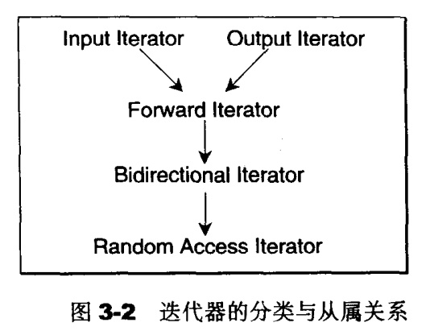
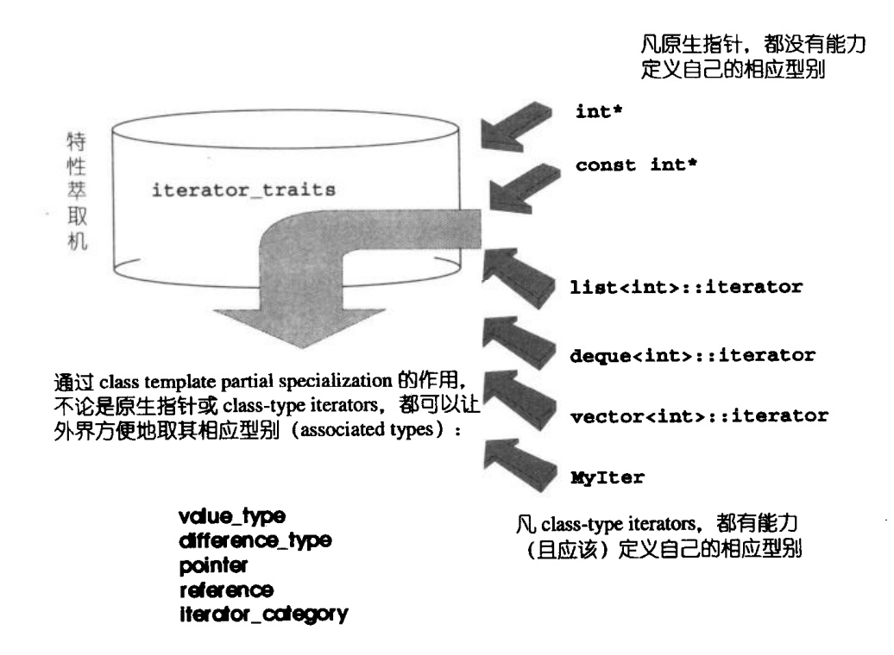

### chapter3 迭代器概念与`traits`编程技法

#### 迭代器设计思维

迭代器(iterators) 是一种抽象的设计概念，23个设计模式中有`iterator`模式，其定义如下：提供一种方法，使之能依序巡访某个聚合物（容器）所含的各个元素，而又无需暴露该聚合物的内部表达式。

有一个重要的概念需要清楚：设计适当的相应型别，是迭代器的责任(这里的相应型别主要指五种类型，后面会详细介绍).设计适当的迭代器，则是容器的责任，只有容器本身才知道该设计出怎样的迭代器来遍历自己，并执行迭代器的各种行为（前进、后退、取值、取用成员...）。

#### 迭代器相应型别

迭代器相应型别不只是“迭代器所指对象的型别”一种而已，根据经验，最常用的相应型别有五种:

1. `value type`:即迭代器所指对象的型别
2. `difference type`:用来表示两个迭代器的距离，因此它也可以用来表示一个容器的最大容量，因为对于连续空间的容器而言，头尾之间的距离就是其最大容量。
3. `reference type`:即迭代器所指对象的引用类型
4. `pointer type`:即迭代器所指对象的指针类别
5. `iterator_category`:迭代器的种类类别。根据移动特性与施行操作，迭代器被分为五类:
   * `Input iterator`:这种迭代器所指的对象，不允许外接改变。只读。
   * `Output iterator`:唯写。
   * `Forward iterator`:允许"写入型"算法在此种迭代器形成的区间上进行读写操作
   * `Bidirectional iterator`:可双向移动。
   * `Random Access iterator`:涵盖所有指针的算术能力。

<div align=center>
</div>
上图中，直线与箭头代表的并非`C++`的继承关系，而是所谓`concept(概念)`与`refinement(强化)`的关系。

#### `Traits`编程技法

为了获得各种不同容器中迭代器的相应型别，`STL`中使用了`Traits`编程技法。



如上图所示，所谓`Traits`编程技法，即要求凡是`class-type iterator`都应该定义自己的相应型别，之后通过定义的`iterator_traits`方便地获取其相应型别。

> 偏特化的定义是：针对（任何）template参数更近一步的条件限制所设计出来的一个特化版本。

下面以获取`value_type`的`iterator_traits`为例进行说明，其代码如下所示:

```cpp
template<class I>
struct iterator_traits{
    typedef typename I::value_type value_type;
};
//针对原生指针而设计的“偏特化”版
template<class T>
struct iterator_traits<T*>{
    typedef T value_type;
};
//针对const原生指针而设计的“偏特化”版
template<class T>
struct iterator_traits<const T*>{
    typedef T value_type;
};

//使用iterator_traits
template<class I>
typename iterator_traits<I>::value_type
func(I ite){
    return *ite;
}
```

上述代码针对原生指针和const原生指针专门设计了“偏特化”版本，目的是使得`STL`对原始指针同样支持。

`iterator_category`可以使得选择算法时，选择一个最优的算法，比如下面这个例子：

```cpp
template<class InputIterator,class Distance>
void advance_II(InputIterator& i,Distance n){
    //单向，逐一前进
    while(n--) ++i;
}

template<class BidirectionalIterator,class Distance>
void advance_BI(BidirectionalIterator& i,Distance n){
    //双向，逐一前进
    if(n>=0)
        while(n--) ++i;
    else
        while(n++) --i;
}

template<class RandomAccessIterator,class Distance>
void advance_RAI(RandomAccessIterator& i,Distance n){
    //跳跃前进
    i+=n;
}
```

当程序调用`advance()`时，如果对于`Random Access Iterator`选择`advance_II`，原本`O(1)`的操作成为了`O(n)`,这是极其缺乏效率的。所以才引入了`iterator_category`，使得算法可以进行重载决议，选择最优的算法。

`iterator_category`的实现及使用如下所示:

```cpp
//五个作为标记用的型别(tag types)
//只是作为标记用，所以不需要任何成员
struct input_iterator_tag{};
struct output_iterator_tag{};
struct forward_iterator_tag:public input_iterator_tag { };
struct bidirectional_iterator_tag:public forward_iterator_tag { };
struct random_access_iterator_tag:public bidirectional_iterator_tag { };

//重载使用不同种类的__advance
template<class InputIterator,class Distance>
inline void __advance(InputIterator& i,Distance n,
                        input_iterator_tag){
    //单向，逐一前进
    while(n--) ++i;
}

template<class ForwardIterator,class Distance>
inline void __advance(ForwardIterator& i,Distance n,
                        forward_iterator_tag){
    //单纯地进行传递调用
    advance(i,n,input_iterator_tag());
}


template<class BidirectionalIterator,class Distance>
inline void __advance(BidirectionalIterator& i,Distance n,
                        bidirectional_iterator_tag){
    //双向，逐一前进
    if(n>=0)
        while(n--) ++i;
    else
        while(n++) ++i;
}

template<class RandomAccessIterator,class Distance>
inline void __advance(RandomAccessIterator& i,Distance n,
                        random_access_iterator_tag){
    //跳跃前进
    i+=n;
}

//定义上层函数
template<class InputIterator,class Distance>
inline void advance(InputIterator& i,Distance n){
    __advance(i,n,iterator_traits<InputerIterator>::iterator_category());
}

//iterator_traits定义如下
template<class I>
struct iterator_traits{
    //...
    typedef typename I::iterator_category iterator_category;
};

template<class T>
struct iterator_traits<T*>{
    //...
    typedef random_access_iterator_tag iterator_category;
};

template<class T>
struct iterator_traits<const T*>{
    //..
    //注意，原生的pointer-to-const是一种Random Access Iterator
    typedef random_access_iterator_tag iterator_category;
};
```

`advanced()`函数按理说可以接受各种类型的迭代器，还为什么要将其型别参数命名为`InputIterator`?这其实是`STL`算法的一个命名规则：以算法所能接受之最低阶迭代器类型，来为其迭代器型别参数命名。

然后为什么五个用于标记的型别要使用继承体系呢？原因是可以利用派生类向基类的转换这一特性，避免不必要的类型判断。(这里可能没有讲清楚，可以参考《STL源码剖析》p94页)

#### std::iterator的保证

为了符合规范，任何迭代器都应该提供五个内嵌相应型别，以利于`traits`萃取。`STL`提供了一个`iterator class`如下，如果每个新设计的迭代器都继承自它，就可保证复合`STL`所需之规范:

```cpp
template<class Category,
        class T,
        class Distance=ptrdiff_t,
        class Pointer=T*,
        class Reference=T&>
struct iterator{
    typedef Category     iterator_category;
    typedef T            value_type;
    typedef Distance     difference_type;
    typedef Pointer      pointer;
    typedef Reference    reference;
};

//使用例子
//定义list的iterator
template<class Item>
struct ListIter:public std::iterator<std::forward_iterator_tag,Item>
{ //... }
```

#### 最后

参考《STL源码剖析》chapter3,我自己实现的`iterator`的源代码及本节所有代码可以参考[github](https://github.com/lingqing97/tinySTL/blob/master/stl_wj_iterator.h).

