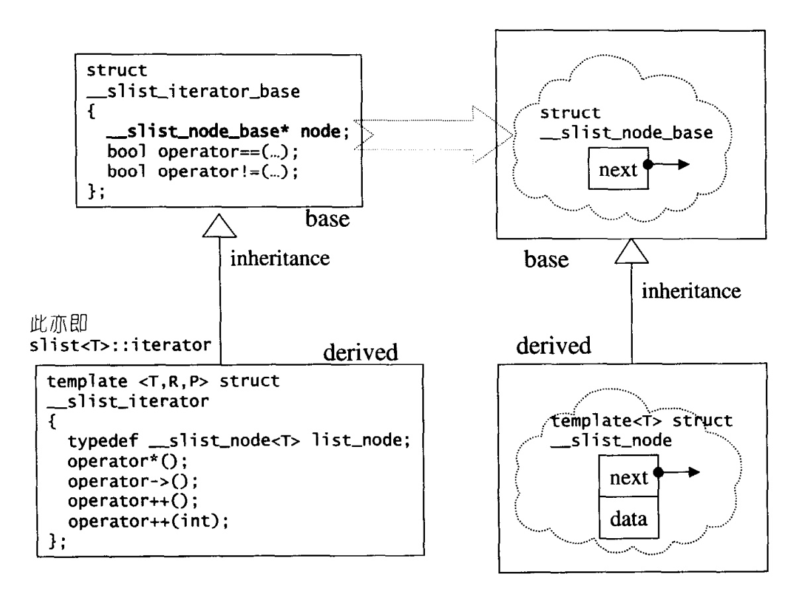

## chapter4 序列式容器(array,forward_list)

[toc]

### 序列式容器array

#### array概述

`array`只是对c++原本的静态数组进行了泛化封装，其定义如下:

```cpp
    template<class T,std::size_t N>
    struct array{
        typedef T                 value_type;
        typedef T*                pointer;
        typedef value_type*       iterator;
        typedef const value_type* const_iterator;
        typedef size_t            size_type;
        typedef T&                reference;

        //内部数据
        value_type _M_instance[N?N:1];

        iterator begin() { return iterator(&_M_instance[0]); }
        const_iterator cbegin() const { return iterator(&_M_instance[0]); }
        iterator end() { return iterator(&_M_instance[N]); }
        const_iterator cend() const { return iterator(&_M_instance[N]); }

        //capacity
        size_type size() const { return N; }
        size_type max_size() const { return N; }
        bool empty() const { return size()==0; }

        //element access
        reference operator[](size_type n) { return _M_instance[n]; }
        reference at(size_type n) {
            if(n<0||n>=N){
                //这里只是将异常抛出
                throw;
            }
            return _M_instance[n];
        }
        reference front() { return _M_instance[0]; }
        reference back() { return _M_instance[N-1]; }
    };
```

从上述代码可以看出`STL`中`array`根据第二模板参数推断出数组的大小，同时由于其和`vectro`一样数据存储在连续线性内存上，所以使用普通的指针即可作为其迭代器。

同时为了与内置的数组保持一致，`STL`中提供的`array`不提供构造函数和析构函数。

在实际使用`array`时，代码编写如下:

```cpp
array<int,10> myarray;
for(int i=0;i<10;++i)
    myarray[i]=i
```

### 序列式容器forward_list(GC2.9中是slist)

#### forward_list概述

`forward_list`和`list`的主要差别在于，前者的迭代器属于单向的`ForwardIterator`,后者的迭代器属于双向的`BidirectionalIterator`。相比于`list`,`forward_list`所耗用的空间更小，某些操作更快。

基于效率的考虑,`forward_list`不提供`push_back`，只提供`push_front()`,因此`slist`的元素次序会和元素插入进来的次序相反。

#### slist的节点和迭代器

`slist`采用下图所示的继承关系设计了节点和迭代器



