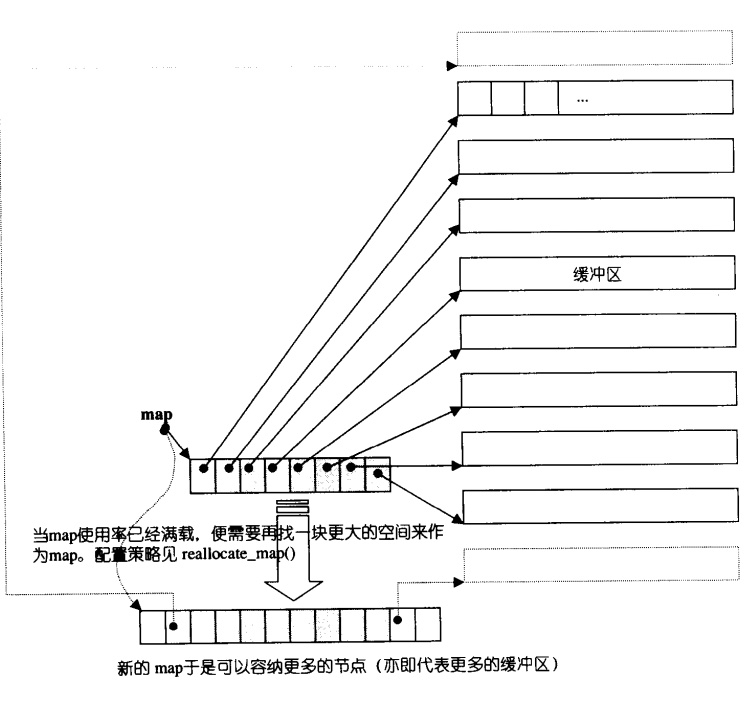

## chapter4 序列式容器(deque,stack和queue)

[toc]

### 序列式容器deque

#### deque概述

`deque`是一种双向开口的连续线性空间。

`deque`和`vector`的最大差异在于:

* `deque`运行常量时间内催起头段进行元素的插入和移除操作
* `deque`没有所谓容量的观念，因为它是动态地以分段连续空间组合而成，随时可以增加一段新的空间并链接起来。

理解`deque`的关键在于其`分段连续`，即通过提供的`Random Access Iterator`来模拟连续的空间。


#### deque的中控器

为了对每个分段缓冲区进行管理，`deque`采用了一块所谓的`map`(不是容器map)作为主控。

这里的`map`是一小块连续空间，其中每个元素（此处称为一个节点node）都是指针，指向另一段（较大的）连续线性空间，称为`缓冲区`。**缓冲区才是`deque`的储存空间主体**。`SGI STL2.9`允许我们制定缓冲区的大小，默认使用`512`bytes缓冲区。



#### deque的迭代器

`deque`实现模拟连续的关键在于其迭代器，`deque`的迭代器定义如下:

```cpp
//定义deque的迭代器
template<class T,class Ref,class Ptr,size_t BufSiz>
struct __deque_iterator{
    //...
    typedef T**                                 map_pointer;
    //声明位置标兵
    T*      cur;            //指向当前缓冲区的当前元素
    T*      first;          //指向当前缓冲区的头部
    T*      last;           //指向当前缓冲区的尾部
    map_pointer node;       //指向缓冲区管控中心
    //...
};
```

其中每个迭代器都指向一个中控的节点，同时通过`first`和`last`两个指针来指定缓冲区的头尾，通过`cur`指针指定当前缓冲区的当前元素。

由于`deque`的迭代器时`Random Access Iterator`所以我们需要定义出`++`,`--`,`[]`,`*`,`->`,`<`,`==,`!=`等操作。其中最关键的就是：一旦行进到缓冲区边缘时，要特别当先，可能需要跳转到下一个缓冲区或跳转到前一个缓冲区。

#### deque的数据结构

就像所有容器一样，`deque`也维护了两个指向头尾的迭代器`start`和`finish`,分别指向第一缓冲区的第一个元素(即`*start`得到的值)和最后缓冲区的最后一个元素的下一位置(`*finish`得到的值)。此外，还通过一个指针指向`map`和一个`size_type`记录`map`的大小。部分定义如下:

```cpp
 //定义deque
template<class T,size_t BufSiz=0>
class deque{
    public:
        //一些声明
        typedef T               value_type;
        typedef value_type*     pointer;
        typedef T&              reference;
        typedef const T&        const_reference;
        typedef size_t          size_type;
        typedef ptrdiff_t       difference_type;
    public:
        typedef __deque_iterator<T,T&,T*,BufSiz> iterator;
    protected:
        //元素的指针的指针
        typedef pointer*        map_pointer;
    protected:
        //Data members
        iterator        start;      //指向第一个缓存区的迭代器
        iterator        finish;     //指向最后一个缓冲区的迭代器
        map_pointer     map;        //指向map,map是块连续空间
                                    //其每个元素都是指针，指向一个缓冲区
        size_type       map_size;   //map内有多少指针，亦即多少缓冲区
        //...
};
```

完整的`deque`代码可以参考[github](https://github.com/lingqing97/tinySTL/blob/master/stl_wj_deque.h)

### 序列式容器stack

#### stack概述

`stack`是一种先进后出(`First In Last Out`,FILO)的数据结构。它只允许重尾端存取元素。

`SGI STL`中的`stack`实际上`deque`的一个封装，默认情况下`stack`采用`deque`作为底层结构。除了使用`deque`作为其底层结构，`vector`或`list`也是可以的。


其完整代码如下:

```cpp
#ifndef __WJSTACK__
#define __WJSTACK__

/*
    本文件实现stack
*/

#include"stl_wj_deque.h"    //for class deque

namespace wj{
    template<class,class> class stack;      //前置声明
    template<class T,class Sequence>
    bool operator==(const stack<T, Sequence>& x,const stack<T, Sequence>& y){
        return x.c==y.c;
    }
    template<class T,class Sequence>
    bool operator<(const stack<T, Sequence>& x,const stack<T, Sequence>& y){
        return x.c<y.c;

    }
    template<class T,class Sequence=wj::deque<T>>
    class stack{
        //声明友元
        friend bool operator== <T,Sequence>(const stack<T, Sequence>& x,const stack<T, Sequence>& y);
        friend bool operator< <T, Sequence>(const stack<T, Sequence>& x,const stack<T, Sequence>& y);
        public:
            //一些声明
            typedef typename Sequence::value_type       value_type;
            typedef typename Sequence::size_type        size_type;
            typedef typename Sequence::reference        reference;
            typedef typename Sequence::const_reference  const_reference;
        protected:
            //底层容器
            Sequence c;
        public:
            //以下操作完全利用Sequence c的操作，完成stack的操作
            bool empty() const { return c.empty(); }
            size_type size() const { return c.size(); }
            reference top() { return c.back(); }
            const_reference top() const { return c.back(); }
            //stack是先进后出
            void push(const value_type& x) { c.push_back(x); }
            void pop() { c.pop_back(); }
    };
}


#endif  /* __WJSTACK__ */
```

### 序列式容器queue

#### queue概述

`queue`是一种先进先出(`First In First Out`,FIFO)的数据结构，它只允许从尾部加入元素、从头部取出元素。同`stack`一样，`queue`也是借助`deque`作为底层容器的。除了使用`deque`作为底层容器，使用`list`也是可以的，但是`vector`不可以，因为`vector`没有提供`pop_front()`操作。

其完整代码如下:

```cpp
#ifndef __WJQUEUE__
#define __WJQUEUE__

/*
    本文件实现queue
*/

#include"stl_wj_deque.h"    //for class deque

namespace wj{
    template<class,class> class queue;          //前置声明

    template<class T,class Sequence>
    bool operator==(const queue<T, Sequence>& x,const queue<T, Sequence>& y){
        return x.c==y.c;
    }

    template<class T,class Sequence>
    bool operator<(const queue<T, Sequence>& x,const queue<T, Sequence>& y){
        return x.c<y.c;
    }

    template<class T,class Sequence=wj::deque<T>>
    class queue{
        //声明友元
        friend bool operator== <T, Sequence>(const queue<T, Sequence>& x,const queue<T, Sequence>& y);
        friend bool operator< <T, Sequence>(const queue<T, Sequence>& x,const queue<T, Sequence>& y);
        public:
            typedef typename Sequence::value_type       value_type;
            typedef typename Sequence::size_type        size_type;
            typedef typename Sequence::reference        reference;
            typedef typename Sequence::const_reference  const_reference;
        protected:
            Sequence c;     //底层容器
        public:
            //以下操作完全利用Sequence c的操作，完成queue的操作
            bool empty() const { return c.empty(); }
            size_type size() const { return c.size(); }
            reference front() { return c.front(); }
            const_reference front() const { return c.front(); }
            reference back()  { return c.back(); }
            const_reference back() const { return c.back(); }
            //queue是先进先出
            void push(const value_type& x) { c.push_back(x); }
            void pop() { c.pop_front(); }
    };
}

#endif /* __WJDEQUE__ */
```

### 总结

`stack`和`queue`实际上是对`deque`的一层封装，所以其在`STL`中被称为`adapter(配接器)`,而不被归类为`container(容器)`。