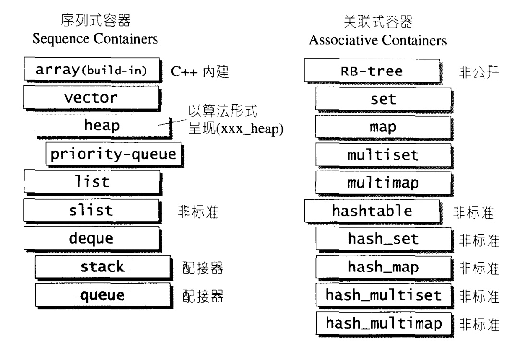

### chapter4 序列式容器概述

#### 容器的概述

`STL`中容器分为`顺序容器`和`关联式容器`.所谓序列式容器，其中的元素都可序(ordered),但未必有序(sorted)。其中`stack`和`queue`由于只是将`deque`改头换面而成，技术上被归纳为一种配接器(`adapter`)。

下图中使用缩进来表示各种容器之间的复合(`composition`)关系。比如`heap`和`priority_queue`内部都有一个`vector`,同理`stack`和`queue`内部都有一个`deque`。

在`c++11`中非标准的`slist`是`forward_list`,`hash_set`、`hash_map`、`hash_multiset`、`hash_multimap`分别是`unordered_set`、`unordered_map`、`unordered_multiset`、`unordered_multimap`。

#### 顺序容器比较

|  | 顺序容器类型 | |
| :----: | :----: | :----: |
| vector | 可变大小数组，支持快速随机访问 | 在尾部之外的位置插入和删除元素可能很慢 |
| deque  | 双端数组,支持快速随机访问  | 在头尾位置插入/删除速度很快 |
| list  | 双向链表,只支持双向顺序访问  | 在list中任何位置进行插入/删除操作速度都很快 |
| forward_list  | 单向链表,只支持单向顺序访问  | 在链表任何位置进行插入/删除操作速度都很快 |
| array  | 固定大小数组，支持快速随机访问  | 不能添加或删除元素
| string  | 与vector类似的容器,但专门用于保存字符  | 随机访问快，在尾部/删除速度快

关于顺序容器的使用可以参考[《C++ primer》chapter9 读书笔记]()