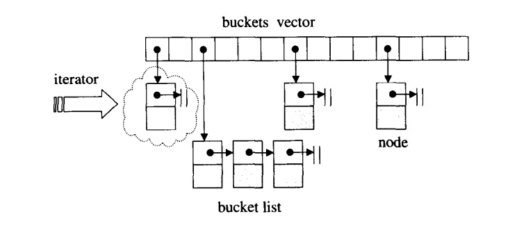

### chapter5 关联式容器hash_table

#### hash table 简介

`hash table`是一种用空间换时间的数据结构，其采用`hash functions`(散列函数)将某一元素映射为一个"大小可接受的索引"。

使用`hash function`会带来一个问题，即不同的元素被映射到相同的位置（亦即有相同的索引），这便是所谓的“碰撞”问题。解决碰撞问题的方法有许多种，包括`线性探测`,`二次探测`,`开链`等做法。

在`STL hash table`中采用`开链`的做法来解决冲突：定义一个`hash table`，同时每个表格元素中维护一个`list`。虽然针对`list`而进行的搜寻只能是一种线性操作，但如果`list`够短，速度还是够快。

在`SGI`中，称`hash table`表格内的元素为桶子(`bucket`)，此名称的意义是，表格内的每个单元，涵盖的不只是个节点，甚且可能是一"桶"节点。



#### hash table的迭代器

`hash table`的迭代器时一种`forward_iterator_tag`,没有后退操作(`operator--()`)。`hash table`迭代器维护了两个指针，一个指向迭代器目前所指节点，另一个保持对容器的连接关系。

```cpp
//hash table的迭代器
template<class Value,class Key,class HashFcn,
        class ExtractKey,class EqualKey>
struct __hashtable_iterator{
    typedef hashtable<Value,Key,HashFcn,ExtractKey,EqualKey> hashtable;
    typedef __hashtable_iterator<Value,Key,HashFcn,ExtractKey,EqualKey> iterator;
    typedef __hashtable_const_iterator<Value,Key,HashFcn,ExtractKey,EqualKey> const_iterator;
    typedef __hashtable_node<Value> node;

    //迭代器的型别
    typedef wj::forward_iterator_tag iterator_category;
    typedef Value value_type;
    typedef ptrdiff_t difference_type;
    typedef Value&  reference;
    typedef Value* pointer;

    typedef size_t size_type;

    //data member
    node* cur;      //迭代器目前所指之节点
    hashtable* ht;  //保持对容器的连结关系

    //ctor
    __hashtable_iterator(node* n,hashtable* tab):cur(n),ht(tab){}
    __hashtable_iterator(){}

    //some functions
    reference operator*() const { return cur->val; }
    pointer operator->() const { return &(operator*()); }
    iterator& operator++();
    iterator operator++(int);
    bool operator==(const iterator& it) const { return cur==it.cur; }
    bool operator!=(const iterator& it) const { return cur!=it.cur; }
};
```

#### hashtable的数据结构


`hashtable`中的`buckets`聚合体是通过`vector`完成的。

```cpp
//hash table
template<class Value,class Key,class HashFcn,
        class ExtractKey,class EqualKey>
class hashtable{
    //...
    private:
        //function member
        hasher hash;
        key_equal equals;
        ExtractKey get_key;

        //data member
        std::vector<node*> buckets;
        size_type num_elements;
    //...
};

//hash table的定义
wj::hashtable<int,int,wj::hash<int>,wj::identity<int>,wj::equal_to<int>> iht;
```

如上述代码所示，`hashtable`的模板参数相当多，包括:

* `Value`:节点的实值型别
* `Key`:节点的键值型别
* `HashFcn`:`hash function`的函数型别
* `ExtractKey`:从节点中取出键值的方法（函数或仿函数）
* `EqualKey`:判断键值相同与否的方法

虽然开链法并不要求表格带下必须为质数，但`SGI STL`仍然以质数来设计表格大小（即`buckets`的大小），并使用"最接近某数并大于某数"的质数作为表格的大小。

#### hashtable的插入

`hashtable`的插入也分为插入重复元素和插入非重复元素两种操作，分别通过`insert_equal`(实际通过调用`insert_equal_noresize()`实现)和`insert_unique`(实际通过调用`insert_unique_noresize()`实现)两个函数实现。

```cpp
//插入元素，不允许重复
template<class V,class K,class HF,class ExK,class EqK>
wj::pair<typename hashtable<V,K,HF,ExK,EqK>::iterator,bool>
hashtable<V,K,HF,ExK,EqK>::insert_unique_noresize(const value_type& obj)
{
    const size_type n=bkt_num(obj);
    node* first=buckets[n]; //找出元素所在的slot的首指针

    for(node* cur=first;cur;cur=cur->next)
        if(equals(get_key(cur->val),get_key(obj)))
            //发现存在键值相同的
            return wj::pair<iterator,bool>(iterator(cur,this),false);

    //离开以上循环时，first指向bucket所指链表的头部节点
    node* tmp=new_node(obj);    //产生新节点
    tmp->next=first;            //将新节点插入于目前位置之后
    buckets[n]=tmp;
    ++num_elements;             //节点个数累加1
    return wj::pair<iterator,bool>(iterator(tmp,this),true);    //返回一个pair,其中的迭代器指向新插入节点
}

//插入元素，允许重复
template<class V, class K, class HF,class ExK,class EqK>
typename hashtable<V,K,HF,ExK,EqK>::iterator
hashtable<V,K,HF,ExK,EqK>::insert_equal_noresize(const value_type& obj)
{
    const size_type n=bkt_num(obj);
    node* first=buckets[n];

    for(node* cur=first;cur;cur=cur->next)
        if(equals(get_key(cur->val),get_key(obj))){
            //如果发现与链表中的某键值相同，就马上插入，然后返回
            node* tmp=new_node(obj);
            tmp->next=cur->next;
            cur->next=tmp;
            ++num_elements;
            return iterator(tmp,this);
        }

    node* tmp=new_node(obj);
    tmp->next=first;
    buckets[n]=tmp;
    ++num_elements;
    return iterator(tmp,this);
}
```

#### hash_set(现在为unordered_set),hash_multiset(现在为unordered_multiset),hash_map(现在为unordered_map)和hash_multimap(现在为unordered_multimap)

`hash_set`和`hash_multiset`底层都是通过`hash table`实现，其使用方式分别与`set`,`multiset`完全相同。

`hash_map`和`hash_multimap`底层也都是通过`hash table`实现，其使用方式分别与`map`,`multimap`完全相同。

这里重点讨论一下`hash_map`，其部分代码如下所示:

```cpp
template<class Key, class T,class HashFcn=hash<Key>,class EqualKe=equal_to<Key>>
class hash_map{
    private:
        typedef hashtable<pair<const Key,T>,Key,HashFcn,select1st<pair<const Key,T> >,EqualKey> ht;
        ht rep;     //底层机制以hash table完成
    //...
    public:
        T& operator[](const key_type& key){
            //find_or_insert返回pair<const Key,T>的引用
            return rep.find_or_insert(value_type(key,T())).second;
        }
};
```

从上述代码可以看出,`hash_map`底层以`hashtable`完成，同时其`hashtable`中每个元素是一个`pair`,该`pair`的第一个元素是键值，第二个元素是实值。同`map`一样，`hash_map`也是通过尝试插入一个新元素的方法来实现下标运算符的。

> 注意:`multimap`,`hash_multimap`都没有提供`operator[]`运算符。