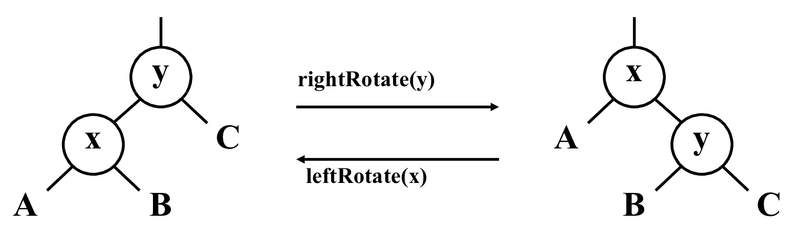
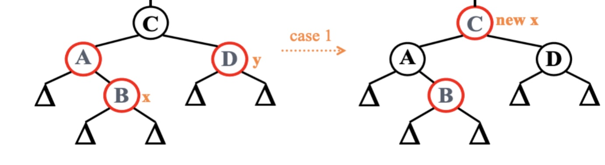
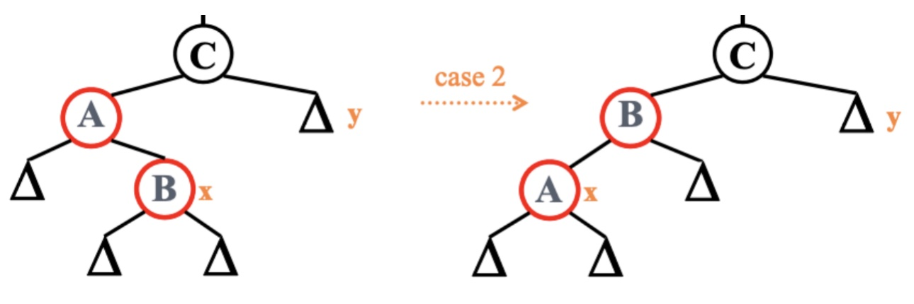
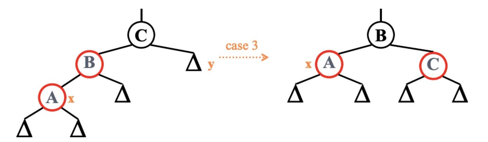

### chapter5 关联式容器概述

#### 关联式容器概述

标准的`STL`关联式容器分为`set`(集合)和`map`(映射表)两大类,以及这两大类的衍生体`multiset`(多键集合)和`multimap`(多键映射表)。

其中`set`,`map`,`multimap`,`multiset`这些容器的底层机制均以`RB-tree`(红黑树)完成. 而`unordered_set`,`unordered_map`,`unordered_multimap`,`unordered_multiset`这些容器则是以`hash table`(散列表)完成的。

#### binary search tree(二叉搜索树)

所谓二叉搜索树(`binary search tree`)，可提供对数时间的元素插入和访问。二叉搜索树的节点放置规则是:任何节点的键值一定大于其左子树中的每一个节点的键值。

#### balanced binary tree(平衡二叉树)

一般而言，关联式容器的内部结构是一个`balanced binary tree`(平衡二叉搜索树),以便获得良好的搜寻效率。所谓树形平衡与否，并没有一个绝对的测量标准。"平衡"的大致意义是：没有任何一个节点过深（深度过大）。不同的平衡条件，造就出不同的效率表现，以及不同的实现复杂度，有数种特殊结构如`AVL-tree`,`RB-tree`,`AA-tree`,其中最被广泛运用于`STL`的是`RB-tree`(红黑树)。

#### AVL-tree

`AVL tree`是一个"加了而外平衡条件"的二叉搜索树，其平衡条件的建立是为了确保整棵树的深度为`O(logN)`。**`AVL tree`要求任何节点的左右子树高度相差最多1**。

#### RB-tree


所谓`RB-tree`不仅是一个二叉搜索树，而且必须满足以下规则:

1. 每个节点不是红色就是黑色
2. 根节点为黑色
3. 父子两节点不得同时为红
4. 任意节点到达NULL节点之任一路径，所含黑节点数必须相同(每个节点的黑高相同，为了理解，我们可以把NULL节点视为黑节点)

为了使得`RB-tree`始终满足上述规则，在插入一个新节点时，**新增节点节点必须为红**，之后我们再根据其他条件对`RB-tree`进行调整。

为了对`RB-tree`进行调整，我们引入`左旋(leftRotate`)和`右旋(rightRotate)`两个操作。



为了方便接下来的讨论，我们引入一些代名：假设新节点为`x`，其父节点为`p`,祖父节点为`g`,伯父节点(父节点之兄弟节点)为`y`,曾祖父节点为`gg`。

当父节点是黑色时，则直接插入新节点成功，不需要调整树的结构。

之后我们可以将插入情况分为父节点是祖父节点的左孩子，和父节点是祖父节点的右孩子两种情况。

当父节点是祖父节点的左孩子，此时插入一个新节点，可以分为以下三种情况:

1. 伯父节点`y`为红色，此时调整的伪代码如下:

```cpp
//伯父节点为红色
if(y->color=RED){
    x->p->color=BLCAK;      //父节点设为黑色
    y->color=BLCAK;         //伯父节点设为黑色
    x->p->p->color=RED;     //祖父节点设为红色
    x=x->p->p;              //祖父节点成为新的x,迭代调整树结构
}
```



2. 伯父节点`y`为黑色，且`x`为右孩子，此时调整的伪代码如下，调整后变为情况3:

```cpp
if(x=x->p->right){      //x为右孩子
    x=x->p;
    leftRotate(x);      //左旋x
}
```



3. 伯父节点`y`为黑色，且`x`为左孩子，此时调整的伪代码如下:

```cpp
x->p->color=BLCAK;         //父节点设为黑色
x->p->p->color=RED;        //祖父节点设为红色
rightRotate(x->p->p-);     //右旋祖父节点
```



当父节点是祖父节点的右孩子时，处理情况和上面类似，这里不再讨论。

在`STL`中，`RB-tree`的元素插入分类`insert_unique()`和`insert_equal()`，前者表示被插入节点的键值在整棵树中必须独一无二（如果树中存在相同的键值，插入操作就不会真正进行），后者表示被插入节点的键值在整棵树中可以重复。因此，无论插入何值都会成功（除非空间不足导致配置失败）。

完整的`RB-tree`实现可以参考[github](https://github.com/lingqing97/tinySTL/blob/master/stl_wj_tree.h)