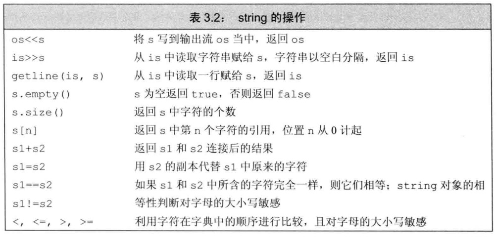
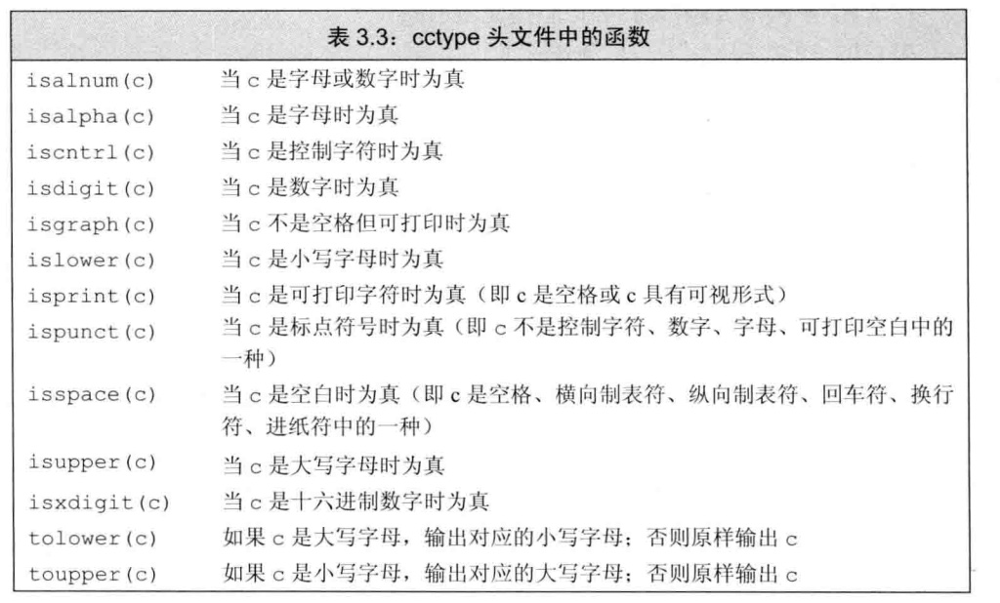
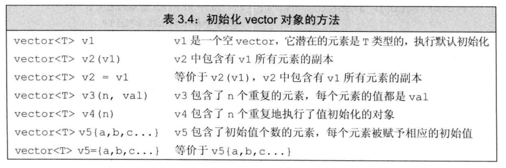
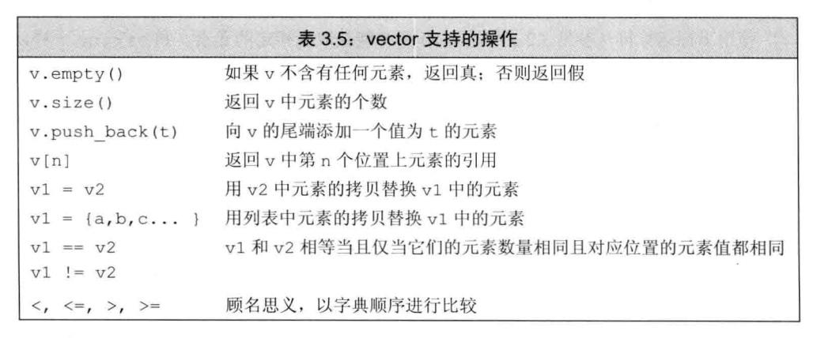
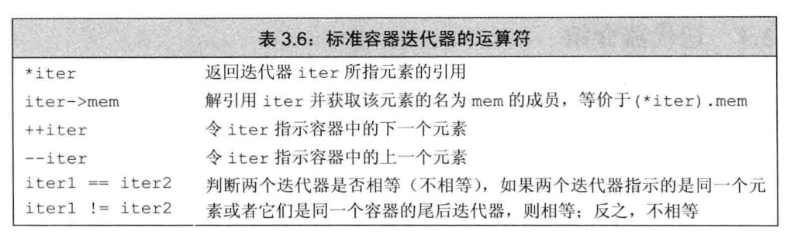

### 命名空间的using声明
- 我们可以使用作用域操作符(`::`)来访问某个命名空间里的库函数，比如:`std::cin`的意思就是要使用命名空间std中的名字cin。
- 上述方法进行声明比较烦琐，可以使用`using声明`。`using声明`的形式为:`using namespace::name;`
```c++
#include <iostream>
using std::cin;
using std::cout; using std::endl;   //多个using声明语句可以放在一行，用分号隔开
int main(){
    cout<<"Enter two numbers:"<<endl;
    int v1,v2;
    cin>>v2>>v2;
    cout<<"The sum of"<<v1<<" and "<<v2
        <<" is "<<v1+v2<<endl;
    return 0;
}
```
- 头文件中不应包含`using`声明,因为头文件的内容会拷贝到引用它的文件中，若引用文件中定义了一个同名的命名空间可能会产生名字冲突。

### string对象上的操作
`string`表示可变长的字符序列，使用string类型必须首先包含string头文件。
```c++
#include <string>
using std::string;
```
- string类型的初始化方式如下图:

- 对于string的初始化，如果使用等号(=)初始化一个变量，实际上执行的是**拷贝初始化**,编译器把等号右侧的初始值拷贝到新创建的对象中去。与之相反，如果不使用等号，则执行的是**直接初始化**。
- string对象上的常见操作如下图:

```c++
//读取未知数量的string对象
int main(){
    string word:
    while(cin>>word){ //反复读取，直至到达文件末尾
        cout<<word<<endl;   //逐个输出单词，每个单词后面紧跟一个换行
    }
}
```
- 使用`getline(cin,s)`读取字符串s可以保留输出时的空白符，当遇到换行符为止（注意换行符也被读进来了），然后将所读的内容存入到那个string对象中去(注意不存换行符)。如果输入一开始就是换行符，那么所得的结果是个空string。
- string的`size()`函数返回一个`string::size_type`类型的值，该值是一个无符号整数，所以，**如果一条表达式中已经有了size()函数就不要再使用int了，这样可以避免混用int和unsigned可能带来的问题。**
```c++
auto len=line.size();   //len的类型是string::size_type
```
- 当把string对象和字符字面值及字符串字面值混在一条语句中使用时，必须确保每个加法运算符两侧的运算对象至少有一个是string.
```c++
string s1="hello",s2="world";
string s3=s1+","+s2+'\n';
string s4=s1+", ";  //正确
string s5="hello"+",";  //错误:两个运算对象都不是string
string s6=s1+","+"world";   //正确:等价于(s1+",")+"world"
string s7="hello"+","+s2;   //错误:等价于("hello"+",")+s2
```
### 处理string对象中的字符

- `cctype`头文件中定义了一组标准库函数来查看某个字符的特性，如下图:

- C++11新标准提供了一种语句:`范围for语句`,这种语句遍历给定序列中的每个元素并对序列中的每个值执行某种操作.
```c++
// for(declartion:expression){
//     statement;
// }
//例子1
string str("some string");
for(auto c:str)
    cout<<c<<endl;
//例子2：将string对象转换为大写
string s("Hello World!!!");
for(auto &c:s){ //注意c是引用
    c=toupper(c);
cout<<s<<endl;  //输出:HELLO WORLD!!!
}
```

### 定义和初始化vector对象
- 初始化vector对象的方法有:

- 运行把一个vector对象的元素拷贝给另一个vector对象
```c++
vector<int> ivec;
vector<int> ivec2(ivec);    //把ivec的元素拷贝给ivec2
vector<int> ivec3=ivec;     //把ivec的元素拷贝给ivec3
```
- C++11新标准可以通过**列表初始化**来给vector对象赋初值
```c++
vector<string> v1={"a","an","the"}; //列表初始化
vector<string> v2{"a","an","the"};  //列表初始化
vector<string> v3("a","an","the");  //错误

//注意区分列表初始化还是元素数量
vector<int> v1(10); //v1有10个元素，每个的值都是0
vector<int> v2{10}; //v2有1个元素，该元素的值是10

vector<int> v3(10,1);   //v3有10个元素，每个的值都是1
vector<int> v4{10,1};   //v4有2个元素，值分别是10和1
```
- 创建指定数量的元素
```c++
vector<int> ivec(10,-1);
vector<string> svec(10,"hi!);
vector<int> ivec(10);   //10个元素，每个都初始化为0
vector<string> svec(10);    //10个元素，每个都是空string对象
```
- vector支持的操作如下:

- 两个vector对象相等当且.仅当它们所含的元素个数相同，而且对应位置的元素值也相同。关系运算符依照字典顺序进行比较: 如果两个vector对象的容量不同，但是在相同位置上的元素值都一样，则元素较少的vector对象小于元素较多的vector对象;若元素的值有区别，则vector对象的大小关系由第一对相异的元素值的大小关系决定。

### 使用迭代器
- 迭代器类似于指针类型，提供了对对象的间接访问。
- 有迭代器的类型都拥有`begin`和`end`的成员，其中`begin`成员负责返回指向第一个元素的迭代器，`end`成员则负责返回指向容器"尾元素的下一位置"的迭代器。
- 迭代器的运算符如下:

- 拥有迭代器的标准库类型使用iterator和const_iterator来表示迭代器的类型，如果对象是常量,begin和end返回const_iterator,否则返回iterator:
```c++
vector<int>::iterator it;   //it能读能写
string::iterator it2;   //it2能读写

vector<int>::const_iterator it3;    //it3只能读元素，不能写元素
string::const_iterator it4: //it4只能读字符，不能写字符
```
- C++11新标准引入了两个新函数，分别是`cbegin`和`cend`,类似于`begin`和`end`,也分别返回指示容器第一元素或最后元素下一个位置的迭代器。有所不同的是，该类迭代器的返回值都是`const_iterator`。
- 谨记，**但凡是使用了迭代器的循环体，都不要向迭代器所属的容器添加元素。**