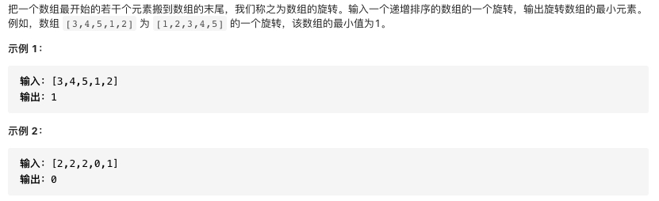

### 二分法总结

#### 关键点

1. 区间与中间数划分的关系(主要是为了防止两个元素的时候陷入死循环):

* 划分 [left, mid] 与 [mid + 1, right] ，mid 被分到左边，对应 int mid = left + (right - left) / 2;；
* 划分 [left, mid - 1] 与 [mid, right] ，mid 被分到右边，对应 int mid = left + (right - left + 1) / 2;。

2. 退出循环的时候有 left == right 成立，此时如果能确定问题一定有解，返回 left 即可，如果不能确定，需要单独判断一次

3. 二分法的核心思想在于**每一轮过滤哪部分区间**

**无需记模板**


### 关于做题

1. 第一步，明确搜索的范围
2. 第二步，确定根据什么条件过滤区间
3. 第三步，若left不一定问题的解，需要再单独判断一次


### 典型题

#### 题型一：在数组中查找符合条件的元素的下标

#### 1095. 山脉数组中查找目标值

##### 题目描述


##### 参考题解

```cpp
class Solution {
public:
    int search(vector<int>& nums, int target) {
        int left=0,right=nums.size()-1;
        while(left<right){
            int mid=left+(right-left)/2;
            if(nums[left]<=nums[mid]){
               //左边有序 
               if(nums[left]<=target&&target<=nums[mid]){
                   right=mid;
               }
               else{
                   left=mid+1;
               }
            }
            else{
                //右边有序
                //注意这里不要写成if(nums[mid]<=target&&target<=nums[right])
                //因为若有等于则令left=mid+1可能会将nums[mid]==target这种情况过滤
                if(nums[mid]<target&&target<=nums[right]){
                    left=mid+1;
                }
                else{
                    right=mid;
                }
            }
        }
        return nums[left]==target?left:-1;
    }
};
```

**Hits:过滤区间的条件一定考虑清楚，这里主要是等号取不取的情况**


#### 81. 搜索旋转排序数组 II

##### 题目描述


##### 参考题解

```cpp
class Solution {
public:
    bool search(vector<int>& nums, int target) {
        int left=0,right=nums.size()-1;
        while(left<right){
            int mid=left+(right-left)/2;
            if(nums[left]<nums[mid]){
                //左边一定有序
                if(nums[left]<=target&&target<=nums[mid]){
                    right=mid;
                }
                else{
                    left=mid+1;
                }
            }
            else if(nums[left]>nums[mid]){
                //右边有序
                if(nums[mid]<target&&target<=nums[right]){
                    left=mid+1;
                }
                else{
                    right=mid;
                }
            }
            else{
                //nums[left]==nums[mid]
                //这时无法判断左边是否一定有序比如(23222)
                if(nums[left]==target) return true;
                ++left;
            }
        }
        return nums[left]==target;
    }
};
```

**Hits:与上一题不同，这里不要要考虑出现重复元素的情况**


##### 剑指 Offer 11. 旋转数组的最小数字

##### 题目描述



##### 参考题解

```cpp
class Solution {
public:
    int minArray(vector<int>& numbers) {
        int left=0,right=numbers.size()-1;
        //找左右区间的交界
        while(left<right){
            int mid=left+(right-left)/2;
            //关键在于过滤值较大的区间，所以这里numbers[mid]要和numbers[right]比较，而不是和numbers[left]比较
            if(numbers[mid]<numbers[right]){
                right=mid;
            }
            else if(numbers[mid]>numbers[right]){
                left=mid+1;
            }
            else{
                --right;
            }
        }
        return numbers[left];
    }
};
```

**Hits:套路题，暂时没有好的理解(要找最小的数，所以要过滤大区间?)**


##### 1095. 山脉数组中查找目标值

##### 题目描述


##### 参考题解

```cpp
/**
 * // This is the MountainArray's API interface.
 * // You should not implement it, or speculate about its implementation
 * class MountainArray {
 *   public:
 *     int get(int index);
 *     int length();
 * };
 */

class Solution {
public:
    int findInMountainArray(int target, MountainArray &mountainArr) {
        //step1:先找山顶
        int n=mountainArr.length();
        int left=0,right=n-1;
        while(left<right){
            int mid=left+(right-left)/2;
            //找山顶
            //这里mid+1一定不会越界，因为mid偏向left
            int num1=mountainArr.get(mid),num2=mountainArr.get(mid+1);
            if(num1<num2){
                left=mid+1;
            }
            else{
                right=mid;
            }
        }
        int top=left;
        if(mountainArr.get(top)==target) return top;
        cout<<mountainArr.get(top)<<endl;
        //step2:在山顶左边找目标值
        int res=binary_search(target,mountainArr,0,top-1,1);
        if(res==-1)
            //step3:在山顶右边找目标值
            return binary_search(target,mountainArr,top+1,n-1,-1);
        return res;
    }
    int binary_search(int target,MountainArray& mountainArr,int left,int right,int reverse=1){
        //定义一个reverse来区分左右
        if(left>right) return -1;
        while(left<right){
            int mid=left+(right-left)/2;
            int mval=mountainArr.get(mid)*reverse;
            if(mval>=reverse*target){
                right=mid;
            }
            else{
                left=mid+1;
            }
        }
        return mountainArr.get(left)==target?left:-1;
    }
};
```

**Hits:这里找山峰非常具有技巧性，牢记!!!**


#### 题型二：在一个有范围的区间里搜索一个整数

##### 1300. 转变数组后最接近目标值的数组和

##### 题目描述


##### 参考题解

```cpp
class Solution {
public:
    int findBestValue(vector<int>& arr, int target) {
        int left=0,right=*max_element(arr.begin(),arr.end());
        while(left<right){
            int mid=left+(right-left)/2;
            int tempsum=getSum(arr,mid);
            //查找第一个数使得tempsum大于target
            //这里要查找第一个大于target的，不是第一个小于等于target(因为+1不一定大于等于target)
            if(tempsum<target){
                left=mid+1;
            }
            else{
                right=mid;
            }
        }
        return (target-getSum(arr,left-1))<=(getSum(arr,left)-target)?left-1:left;
    }
    int getSum(const vector<int>& arr,int n){
        int res=0;
        for(auto num:arr){
            res+=min(num,n);
        }
        return res;
    }
};
```

**Hits:该类题型限定了查找范围，所以可以用二分法来查找**

##### 287. 寻找重复数

##### 题目描述


##### 参考题解

```cpp
class Solution {
public:
    int findDuplicate(vector<int>& nums) {
        int n=nums.size();
        //注意这里的搜索范围
        int left=1,right=n-1;
        while(left<right){
            int mid=left+(right-left)/2;
            //这里的关键是通过个数来过滤区间
            int cnt=0;
            for(auto num:nums){
                if(num<=mid) cnt++;
            }
            //若左部分包含有重复元素则其数量将大于mid
            if(cnt>mid){
                right=mid;
            }
            else{
                left=mid+1;
            }
        }
        return left;
    }
};
```

**Hits:这里cnt>mid的条件细细体会?!!!**
