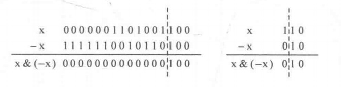

### lowbit运算

lowbit(x)=x&(-x),这个式子代表取x的二进制最右边的1和它右边所有0，lowbit(x)也可以理解为能整除x的最大2的幂次。



```c++
#define lowbit(x) ((x)&(-x))
```

### 树状数组

#### 问题引出

>给出一个整数序列A，元素个数为N($N<=10^5$),接下来查询K次($K<=10^5$),在查询的过程中可能随时给第x个数加上一个整数v，每次查询将给出一个正整数x($x<=N$),求前x个整数之和。

对于这个问题，常规做法是定义一个sum数组，sum[i]表示前i个整数之和，这样每次查询的时间复杂是O(1),但进行更新时却要给sum[x],sum[x+1],...sum[N]都加上v,更新的时间复杂度会是O(KN).

使用树状数组可以巧妙地解决这个问题。

#### 树状数组定义

定义:**数组C是树状数组(从下标1开始)，其中C[i]存放数组A中i号位之前lowbit(i)个元素之和，显然C[i]的覆盖长度是lowbit(i),它是2的幂次**。

1. 设计函数getSum(x),返回前x个数之和A[1]+A[2]+...+A[x]
2. 设计函数update(x,v),实现将第x个数加上一个数v的功能，即A[x]+=v

##### getSum(x)函数

记SUM(1,x)=A[1]+A[2]+A[3]+...A[x]，**由于C[x]的覆盖长度为lowbit(x)**,则有
$$C[x]=A[x-lowbit(x)+1]+...A[x]$$
于是有:
$$
\begin{aligned}
\operatorname{SUM}(1, \mathrm{x}) &=\mathrm{A}[1]+\cdots+\mathrm{A}[\mathrm{x}] \\
&=\mathrm{A}[1]+\cdots+\mathrm{A}[\mathrm{x}-\operatorname{lowbit}(\mathrm{x})]+\mathrm{A}[\mathrm{x}-\operatorname{lowbit}(\mathrm{x})+1]+\cdots+\mathrm{A}[\mathrm{x}] \\
&=\mathrm{SUM}(1, \mathrm{x}-\operatorname{lowbit}(\mathrm{x}))+\mathrm{C}[\mathrm{x}]
\end{aligned}
$$

接着就能很容易写出getsum函数了:
```c++
//getSum函数返回前x个整数之和
//数组c从下标1开始
int getSum(x){
    int sum=0;
    for(int i=x;i>0;i-=lowbit(x)){
        sum+=c[i];  //累积c[i],然后把问题缩小为SUM(1,i-lowbit(i))
    }
    return sum;
}
```

>小技巧：**如果要求数组下标在区间[x,y]内的数之和，即A[x]+A[x+1]+...+A[y],可以转换成getSum(y)-getSum(x-1)来求解**.

##### update函数

要让A[x]加上v，就是要寻找树状数组C中能覆盖A[x]的那些元素，让它们都加上v.比如要让A[5]加上v,就从C[5]开始，把覆盖A[5]的C[5],C[6],C[8],C[16]...都加上v即可.

那么，如何找到距离当前的C[x]最近的能覆盖C[x]的C[y]呢？ 首先，可以得到一个显然的结论: lowbit(y)必须大于lowbit(x) (不然怎么覆盖呢)。于是问题等价于求一个尽可能小的整数a，使得 lowbit(x+a)> lowbit(x)。显然，由于 lowbit(x)是取 x 的二进制最右边的1的位置，因此如果lowbit(a) < lowbit(x)，lowbit(x + a)就会小于 lowbit(x)。为此lowbit(a)必须不小于 lowbit(x)。接着发现，**当a取lowbit(x)时，由于x和a的二进制最右边的1的位置相同， 因此x + a 会在这个1的位置上产生进位，使得进位过程中的所有连续的1变成0，直到把它们左边第一个0置为1时结束**。于是lowbit(x + a) > lowbit(x)显然成立, 最小的a就是lowbit(x)。

update函数代码如下:
```c++
//update函数将第x个整数加上v
void update(int x,int v){
    for(int i=x;i<=N;i+=lowbit(i)){ //注意i必须能取到N
        c[i]+=v;    //让i不断加上lowbit(i),直到i超过给定的数据范围为止
    }
}
```

##### 时间复杂度分析

**getSum(x)和update(x,v)的时间复杂度都是O(logN)**

#### 树状数组扩展

之前对树状数组进行的是**单点更新，区间查询**，如果想要进行**区间更新，单点查询**，那么就是要解决这两个问题:
1. 设计函数getSum(x),返回A[x]
2. 设计函数update(x,v),将A[u]~A[x]的每个数都加上一个数v

首先重新定义树状数组:树状数组C,其中C[i]表示数组A中i号位之前lowbit(i)个元素当前被加了多少。

此时可以把原先的update函数作为这里的getSum函数，代码如下:
```c++
//getSum函数返回dix个整数的值
int getSum(int x){
    int sum=0;
    for(int i=x;i<maxn;i+=lowbit(i)){
        sum+=c[i];
    }
    return sum;
}
```
而update函数可以用原先的getSum函数，代码如下:
```c++
//update函数将前x个整数都加上v
void update(int x;i>0;i-=lowbit(i)){
    c[i]+=v;
}
```

### 应用1：统计序列中在元素左边比该元素小的元素个数

例子:给定一个序列A为{520,9999999,18,666,88888}，则输出为{0,1,0,2,3}

由于序列中的数可能很大，所以可以用**离散化**的技巧来处理，在上面这个例子中{520,9999999,18,666,88888}与{2,5,1,3,4}等价，所以我们可以用排名来代替原序列。

#### 思路

首先进行离散化，得到新数组B,然后定义hash数组C,C[i]表示i号元素是否出现,遍历到i号位置时即将C[B[i]]置为1。

利用树状数组:当遍历到i号位置，执行update(B[i],1),统计i号位置左边比该元素小的个数即getSum(B[i]-1);

```c++
#include<cstdio>
#include<cstring>
#include<algorithm>
using namespace std;
const int maxn=100010;
#define lowbit(i) ((i)&(-i))
struct Node{
    int val://序列元素的值
    int pos;//原始序号
} temp[maxn];
int A[maxn];//离散化后代额原始数组
int c[maxn];//树状数组

//update函数将第x个整数加上v
void update(int x,int v){
    for(int i=x;i<maxn;i+=lowbit(i)){
        c[i]+=v;
    }
}
//getSum函数返回前x个整数之和
int getSum(int x){
    int sum=0;
    for(int i=x;i>0;i-=lowbit(i)){
        sum+=c[i];
    }
    return sum;
}
//按val从小到大排序
bool cmp(Node a,Node b){
    return a.val<b.val;
}
int main(){
    int n;
    scanf("%d",&n);
    memset(c,0,sizeof(c));
    for(int i=0;i<n;i++){
        scanf("%d",&temp[i].val);
        temp[i].pos=i;
    }
    //离散化
    sort(temp,temp+n,cmp);  //按val从小到大排序
    for(int i=0;i<n;i++){
        //与上一个元素值不同时，赋值为元素个数
        if(i==0||temp[i].val!=temp[i-1].val){
            A[temp[i].pos]=i+1;
        }
        else{
            //与上一个元素值相同时，直接继承
            A[temp[i].pos]=A[temp[i-1].pos];
        }
    }
    //正式进入更新和求和操作
    for(int i=0;i<n;i++){
        update(A[i],1);//A[i]的出现次数加1
        printf("%d\n",getSum(A[i]-1));//查询当前小于A[i]的数的个数
    }
    return 0;
}
```
