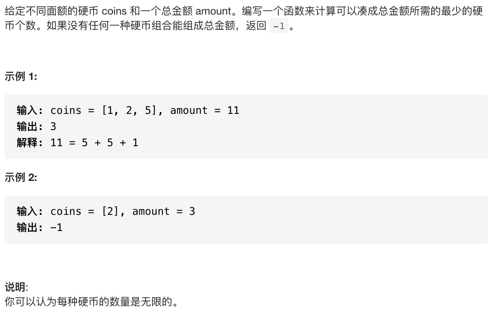
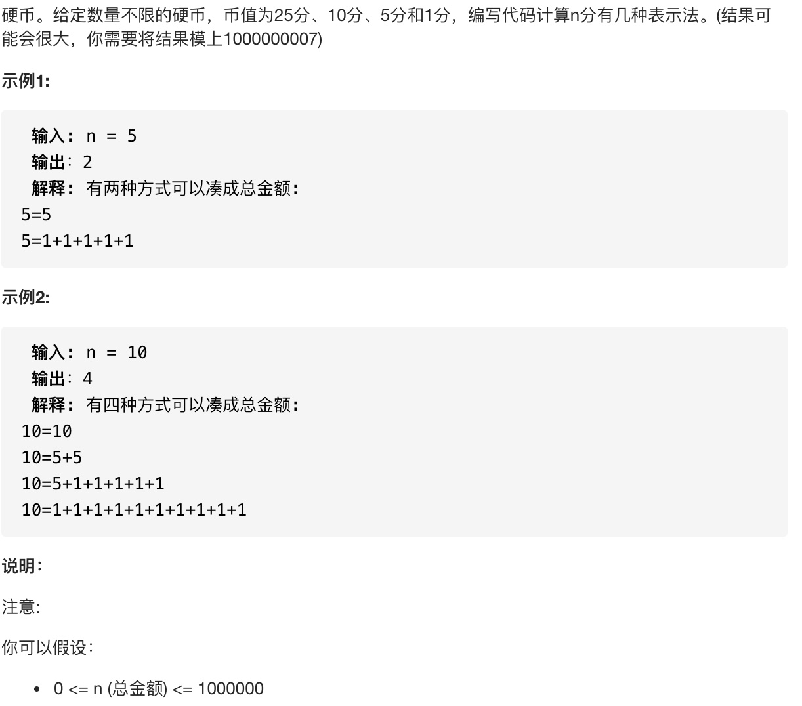
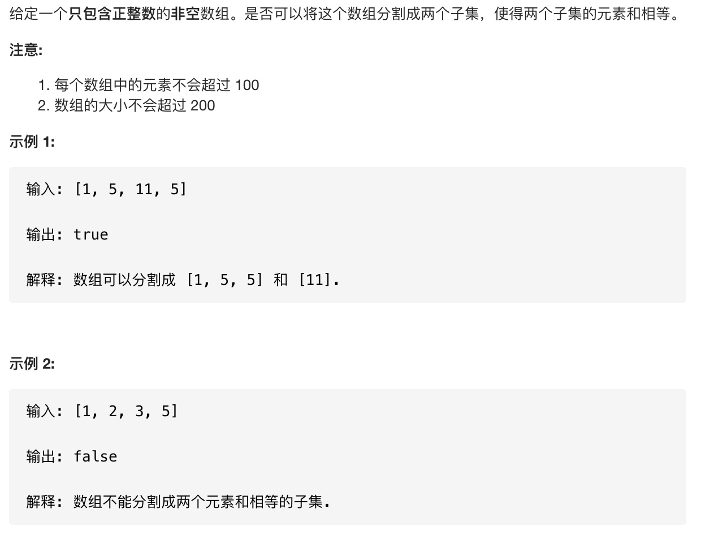
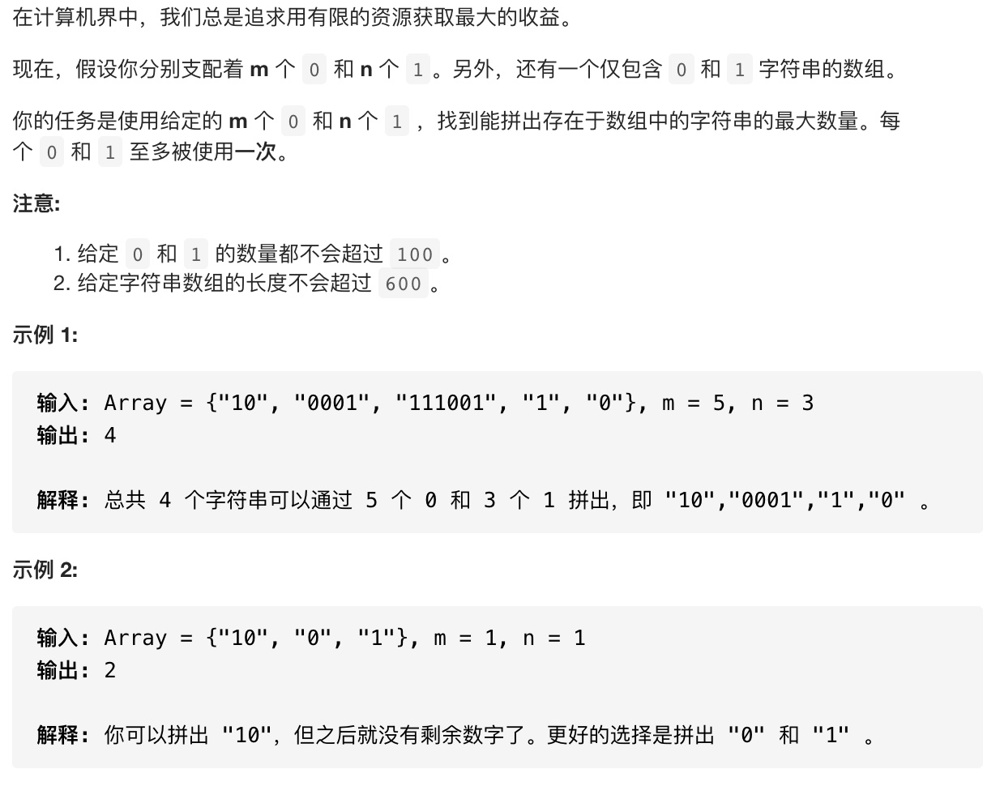
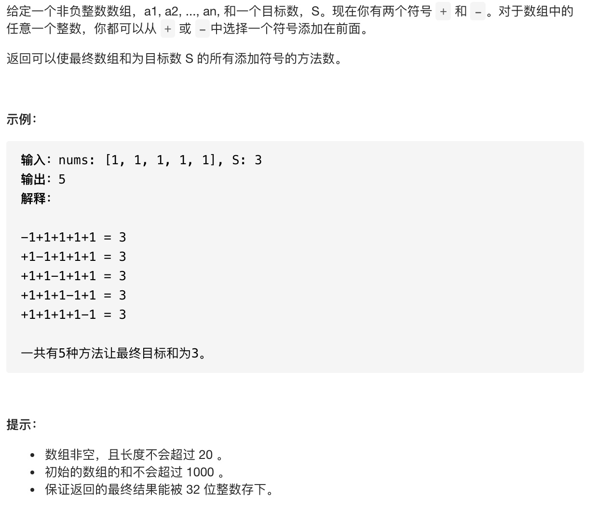

### 背包问题

#### 0-1背包问题描述
给定多个（n）物品，每种物品都有自己的重量$（w_{i}）$和价值（ $v_{i}$ )，在限定的总重量/总容量（C）内，选择其中若干个（也即每种物品可以选0个或1个），设计选择方案使得物品的总价值最高。

用数学语言可以描述为:
给定正整数 $\left\{\left(w_{i}, v_{i}\right)\right\}_{1 \leq i \leq n}$ 、给定正整数 $C,$ 求解0-1背包问题:

$\max \sum_{i=1}^{n} x_{i} v_{i}$
    s.t. $\sum_{i=1}^{n} x_{i} w_{i} \leq C, \quad x_{i} \in\{0,1\}$

#### 动态规划思路

* 定义状态：dp[i][j]为从前i个物品中挑选总重量不超过j的物品可以取得的最大价值。
* 状态转移方程为:
  * 不选当前物品:dp[i][j]=dp[i-1][j]
  * 选当前物品:dp[i][j]=dp[i-1][j-$w_{i}$]+$v_{i}$ ,if j>=$w_{i}$
  * 取两者最大值:dp[i][j]=max(dp[i-1][j],dp[i][j]=dp[i-1][j-$w_{i}$]+$v_{i}$) if j>=$w_{i}$ else dp[i][j]=dp[i-1][j]
* 考虑边界情况:dp[i][0]=0,dp[0][j]=0

由于dp[i]仅依赖于dp[i-1],所以我们可以定义一个滚动数组即可，而不用定义一个二维数组。

下面是leetcode上关于背包问题的相关题目。

### 322.零钱兑换

#### 问题描述


#### 动态规划思路

这是一道典型的背包问题。
* 定义状态:dp[i][j]为从前i种银币中挑选价值j所需最少的硬币数。
* 状态转移方程为:
  * 由于每种硬币可以选很多次，所以定义每种硬币选择的数量为k，则有:
    * dp[i][j]=min(dp[i-1][j],dp[i-1][j-coins[i]*1]+1,dp[i-1][j-coins[i]*2]+2,...dp[i-1][j-coins[i]*k]+k) 其中j-coins[i]*k>=0
    * 由于dp[i][j-coins[i]]=min(dp[i-1][j-coins[i]],dp[i-1][j-coins[i]*2]+1,...)
    * 所以dp[i][j]=min(dp[i-1][j],dp[i][j-coins[i]]+1) 其中j-coins[i]>=0
* 考虑边界情况:dp[i][0]=0,dp[0][j]=0

同样，可以用滚动数组来节省空间。

#### 参考代码
```cpp
class Solution {
public:
    int coinChange(vector<int>& coins, int amount) {
        if(coins.size()<0||amount<0) return 0;
        vector<int> dp(amount+1,INT_MAX);
        dp[0]=0;
        for(int i=0;i<coins.size();i++){
            int coin=coins[i];
            for(int j=coin;j<=amount;j++){
              //越界的直接设为INT_MAX,这部分越界的不会影响最终结果
                dp[j]=min(dp[j],dp[j-coin]==INT_MAX?INT_MAX:dp[j-coin]+1);
            }
        }
        return dp[amount]==INT_MAX?-1:dp[amount];
    }
};
```
### 面试题 08.11. 硬币

#### 问题描述


#### 动态规划思路

这道题和上面那道题类似。
* 定义状态:dp[i][j]为从前i个数中组成金额为j的方案数
* 状态转移方程:
  * dp[i][j]=dp[i-1][j]+dp[i-1][j-prices[i]*1]+dp[i-1][j-prices[i]*2]+...dp[i-1][j-prices[i]*k]
  * 由于dp[i][j-prices[i]]=dp[i-1][j-prices[i]]+dp[i-1][j-prices[i]*2]+...dp[i-1][j-prices[i]*k]
  * 所以dp[i][j]=dp[i-1][j]+dp[i][j-prices[i]]
* 考虑边界情况:dp[0][0]=1,dp[0][j]=0,j!=0

#### 参考代码
```cpp
class Solution {
public:
    int waysToChange(int n) {
        if(n==0) return 0;
        vector<int> dp(n+1,1);
        dp[0]=1;
        const int coins[4]={1,5,10,25};
        for(int i=1;i<4;i++){
            int coin=coins[i];
            for(int j=coin;j<=n;j++){
                dp[j]=(dp[j]+dp[j-coin])%(1000000007);
            }
        }
        return dp[n];
    }
};
```

### 416. 分割等和子集

#### 问题描述


#### 动态规划思路

这道题不太容易看出是背包问题，首先假设非空数组的和为sum,则问题转化为是否从非空数组中选出一个和为sum/2的子数组.
* 定义状态:dp[i][j]为前i个数中选择出的数的和**恰好为j**.
* 状态转移方程:
  * dp[i][j]=dp[i-1][j]||dp[i-1][j-nums[i]] if j>=nums[i] else dp[i][j]=dp[i-1][j]
* 考虑边界情况:dp[0][0]=true dp[0][j]=false,其中j!=0

#### 参考代码
```cpp
class Solution {
public:
    bool canPartition(vector<int>& nums) {
        if(nums.size()==0) return false;
        int n=nums.size();
        int sum=0;
        for(int num:nums){
            sum+=num;
        }
        //若和为奇数则一定不满足
        if(sum&1) return false;
        int m=sum/2+1;
        vector<bool> dp(m,false);
        dp[0]=true;
        for(int i=1;i<=n;i++){
            for(int j=m-1;j>=0;j--){
              //反向遍历防止覆盖前面的值
                if(j-nums[i-1]>=0){
                        dp[j]=dp[j]||dp[j-nums[i-1]];
                }
            }
        }
        return dp[m-1];
    }
};
```

### 474. 一和零

#### 问题描述


#### 动态规划思路
0 的个数， 1 的个数视为背包的容量，每一个字符串视为装进背包的物品。这道题就可以使用0-1背包问题的思路完成。这里的目标值是能放进背包的字符串的数量。

* 定义状态:dp[i][j][k] 表示输入字符串在子区间 [0, i] 能够使用 j 个 0 和 k 个 1 的字符串的最大数量。
* 状态转移方程为:
  * dp[i][j][k]=max{dp[i−1][j][k],dp[i−1][j−当前字符串使用0的个数][k−当前字符串使用1的个数]+1}
* 考虑边界条件:dp[0][j][k]=0

#### 参考代码
```cpp
class Solution {
public:
    int findMaxForm(vector<string>& strs, int m, int n) {
        if(strs.size()==0) return 0;
        vector<vector<int>> dp(m+1,vector<int>(n+1,0));
        for(int i=0;i<strs.size();i++){
            vector<int> cnt=countZeroOne(strs[i]);
            //反向遍历防止覆盖前面的值
            for(int j=m;j>=cnt[0];j--){
                for(int k=n;k>=cnt[1];k--){
                    dp[j][k]=max(dp[j][k],dp[j-cnt[0]][k-cnt[1]]+1);
                }
            }
        }
        return dp[m][n];
    }
    vector<int> countZeroOne(string str){
        vector<int> cnt(2,0);
        for(int i=0;i<str.size();i++){
            cnt[str[i]-'0']++;
        }
        return cnt;
    }
};
```

### 494. 目标和

#### 问题描述


#### 动态规划思路

这是一个常见的背包问题，要注意考虑边界情况。
* 定义状态:dp[i][j]为用数组中的前i个元素，组成和为j的方案数。
* 状态转移方程:
  * dp[i][j] = dp[i - 1][j - nums[i]] + dp[i - 1][j + nums[i]]
  * 由于这里和可能为负数，所以第二个下标加上数组的最大和sum保证考虑负数的情况即
    * dp[i][j+sum]=dp[i-1][j-nums[i]+sum]+dp[i-1][j+nums[i]+sum]
* 考虑边界情况:
  * 当nums[0]!=0时，dp[1][-nums[0]+sum]=1,dp[i-1][nums[0]+sum]=1
  * 当nums[0]==0时，dp[1][0]=2，零取正负两种情况

#### 参考代码
```cpp
class Solution {
public:
    int findTargetSumWays(vector<int>& nums, int S) {
        if(nums.size()==0) return 0;
        int n=nums.size(),sum=0;
        for(int num:nums){
            sum+=num;
        }
        if(S>sum) return 0;
        vector<int> dp(2*sum+1,0);
        if(nums[0]==0){
            //第一个为0的情况
            dp[sum]=2;
        }
        else{
            dp[sum-nums[0]]=1;
            dp[sum+nums[0]]=1;
        }
        for(int i=1;i<n;i++){
          //使用滚动数组节省空间
            vector<int> pre(2*sum+1,0);
            for(int j=0;j<=2*sum;j++){
                int l=(j-nums[i]>=0?dp[j-nums[i]]:0);
                int r=(j+nums[i]<=2*sum?dp[j+nums[i]]:0);
                pre[j]=l+r;
            }
            dp=pre;
        }
        return dp[sum+S];
    }
};
```


### 总结

* 0-1背包问题的精髓就在于从物品的选与不选中择优
* 状态的定义影响边界条件,边界条件要考虑清楚
* 背包类动态规划问题一般可以用滚动数组节省空间