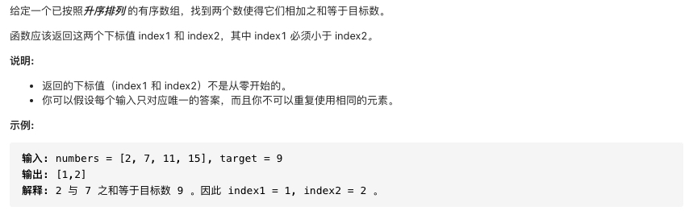
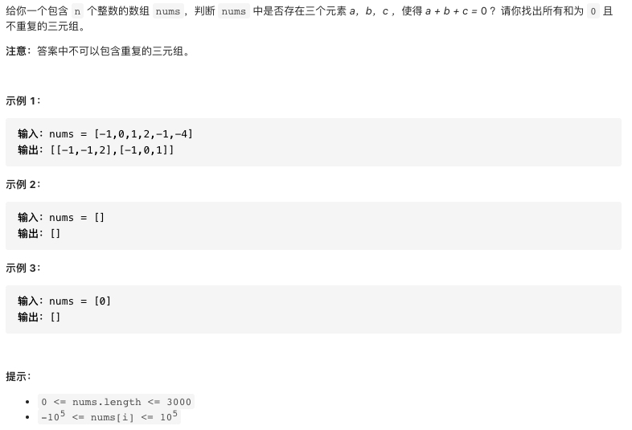
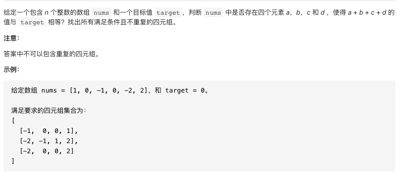
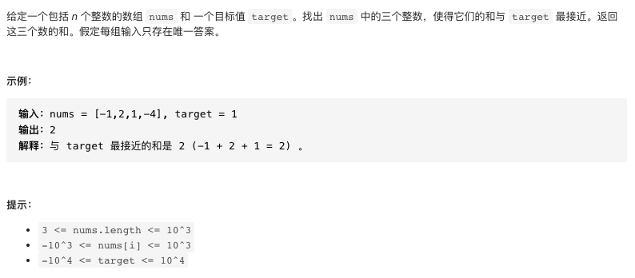
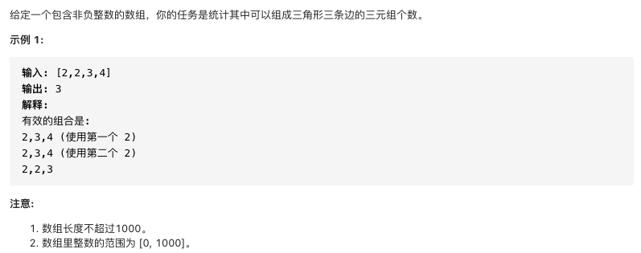

### 双指针

Leetcode 双指针题型有:
* [167.两数之和II-输入有序数组](https://leetcode-cn.com/problems/two-sum-ii-input-array-is-sorted/)
* [15.三数之和](https://leetcode-cn.com/problems/3sum/)
* [18.四数之和](https://leetcode-cn.com/problems/4sum/)
* [16.最接近的三数之和](https://leetcode-cn.com/problems/3sum-closest/)
* [611.有效三角形的个数](https://leetcode-cn.com/problems/valid-triangle-number/)

#### 167.两数之和II-输入有序数组



#### 参考代码

```cpp
class Solution {
public:
    vector<int> twoSum(vector<int>& nums, int target) {
        int left=0,right=nums.size()-1;
        while(left<right){
            int sum=nums[left]+nums[right];
            if(sum==target) return {left+1,right+1};
            else if(sum>target) right--;
            else left++;
        }
        return {-1,-1};
    }
};
```

#### 15.三数之和



#### 参考代码

```cpp
class Solution {
public:
    vector<vector<int>> threeSum(vector<int>& nums) {
        //两个关键点:
        //1.使用双指针
        //2.跳过重复元素:if(nums[i]==nums[i-1]) continue

        //双指针比较简单，这里重点讲讲跳过重复元素，假设nums排好序后是:[-1,-1,2,1]
        //这里有两个重复元素-1，所以要跳过-1
        //跳过-1并不会对结果有影响，因为与-1相关的解有[-1,-1,2],[-1,2,1]
        //若不跳过-1则会得到两个[-1,2,1]

        if(nums.size()<3) return {};
        sort(nums.begin(),nums.end());
        vector<vector<int>> res;
        for(int i=0;i<nums.size()-2;i++){
            //跳过重复元素(注意点1))
            if(i>0&&nums[i-1]==nums[i]) continue;
            int left=i+1,right=nums.size()-1;
            while(left<right){
                int sum=nums[i]+nums[left]+nums[right];
                if(sum==0){
                    res.push_back({nums[i],nums[left],nums[right]});
                    //这里不能break，有可能还有解(注意点2)
                    ++left;
                    //跳过重复元素，防止出现重复解(注意点3)
                    while(left<right&&nums[left]==nums[left-1]) ++left;
                    --right;
                    while(left<right&&nums[right]==nums[right+1]) --right;
                }
                else if(sum<0){
                    ++left;
                }
                else{
                    --right;
                }
            }
        }
        return res;
    }
};
```

#### 18.四数之和



#### 参考代码

```cpp
class Solution {
public:
    vector<vector<int>> fourSum(vector<int>& nums, int target) {
        //和三数之和思路一样
        if(nums.size()<4) return {};
        sort(nums.begin(),nums.end());
        vector<vector<int>> res;
        for(int first=0;first<nums.size()-3;first++){
            if(first>0&&nums[first]==nums[first-1]) continue;
            //下面和三数之和完全一样
            for(int second=first+1;second<nums.size()-2;second++){
                if(second>first+1&&nums[second]==nums[second-1]) continue;
                int third=second+1,fourth=nums.size()-1;
                while(third<fourth){
                    int sum=nums[first]+nums[second]+nums[third]+nums[fourth];
                    if(sum==target){
                        res.push_back({nums[first],nums[second],nums[third],nums[fourth]});
                        ++third;
                        while(third<fourth&&nums[third]==nums[third-1]) ++third;
                        --fourth;
                        while(third<fourth&&nums[fourth]==nums[fourth+1]) --fourth;
                    }
                    else if(sum<target){
                        ++third;
                    }
                    else{
                        --fourth;
                    }
                }
            }
        }
        return res;
    }
};
```

#### 16.最接近的三数之和



#### 参考答案

```cpp
class Solution {
public:
    int threeSumClosest(vector<int>& nums, int target) {
        //思路和三数之和一样
        sort(nums.begin(),nums.end());
        int res=nums[0]+nums[1]+nums[2];
        for(int first=0;first<nums.size()-2;++first){
            if(first>0&&nums[first]==nums[first-1]) continue;
            int second=first+1,third=nums.size()-1;
            while(second<third){
                int sum=nums[first]+nums[second]+nums[third];
                res=(abs(target-sum)<abs(target-res)?sum:res);
                if(sum==target){
                    return sum;
                }
                else if(sum<target){
                    ++second;
                }
                else{
                    --third;
                }
            }
        }
        return res;
    }
};
```

#### 611.有效三角形的个数



#### 参考答案

```cpp
class Solution {
public:
    int triangleNumber(vector<int>& nums) {
        //由于排序后nums[first]<=nums[second]<=nums[third]
        //所以nums[first]+nums[third]>nums[second],nums[second]+nums[third]>nums[first]
        //这里只需确定nums[first]+nums[second]>nums[third]是否成立
        //使用双指针
        sort(nums.begin(),nums.end());
        int res=0;
        for(int third=nums.size()-1;third>=2;--third){
            int first=0,second=third-1;
            while(first<second){
                if(nums[first]+nums[second]>nums[third]){
                    //nums[second]与nums[first],nums[first+1]...都成立，共有second-first种
                    //这里具有技巧性!!!
                    res+=second-first;
                    --second;
                }
                else{
                    ++first;
                }
            }
        }
        return res;
    }
};
```

