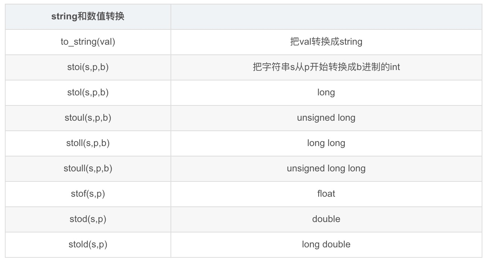

参考:[C++ string的用法和例子](https://blog.csdn.net/tengfei461807914/article/details/52203202)


### 声明与初始化

```cpp
string s;//声明一个string对象
string ss[10];//string数组
```

```cpp
//string (const char* s, size_t n);
char cs[]="12345";
string s1(cs,3);//复制字符串cs的前3个字符到s当中

//string (const string& str, size_t pos, size_t len = npos);
string s2="abcde";
string s3(s2,3);//从s2的下标3开始拷贝

//string (const string& str, size_t pos, size_t len = npos);
string s4="abcedfghi";
string s5(s4,3,4);//从s4的下标3开始拷贝4个长度
```

### 字符串处理

* substr操作:获取子串

```c++
//string substr (size_t pos = 0, size_t len = npos) const;
string s="abcdefg";
string s2=s.substr(1,5);//获取s的下标1开始的5个长度的子串
```

* insert操作:插入操作

```c++
//string& insert (size_t pos, const string& str);
string str="to be question";
string str2="the ";
string str3="or not to be";
str.insert(6,str2);//str此时为"to be the question";

//string& insert (size_t pos, const string& str, size_t subpos, size_t sublen);
str.insert(6,str3,3,4)//str此时为"to be not the question";
```

* erase操作:清除中间字符

```c++
//string& erase (size_t pos = 0, size_t len = npos);
string str="This is an example sentence.";
str.erase(10,8); //str此时为"This is an sentence.";
```

* append操作:尾部追加字符和字符串

```c++
//string& append (const string& str, size_t subpos, size_t sublen);
string str;
string str2="print 10 and then 5 more";
string str3="here:";
str.append(str2,6,3);//此时str为“10 ”

//string& append (const string& str);
str.append(str3);//直接添加，等价于+=,此时str为"10 here:";
```

* replace操作:替换

```c++
//string& replace (size_t pos,        size_t len,        const string& str);
string base="this is a test string";
string str2="n example";
string str3="sample phrase";

string str=base;
str.replace(9,5,str2);//将str的下标9开始的长为5的字符串全部替换为str2,此时str为"this is an example string";

//string& replace (size_t pos,        size_t len,        const string& str,size_t subpos, size_t sublen);
str.replace(19,6,str3,7,6);//将str的下标19开始的长为6的字符串全部替换为str3的下标7开始长为6的子串，此时str为"this is an example phrase";
```

### string 的搜索操作

* find和rfind函数

find函数主要是查找一个字符串是否在调用的字符串中出现过，大小写敏感。

```c++
string str="There are two nneedies in this haystack with needles.";
string str2="needle";
//size_t find (const string& str, size_t pos = 0) const noexcept; 从pos开始查找参考字符串str，找到则返回出现的位置,未查找到则返回结尾
size_t found=str.find(str2);
if(found!=string::npos){
    cout<<found<<endl;
}
```

rfind函数是从后往前查找，即找最后一个出现的匹配字符串，未查找成功则返回string::npos

* find_..._of函数
  * find_first_of(args):查找args中**任何一个字符**第一次出现的位置
  * find_last_of(args):查找最后一个出现的位置
  * find_first_not_of(args):查找第一个不在args中的字符
  * find_last_not_of(args):查找最后一个不在args中出现的字符

```c++
string str="Please, replace the vowels in this sentence by asterisks.";
size_t found=str.find_first_of("aeiou");
//把所有元音找出来用*代替
while(found!=string::npos){
    str[found]='*';
    found=str.find_first_of("aeiou",found+1);
}
cout<<str<<endl;
```

### 数值转换

c++11中定义好的字符串与数值转换函数如下图


```c++
stirng s1="123";
int a=stoi(s1);
cout<<a<<endl;
```

### clear与resize

clear函数清空字符串，字符串清空后成为空字符串，长度为0

resize函数调整字符串大小
```c++
//void resize (size_t n);
//void resize (size_t n, char c);

string str="I like to code in C";
unsigned sz=str.size();
str.resize(sz+2,'+');//str此时为"I like to code in C++";

str.resize(14);//str此时为"I like to code";
```


