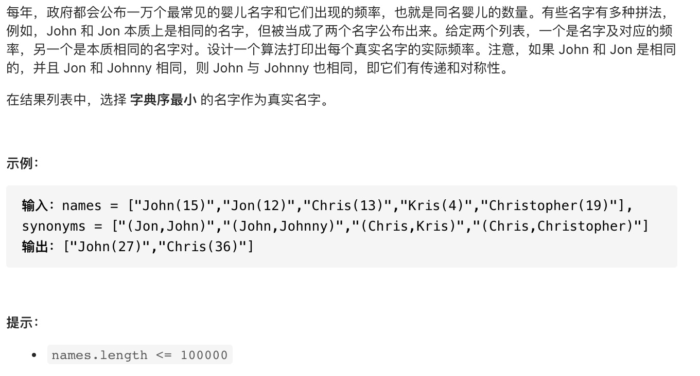
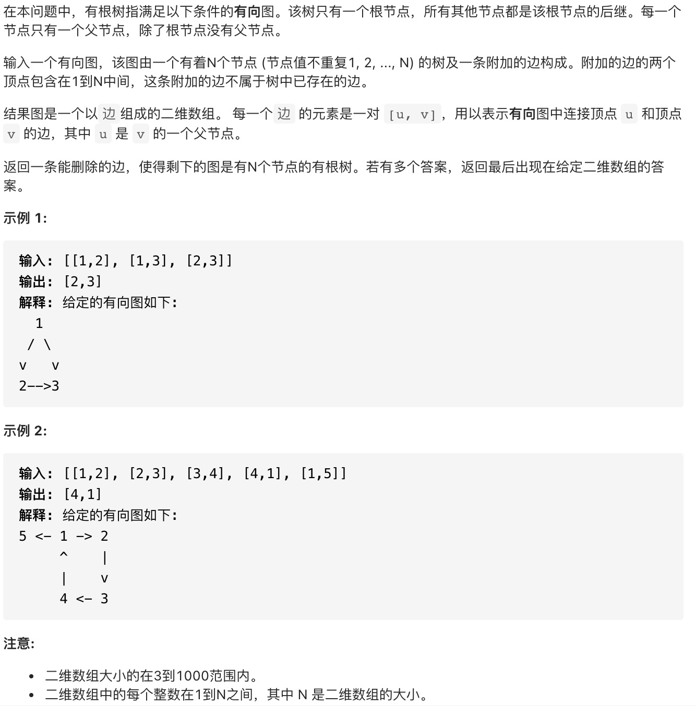
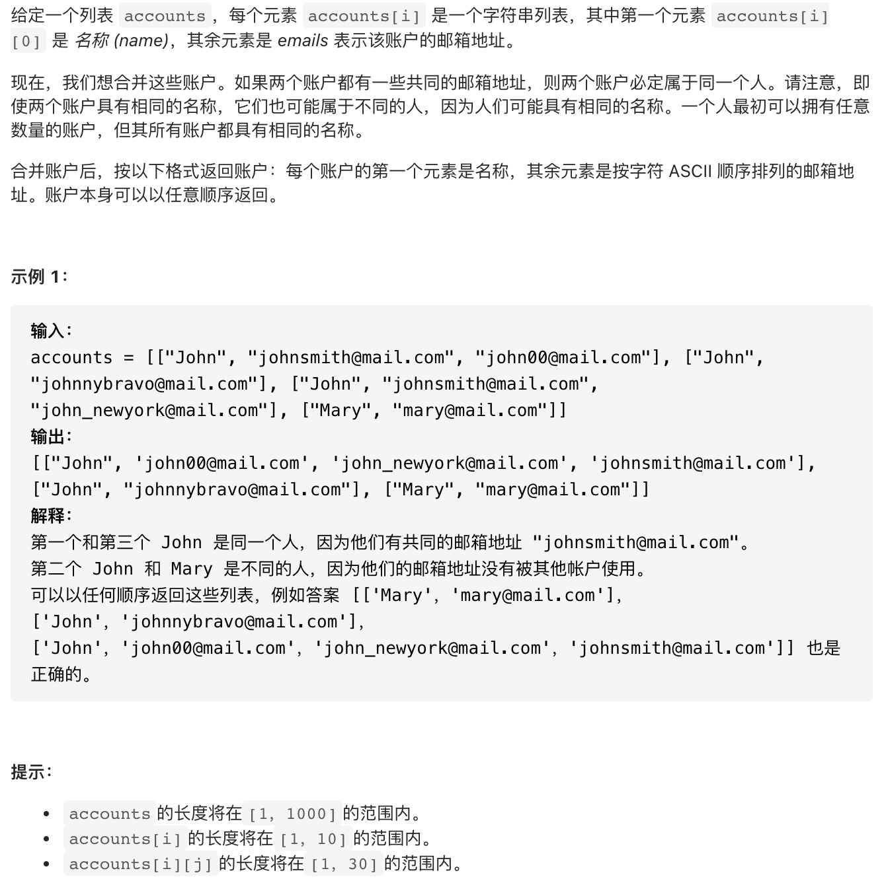
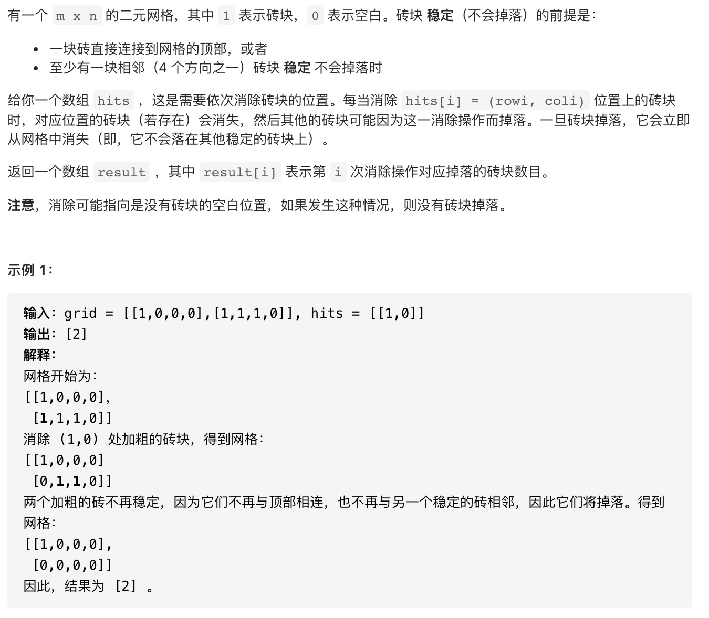
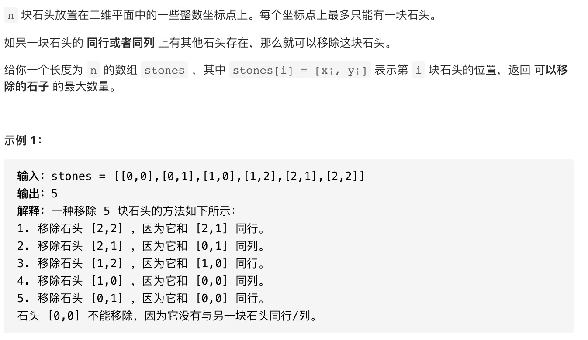

### 并查集

#### 并查集模板

```cpp
//并查集模板
vector<int> root;       //用于记录父节点

void init(int n){       //初始化root
    for(int i=0;i<n;++i)
        root.push_back(i);
}

int findRoot(int x){    //查找根结点
    // int y=x;
    while(x!=root[x]){
        x=root[x];
    }
    //路径压缩
    // while(x!=root[y]){
    //     int temp=root[y];
    //     root[y]=x;
    //     y=temp;
    // }
    return x;
}

void join(int x,int y){ //合并两个节点
    int root_x=findRoot(x);
    int root_y=findRoot(y);
    if(root_x!=root_y)
        root[root_x]=root_y;
}

```

#### 带权并查集模板

```cpp
//带权并查集模板
vector<int> root;       //用于记录父节点
vector<int> value;      //用于记录权重

void init(int n){       //初始化
    for(int i=0;i<n;++i){
        root.push_back(i);
        value.push_back(0);
    }
}

vector<int> findRoot(int x){//查找父节点并计算路径权重
    int v=0;
    while(x!=root[x]){
        x=root[x];
        v+=value[x];
    }
    return {x,v};
}

void join(int x,int y,int value){     //合并两个节点
    //value:x->y的权重
    auto res_x=findRoot(x);
    auto res_y=findRoot(y);
    if(res_x[0]!=res_y[0]){
        root[res_x[0]]=res_y[0];
        value[res_x[0]]=res_y[1]+value-res_x[1];    //更新权重
    }
}
```

#### Leetcode

* [面试题 17.07. 婴儿名字](https://leetcode-cn.com/problems/baby-names-lcci/)
* [685. 冗余连接 II](https://leetcode-cn.com/problems/redundant-connection-ii/)
* [721. 账户合并](https://leetcode-cn.com/problems/accounts-merge/)
* [803. 打砖块](https://leetcode-cn.com/problems/bricks-falling-when-hit/)
* [947. 移除最多的同行或同列石头](https://leetcode-cn.com/problems/most-stones-removed-with-same-row-or-column/)

#### 面试题 17.07. 婴儿名字



#### 参考代码

```cpp

```

#### 685. 冗余连接 II



#### 参考代码

```cpp

```

#### 721. 账户合并



#### 参考代码

```cpp

```

#### 803. 打砖块



#### 参考代码

```cpp

```

#### 947. 移除最多的同行或同列石头



#### 参考代码

```cpp

```