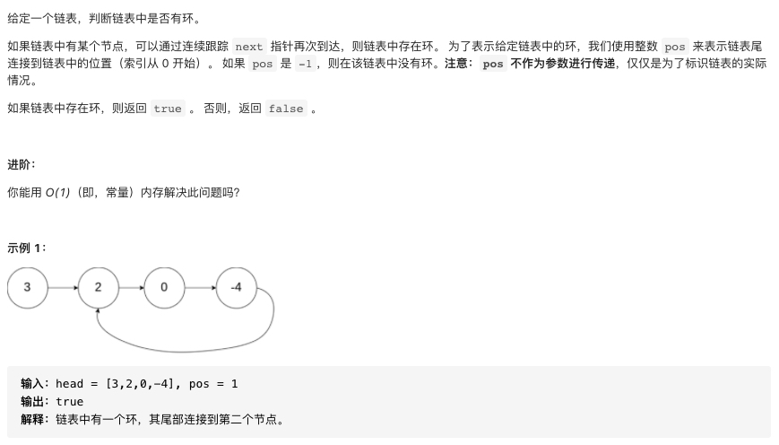
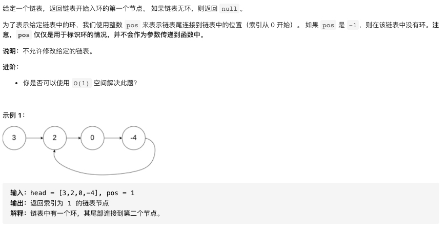
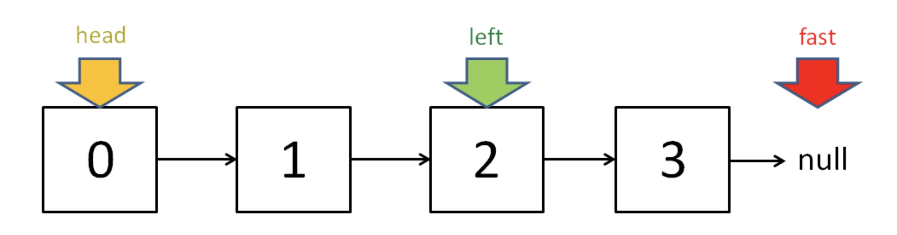
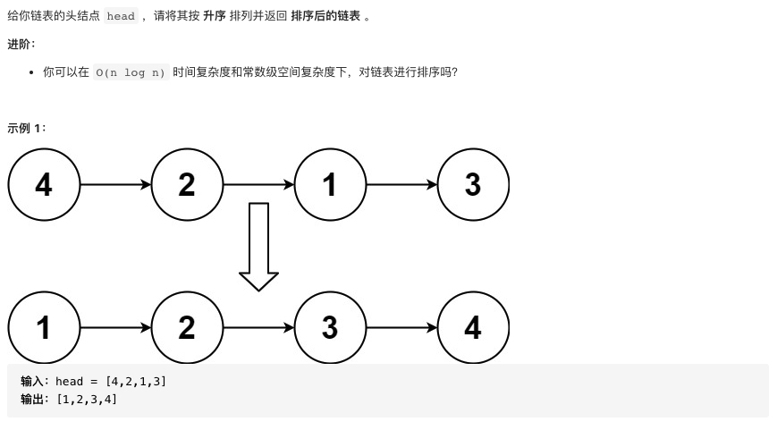
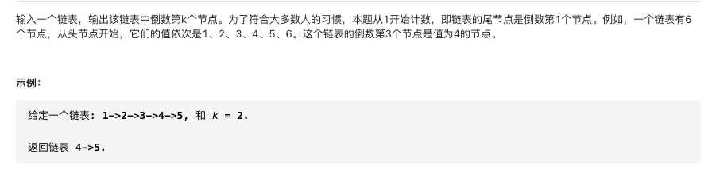

参考;[算法思维系列/双指针技巧](https://github.com/labuladong/fucking-algorithm/blob/master/%E7%AE%97%E6%B3%95%E6%80%9D%E7%BB%B4%E7%B3%BB%E5%88%97/%E5%8F%8C%E6%8C%87%E9%92%88%E6%8A%80%E5%B7%A7.md)


### 快慢指针的常见用法

#### 判断链表中是否含有环

##### 题目描述



##### 参考代码

```cpp
/**
 * Definition for singly-linked list.
 * struct ListNode {
 *     int val;
 *     ListNode *next;
 *     ListNode(int x) : val(x), next(NULL) {}
 * };
 */
class Solution {
public:
    bool hasCycle(ListNode *head) {
       ListNode* slow=head;
       ListNode* fast=head; 
       while(fast!=nullptr&&fast->next!=nullptr){
           slow=slow->next;
           fast=fast->next->next;
           if(slow==fast) return true;
       }
       return false;
    }
};
```
#### 已知链表中有环，返回这个环的起始位置

##### 题目描述



##### 参考代码

```cpp
/**
 * Definition for singly-linked list.
 * struct ListNode {
 *     int val;
 *     ListNode *next;
 *     ListNode(int x) : val(x), next(NULL) {}
 * };
 */
class Solution {
public:
    ListNode *detectCycle(ListNode *head) {
        ListNode* slow=head;
        ListNode* fast=head;
        while(fast!=nullptr&&fast->next!=nullptr){
            slow=slow->next;
            fast=fast->next->next;
            if(slow==fast) break;
        }
        if(fast==nullptr||fast->next==nullptr) return nullptr;
        slow=head;
        //技巧所在
        while(slow!=fast){
            slow=slow->next;
            fast=fast->next;
        }
        return slow;
    }
};
```

#### 寻找链表的中点

```cpp
//寻找链表中点
ListNode* slow=head;
ListNode* fast=head;
while(fast!=nullptr&&fast->next!=nullptr){
    slow=slow->next;
    fast=fast->next->next;
}
//当链表长度为奇数时,slow就指向中点位置,当链表长度为偶数时，slow指向中点偏右位置(可以把最右的那个null也看做节点就很好理解了)
return slow;
```



> 寻找链表的中点的经典应用就是对链表的归并排序

##### 题目描述(链表的归并排序)



###### 参考代码

```cpp
/**
 * Definition for singly-linked list.
 * struct ListNode {
 *     int val;
 *     ListNode *next;
 *     ListNode() : val(0), next(nullptr) {}
 *     ListNode(int x) : val(x), next(nullptr) {}
 *     ListNode(int x, ListNode *next) : val(x), next(next) {}
 * };
 */
class Solution {
public:
    ListNode* sortList(ListNode* head) {
        //链表的归并排序
        if(head==nullptr||head->next==nullptr) return head;
        return mergeSort(head);
    }
    ListNode* mergeSort(ListNode* first){
        //注意：只有一个元素的时候需要返回不然那会造成死循环
        if(first==nullptr||first->next==nullptr) return first;
        //step1:找中点
        ListNode* slow=first;
        ListNode* fast=first;
        ListNode* pre=slow;
        while(fast!=nullptr&&fast->next!=nullptr){
            pre=slow;
            slow=slow->next;
            fast=fast->next->next;
        }
        //step2:切断
        pre->next=nullptr;
        //step3:二路归并
        ListNode* l1=mergeSort(first);
        ListNode* l2=mergeSort(slow);
        ListNode* dummy=new ListNode(0);
        ListNode* q=dummy;
        while(l1!=nullptr&&l2!=nullptr){
            if(l1->val<=l2->val){
                q->next=l1;
                l1=l1->next;
                q=q->next;
            }
            else{
                q->next=l2;
                l2=l2->next;
                q=q->next;
            }
        }
        if(l1==nullptr) q->next=l2;
        if(l2==nullptr) q->next=l1;
        return dummy->next;
    }
};
```

#### 寻找链表的第k个元素

```cpp
ListNode slow, fast;
slow = fast = head;
//让快指针先走
while (k-- > 0)
    fast = fast.next;

while (fast != null) {
    slow = slow.next;
    fast = fast.next;
}
return slow;
```

##### 题目描述



##### 参考代码

```cpp
/**
 * Definition for singly-linked list.
 * struct ListNode {
 *     int val;
 *     ListNode *next;
 *     ListNode(int x) : val(x), next(NULL) {}
 * };
 */
class Solution {
public:
    ListNode* getKthFromEnd(ListNode* head, int k) {
        ListNode* fast=head;
        ListNode* slow=head;
        while(k){
            fast=fast->next;
            --k;
        }
        while(fast!=nullptr){
            slow=slow->next;
            fast=fast->next;
        }
        return slow;
    }
};
```
