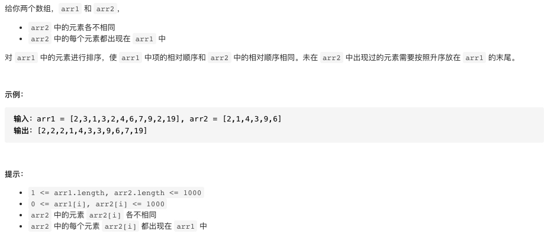
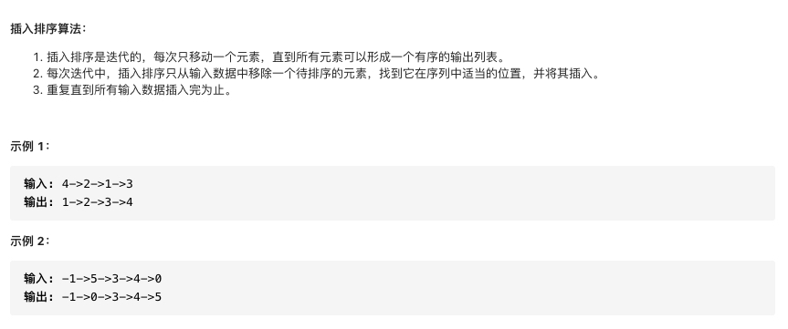

### 排序

#### Leetcode题目列表

* [1122. 数组的相对排序](https://leetcode-cn.com/problems/relative-sort-array/)
* [147. 对链表进行插入排序](https://leetcode-cn.com/problems/insertion-sort-list/)
* [148. 排序链表](https://leetcode-cn.com/problems/sort-list/)
* []()

#### 1122. 数组的相对排序



#### 参考代码

思想比较巧妙，自己做比较难想得到.

借鉴了`计数排序`的思想.

```cpp
class Solution {
public:
    vector<int> relativeSortArray(vector<int>& arr1, vector<int>& arr2) {
        //思想类似于计数排序
        vector<int> res;
        //数组用来记录arr1中元素的个数
        vector<int> B(1005,0);
        for(auto num:arr1) ++B[num];
        //按arr2的顺序摆放结果
        for(auto num:arr2){
            while(B[num]){
                res.push_back(num);
                --B[num];
            }
        }
        //将未出现在arr2中的元素按升序摆放
        for(int i=0;i<B.size();++i){
            while(B[i]){
                res.push_back(i);
                --B[i];
            }
        }
        return res;
    }
};
```

#### 147. 对链表进行插入排序(经典题)



#### 参考代码

```cpp
/**
 * Definition for singly-linked list.
 * struct ListNode {
 *     int val;
 *     ListNode *next;
 *     ListNode() : val(0), next(nullptr) {}
 *     ListNode(int x) : val(x), next(nullptr) {}
 *     ListNode(int x, ListNode *next) : val(x), next(next) {}
 * };
 */
class Solution {
public:
    ListNode* insertionSortList(ListNode* head) {
        /*

            这里其实考察的是链表节点的删除与插入

            q->[a->b->c...->pre]->p->...
                                    ^^^^
                                    next
            关键在于q,pre,p这三个指针
            q是第一个大于p的前一个位置

        */
        if(head==nullptr||head->next==nullptr) return head; 
        //插入排序需要一个占位符
        ListNode* dummy=new ListNode(0);
        dummy->next=head;
        //p为当前指针,pre为p的前一个指针
        ListNode* p=head;
        ListNode* pre=dummy;
        while(p!=nullptr){
            ListNode* q=dummy;
            //链表无法反向遍历，所以这里采用正向遍历
            //正向遍历查找第一个大于p->val的位置
            while(q->next!=p&&q->next->val<=p->val){
                q=q->next;
            }
            //q->next==p说明没有比p更大的元素
            if(q->next==p){
                //正常前移
                p=p->next;
                pre=pre->next;
            }
            else{
                //q此时指向第一个大于p->val的位置的前一个位置
                pre->next=p->next;
                p->next=q->next;
                q->next=p;
                //此时pre不需要移动
                p=pre->next;
            }
        }
        return dummy->next;
    }
};
```

#### 148.排序链表（经典题）


#### 参考代码

分析：链表的归并排序时间复杂度和数组的归并排序时间复杂度一样都是`O(nlogn)`,但是空间复杂度是`O(1)`,因为链表的归并不需要开辟额外的空间

本题在滑动窗口专题有提到.

```cpp
/**
 * Definition for singly-linked list.
 * struct ListNode {
 *     int val;
 *     ListNode *next;
 *     ListNode() : val(0), next(nullptr) {}
 *     ListNode(int x) : val(x), next(nullptr) {}
 *     ListNode(int x, ListNode *next) : val(x), next(next) {}
 * };
 */
class Solution {
public:
    ListNode* sortList(ListNode* head) {
        //链表的归并排序
        if(head==nullptr||head->next==nullptr) return head;
        return mergeSort(head);
    }
    ListNode* mergeSort(ListNode* first){
        //注意：只有一个元素的时候需要返回不然那会造成死循环
        if(first==nullptr||first->next==nullptr) return first;
        //step1:找中点
        ListNode* slow=first;
        ListNode* fast=first;
        ListNode* pre=slow;
        while(fast!=nullptr&&fast->next!=nullptr){
            pre=slow;
            slow=slow->next;
            fast=fast->next->next;
        }
        //step2:切断
        pre->next=nullptr;
        //step3:二路归并
        ListNode* l1=mergeSort(first);
        ListNode* l2=mergeSort(slow);
        ListNode* dummy=new ListNode(0);
        ListNode* q=dummy;
        while(l1!=nullptr&&l2!=nullptr){
            if(l1->val<=l2->val){
                q->next=l1;
                l1=l1->next;
                q=q->next;
            }
            else{
                q->next=l2;
                l2=l2->next;
                q=q->next;
            }
        }
        if(l1==nullptr) q->next=l2;
        if(l2==nullptr) q->next=l1;
        return dummy->next;
    }
};
```