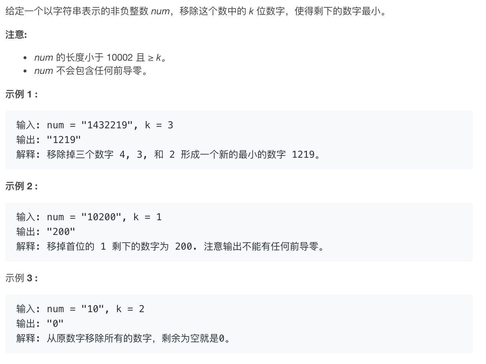
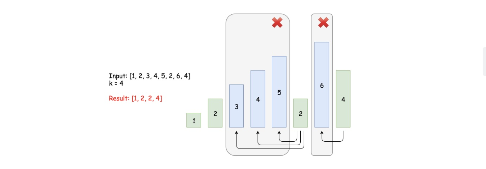

### 496.下一个更大元素（一）
#### 题目描述
.jpg)
#### 思路
先忽略数组nums1,之后通过**单调栈**将nums2中每一个元素的下一个更大的元素找出。
我们维护一个单调栈，栈中的元素从栈顶到栈底是**单调不降的**。
#### 题解
```c++
class Solution {
public:
    vector<int> nextGreaterElement(vector<int>& nums1, vector<int>& nums2) {
        stack<int> mystack;
        unordered_map<int,int> mymap;
        for(int i=0;i<nums2.size();i++){
            //细节:nums2[i]>mystack.top(),没有等于，题目是找下一个更大的元素，不包括等于
            while((!mystack.empty())&&(nums2[i]>mystack.top())){
                mymap[mystack.top()]=nums2[i];
                mystack.pop();
            }
            mystack.push(nums2[i]);
        }
        while(!mystack.empty()){
            mymap[mystack.top()]=-1;
            mystack.pop();
        }
        vector<int> ans;
        for(int i=0;i<nums1.size();i++){
            ans.push_back(mymap[nums1[i]]);
        }
        return ans;
    }
};
```
#### 复杂度分析
* 时间复杂度:O(M+N),其中M和N分别是nums1和nums2的长度
* 空间复杂度:O(N),用来存储nums2的栈和哈希表

#### 下一个更大元素(二)
.jpg)
##### 题解
```c++
class Solution {
public:
    vector<int> nextGreaterElements(vector<int>& nums) {
        vector<int> ans(nums.size(),0);
        stack<int> mystack;
        int L=nums.size();
        //通过取余来实现循环
        for(int i=2*L-1;i>=0;i--){
            while((!mystack.empty())&&(nums[i%L]>=mystack.top())){
                mystack.pop();
            }
            ans[i%L]=(mystack.empty()?-1:mystack.top());
            mystack.push(nums[i%L]);
        }
        return ans;
    }
};
```
##### 复杂度分析

* 时间复杂度:O(N),其中N为nums数组的大小
* 空间复杂度:O(N)

### 402.移除K位数字

#### 问题描述

#### 思路
采用`贪心策略+栈`来处理:给定一个数字序列$[D_1,D_2,D_3,...D_n]$,如果$D_2<D_1$,则我们应该删除$D_2$的左邻居$D_1$,以获得最小结果。
对于**逆序操作**，我们使用栈来从左到右处理:
- 对于每个数字，如果该数字小于栈顶部，即该数字的左邻居，则弹出堆栈，即删除左邻居。否则，我们把数字推到栈上。
- 我们重复上述步骤，直到任何条件不再适用，例如堆栈为空（不再保留数字）。或者我们已经删除了 k 位数字。
- 当我们离开主循环时，我们删除了`m`个数字，若比要求的要少，即$m<k$。在这种情况下，我们只需要从序列尾部删除额外的`k-m`个数字。
- 一旦我们从序列中删除`k`位数字，可能还有一些前导零。要格式化最后的数字，我们需要去掉前导零。

**这里实际上是维护了一个单调栈!!!**
#### 题解
```c++
class Solution {
public:
    string removeKdigits(string num, int k) {
        string ans="";
        int n=num.size(),m=n-k;
        for(auto ch:num){
            while(k&&ans.size()&&ch<ans.back()){
                ans.pop_back();
                k--;
            }
            ans.push_back(ch);
        }
        ans.resize(m);
        while((!ans.empty())&&ans[0]=='0'){
            ans.erase(ans.begin());
        }
        return ans.empty()?"0":ans;
    }
};
```
#### 复杂度分析
* 时间复杂度:O(N)
* 空间复杂度:O(N)

