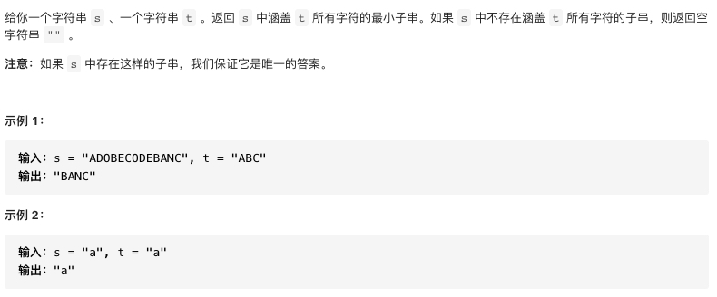

### 滑动窗口

参考:
1. [LeetCode 滑动窗口（Sliding Window）类问题总结](https://juejin.cn/post/6844903837447225358)
2. [滑动窗口算法框架](https://github.com/lingqing97/fucking-algorithm/blob/master/%E7%AE%97%E6%B3%95%E6%80%9D%E7%BB%B4%E7%B3%BB%E5%88%97/%E6%BB%91%E5%8A%A8%E7%AA%97%E5%8F%A3%E6%8A%80%E5%B7%A7.md)

```cpp
//滑动窗口基本框架
//不要记框架，重点是理解滑动窗口的思想
int slidingWindowTemplate(String a, ...) {
    // 输入参数有效性判断
    if (...) {
        ...
    }

    // 申请一个散列，用于记录窗口中具体元素的个数情况
    unordered_map<...,...> hash;

    // 预处理(可省), 一般情况是改变 hash
    ...

    // left 表示左指针
    int left=0;
    // result用来存储结果
    typename result;

    // right 表示右指针
    // 移动右指针
    for (int right = 0; right < A.length; ++right) {
        //根据条件更新hash
        if(满足一定条件){
            更新hash
        }
        //这里通常是关键点和难点
        //满足一定条件或不满足一定条件更新左指针
        while (条件不满足 or 条件满足) {
            // 可能会更新结果(可选)
            // result=...
            ...
            //移动左指针,更新hash
            hash[A[l]]++;
            l++;
        }
        // 可能会更新结果(可选)
        // results = ...
    }
    return results;
}
```

#### Leetcode题目

* [76.最小覆盖子串](https://leetcode-cn.com/problems/minimum-window-substring/)
* [567.字符串的排列](https://leetcode-cn.com/problems/permutation-in-string/)
* [438.找到字符串中所有字母异位词](https://leetcode-cn.com/problems/find-all-anagrams-in-a-string/)
* [3.无重复字符的最长子串](https://leetcode-cn.com/problems/longest-substring-without-repeating-characters/)
* [239.滑动窗口最大值](https://leetcode-cn.com/problems/sliding-window-maximum/)
* [424.替换后的最长重复字符](https://leetcode-cn.com/problems/longest-repeating-character-replacement/)
* [632.最小区间](https://leetcode-cn.com/problems/smallest-range-covering-elements-from-k-lists/)
* [1423.可获得的最大点数](https://leetcode-cn.com/problems/maximum-points-you-can-obtain-from-cards/)

#### 76.最小覆盖子串



#### 参考代码

```cpp
class Solution {
public:
    string minWindow(string s, string t) {
        //定义hash,用于记录当前窗口中包含t中各字符的情况
        unordered_map<char,int> hash;
        //初始化hash,记录t中各字符的数量
        for(auto ch:t)
            ++hash[ch];
        //left为左指针
        int left=0;
        //result用来存储结果
        string result="";
        //移动右指针
        for(int right=0;right<s.size();++right){
            char rch=s[right];
            //若rch是t中的字符则更新hash
            if(hash.count(rch)){
                hash[rch]--;
            }
            //找到一个子串
            while(check(hash)){
                //取最小的字符串
                string window=s.substr(left,right-left+1);
                result=(result.empty()||window.size()<result.size()?window:result);
                //移动左指针
                char lch=s[left];
                if(hash.count(lch)){
                    hash[lch]++;
                }
                left++;
            }
        }
        return result;
    }
    bool check(const unordered_map<char,int> &hash){
        for(auto p:hash){
            //题目要求找涵盖t的子串，所以这里小于0的子串也是符合条件的
            //这里是小于等于0的都满足条件,注意!!!
            if(p.second>0) return false;
        }
        return true;
    }
};
```

#### 567.字符串的排列


#### 参考代码

和上一题类似，只是改变滑动窗口的条件不同.

```cpp
class Solution {
public:
    bool checkInclusion(string s1, string s2) {
        //定义hash记录s1中各字符的数量
        unordered_map<char,int> hash;
        for(auto ch:s1)
            ++hash[ch];
        int left=0;
        for(int right=0;right<s2.size();++right){
            char rchar=s2[right];
            if(hash.count(rchar)){
                --hash[rchar];
            }
            //长度等于s1的长度，此时需要移动左指针
            if(right-left+1>=s1.size()){
                //判断当前窗口中的子串是否是s1的排列
                if(check(hash)) return true;
                //移动左指针
                char lchar=s2[left];
                if(hash.count(lchar)){
                    ++hash[lchar];
                }
                ++left;
            }
        }
        return false;
    }
    bool check(const unordered_map<char,int> &hash){
        for(auto p:hash){
            //这题是找排列，所以要全等于0才是满足条件的
            if(p.second!=0) return false;
        }
        return true;
    }
};
```

#### 438.找到字符串中所有字母异位词


#### 参考代码

和上一题一样，没有什么特色。

```cpp
class Solution {
public:
    vector<int> findAnagrams(string s, string p) {
        unordered_map<char,int> hash;
        for(auto ch:p)
            ++hash[ch];
        int left=0;
        vector<int> result;
        for(int right=0;right<s.size();++right){
            char rchar=s[right];
            if(hash.count(rchar)){
                --hash[rchar];
            }
            if(right-left+1>=p.size()){
                if(check(hash)) result.push_back(left);
                char lchar=s[left];
                if(hash.count(lchar)){
                    ++hash[lchar];
                }
                ++left;
            }
        }
        return result;
    }
    bool check(const unordered_map<char,int> &hash){
        for(auto p:hash){
            if(p.second!=0) return false;
        }
        return true;
    }
};
```

#### 3.无重复字符的最长子串


#### 参考代码

```cpp
class Solution {
public:
    int lengthOfLongestSubstring(string s) {
        if(s.empty()) return 0;
        unordered_map<char,int> hash;
        int left=0;
        int result=0;
        for(int right=0;right<s.size();++right){
            char rchar=s[right];
            ++hash[rchar];
            //这里保证滑动窗口中一定是不含有重复字符
            //若条件不满足，则移动左指针，直到条件满足
            while(!check(hash)){
                char lchar=s[left];
                --hash[lchar];
                ++left;
            }
            //更新结果
            result=max(result,(right-left+1));
        }
        return result;
    }
    bool check(const unordered_map<char,int> &hash){
        for(auto p:hash){
            if(p.second>1) return false;
        }
        return true;
    }
};
```

#### 239.滑动窗口最大值


#### 参考代码

这题的关键是想到用单调非递减的`deque`来保存最大值，次大值...
本质上是类单调栈与滑动窗口的结合.

```cpp
class Solution {
public:
    vector<int> maxSlidingWindow(vector<int>& nums, int k) {
        //这里借助一个非递增的deque来保存窗口中的最大值，次大值...
        deque<int> intDeque;
        int left=0,maxValue=INT_MIN;
        vector<int> res;
        for(int right=0;right<nums.size();++right){
            //更新deque,保证dque的非递增性
            while((!intDeque.empty())&&(nums[intDeque.back()]<nums[right])){
                intDeque.pop_back();
            }
            intDeque.push_back(right);
            //移动左指针
            if(right-left+1>=k){
                int temp=intDeque.front();
                res.push_back(nums[temp]);
                //更新deque
                if(left==temp){
                    intDeque.pop_front();
                }
                left++;
            }
        }
        return res;
    }
};
```

#### 424.替换后的最长重复字符


#### 参考代码

```cpp

```

#### 632.最小区间

![avatar]

#### 参考代码

```cpp

```

#### 1423.可获得的最大点数

![avatar]

#### 参考代码

```cpp

```