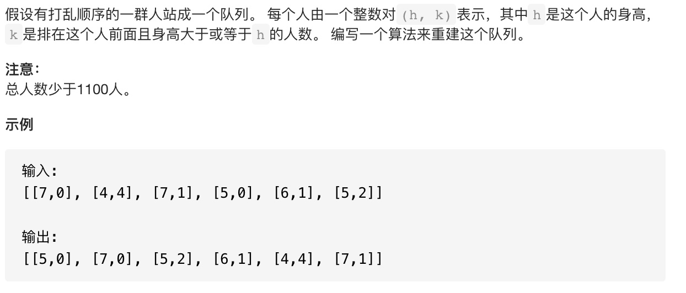

### 392.判断子序列
#### 题目描述

#### 题解
```c++
class Solution {
public:
    bool isSubsequence(string s, string t) {
        if(s.size()==0) return true;
        int a=0;
        for(int i=0;i<t.size();i++){
            if(s[a]==t[i]) a++;
            if(a==s.size()) return true;
        }
        return false;
    }
};
```
#### 复杂度
* 时间复杂度:O(N)
* 空间复杂度:O(1)

### 406.根据身高重建队列
#### 题目描述

#### 思路
贪心策略可以按一下步骤执行:
* 先对所有人按`h`降序排序，若`h`相同则按照`k`升序排序。
* 之后依次遍历每个人，将这个人插入到`k`值所在的位置

#### 题解
```c++
class Solution {
public:
    vector<vector<int>> reconstructQueue(vector<vector<int>>& people) {
        stable_sort(people.begin(),people.end(),[&](const vector<int>& a,const vector<int>& b){
            if(a[0]==b[0]) return a[1]<b[1];
            else return a[0]>b[0];
        });
        vector<vector<int>> ans;
        for(int i=0;i<people.size();i++){
            ans.insert(ans.begin()+people[i][1],people[i]);
        }
        return ans;
    }
};
```
#### 复杂度
* 时间复杂度：$\mathcal{O}\left(N^{2}\right)$ . 排序使用了 $\mathcal{O}(N \log N)$ 的时间，每个人插入到输出队列中需要 $\mathcal{O}(k)$ 的时间, 其中 $k$ 是当前输出队列的元素个数。总共的时间复杂度为 $\mathcal{O}\left(\sum_{k=0}^{N-1} k\right)=\mathcal{O}\left(N^{2}\right)$
* 空间复杂度：$\mathcal{O}\left(N\right)$，输出队列使用的空间。