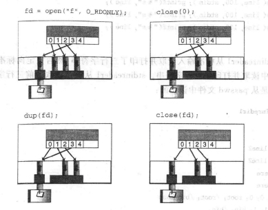
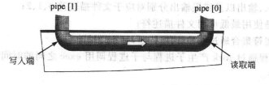

### chapter10 I/O 重定向和管道

#### 章节知识总结

所有的Unix工具都使用文件描述符0,1和2。标准输入文件的描述符是0,标准输出文件的描述符是1，而标准错误输出的文件描述符则是2。Unix假设文件描述符0、1、2已经被打开，可以分别进行读、写和写的操作了。

所谓文件描述符，是一个数组的索引号。每个进程都有其打开的一组文件。这些打开的文件被保持在一个数组中。文件描述符即为某文件在数组中的索引。

**最低可用文件描述符：当打开文件时，为此文件安排的描述符总是此数组中最低可用位置的索引。**

将`stdin`重定向到文件有三种方法:

##### 方法一:close(0)..open()

`close then open`的方法首先将`0`号文件描述符关闭于键盘的连接，由于此时最低可用文件描述符为`0`,当`open`一个新文件时，给该新文件分配的文件描述符为`0`,从而实现了将`stdin`重定向到文件。

```cpp
#include<stdio.h>
#include<unistd.h>  //for close()
#include<fcntl.h>   //for open()

int main()
{
    char line[100];

    //首先从键盘读取输入
    fgets(line,100,stdin); printf("%s\n",line);
    fgets(line,100,stdin); printf("%s\n",line);
    fgets(line,100,stdin); printf("%s\n",line);

    //close(0)-then-open(fd)
    close(0);
    if(open("/etc/passwd",O_RDONLY)==-1)
        perror("open");

    //之后从/etc/passwd读取输入
    fgets(line,100,stdin); printf("%s\n",line);
    fgets(line,100,stdin); printf("%s\n",line);
    fgets(line,100,stdin); printf("%s\n",line);

    return 0;
}
```

##### 方法二/三：open(file)..close(0)..dup(fd,0)..close(fd)  / open(file)..dup2(fd,0)..close(fd)

`open(file)..close(0)..dup(fd)..close(fd)`操作如下图所示：`fd=open(file)`首先分配一个文件描述符，之后`close(0)`使得此时最低可用文件描述符为`0`,通过`dup(fd)`将`fd`和最低可用文件描述符（此时为`0`）两个文件描述符都连接到新文件，此时`close(fd)`则只有`0`连接到新文件，从而实现`stdin`重定向到文件。

`dup2(fd,0)`操作相当于`close(0),dup(fd,0)`.



```cpp
#include<stdio.h>
#include<unistd.h>  //for close() and dup()
#include<fcntl.h>   //for open()

//#define CLOSE_DUP

int main()
{
    char line[100];

    fgets(line,100,stdin); printf("%s\n",line);
    fgets(line,100,stdin); printf("%s\n",line);
    fgets(line,100,stdin); printf("%s\n",line);

    //open(fd)..close(0)..dup(fd)..close(fd)
    int fd;
    if((fd=open("/etc/passwd",O_RDONLY))==-1)
        perror("open");

    #ifndef CLOSE_DUP
        close(0);
        if(dup(fd)==-1)
            perror("dup");
    #else
        dup2(fd,0);
    #endif

    close(fd);

    fgets(line,100,stdin); printf("%s\n",line);
    fgets(line,100,stdin); printf("%s\n",line);
    fgets(line,100,stdin); printf("%s\n",line);

    return 0;
}
```

要将`stdout`重定向到文件也可以采用上述的方法，只是将`open`操作改为`creat`操作即可，`creat`操作同样适用最低可用文件描述符。

需要注意的是，**文件描述符集合通过`exec`调用传递，且不会改变。** 利用这个特性可以实现父子进程之间的通信。

```cpp
//将子进程中exec调用程序的输出重定向到userlist
#include<stdio.h>
#include<unistd.h>      //for close()
#include<fcntl.h>       //for creat()

int main()
{
    int pid;
    printf("About to run who into a file\n");
    if((pid==fork())==-1){
        perror("fork");
    }
    if(pid==0){
        close(1);
        creat("userlist",0644);
        execlp("who","who",NULL);
        perror("execlp");
        exit(0);
    }
    else{
        wait(NULL);
        printf("Done running who. results in userlist.\n");
    }
    return 0;
}
```

管道是内核中的一个单向的数据通道。管道有一个读取端和一个写入端，通过`pipe(int array[2])`创建管道，其中`array[0]`为读数据端的文件描述符，而`array[1]`则为写数据段的文件描述符，类似于`open`调用，`pipe`调用也使用最低可用文件描述符。



将`pipe`和`fork`结合起来，就可以连接两个不同的进程了。两个进程都可以读写管道，但是当一个程序读，另一个进程写的时候，管道的使用效率是最高的。

下面通过一个简单的例子实现指令`pipe who sort`,其中`pipe`是指令关键字，`who`指令通过父进程执行`exec`实现，`sort`指令通过子进程执行`exec`实现(**非常好的一个例子**)。

注意：**只有共同父进程的进程之间才可以用管道连接。**

```cpp
#include<stdio.h>
#include<unistd.h>

#define oops(m,x) { perror(m); exit(x); }

int main(int ac,char* av[])
{
    int thepipe[2],newfd,pid;
    if(ac!=3){
        fprintf(stderr,"usage:pipe cmd1 cmd2\n");
        exit(1);
    }

    if(pipe(thepipe)==-1)
        oops("Cannot get a pipe",1);

    if((pid= fork())==-1)
        oops("Cannot fork",2);

    if(pid>0){
        close(thepipe[1]);
        if(dup2(thepipe[0],0)==-1)
            oops("Cannot not redirect stdin",3);
        close(thepipe[0]);
        execlp(av[2],av[2],NULL);
        oops(av[2],4);
    }
    close(thepipe[0]);
    if(dup2(thepipe[1],1)==-1)
        oops("Cannot not redirect stdin",4);
    close(thepipe[1]);
    execlp(av[1],av[1],NULL);
    oops(av[1],5);
    return 0;
}
```

与文件相比，管道的不同点体现在:

##### 从管道中读数据

1. 管道读取阻塞: 当进程试图从管道中读取数据时，进程被挂起直到数据被写进管道
2. 管道的读取结束标志: 当所有的写者关了管道的写数据端时，试图从管道读取数据的调用返回0，这意味着文件的结束
3. 多个读者可能会引起麻烦: 多个进程读取一个管道可能会产生不可预见的错误

##### 从管道中写数据

1. 写入数据阻塞直到管道有空间去容乃新的数据：管道容纳数据的能力要比磁盘文件差的多。
2. 写入必须保证一个最小的块大小(?)
3. 若无读者在读取数据，则写操作执行失败：如果所有的读者都已将管道的读取端关闭，那么对管道的写入调用将会执行失败(此时内核采用两种方法来通知进程：一是发送`SIGPIPE`消息该进程,若进程被终止，则无任何事情发生。否则(即未对`SIGPIPE`信号进行处理)，采用方法二，二是`write`调用返回-1,并且将`errno`置为`EPIPE`)。

#### 系统调用

| | dup,dup2 |
| :----: | :----: |
| 用途 | 复制一个文件描述符 |
| 头文件 | #include<unistd.h> |
| 函数原型 | newfd=dup(oldfd); newfd=dup2(oldfd,newfd); |
| 参数 | oldfd需要复制的文件描述符 ; newfd复制oldfd后得到的文件描述符 |
| 返回值 | -1:发生错误; newfd:新的文件描述符 |

| | pipe |
| :----: | :----: |
| 用途 | 创建管道 |
| 头文件 | #include<unistd.h> |
| 函数原型 | result=pipe(int array[2]) |
| 参数 | array:包含两个int类型数据的数组 |
| 返回值 | -1:发生错误 ； 0：成功 |