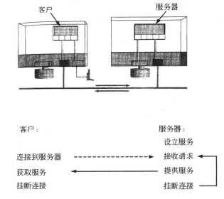

### chapter12 连接和协议：编写Web服务器

#### 章节知识总结

基于`socket`的客户/服务器系统处理流程如下图所示:



服务器的设计有两种方式:

1. 自己做(DO It Yourself,DIY):服务器接收请求，自己处理工作
2. 代理：服务器接收请求，然后创建一个新进程来处理工作

其中，自己做用于快速简单的任务，代理用于慢速的更加复杂的任务。

一个使用代理的服务器如下所示:

```cpp
#include<stdio.h>
#include<unistd.h>
#include<signal.h>
#include<sys/wait.h>
#include<sys/errno.h>

int make_server_socket(int portnum);
int connect_to_server(char* host,int portnum);

#define PORTNUM 15000
#define oops(msg) { perror(msg); exit(1); }

static int cnt=1;

void process_request(int fd)
{
    if(fork()==0){
        dup2(fd,1);
        close(fd);
        execlp("date","date",NULL);
        oops("execlp");
    }
}

void child_waiter(int signum)
{
    //wait(NULL);
    //同时处理多个SIGCHLD信号
    //值-1表示等待所有的子进程
    while(waitpid(-1,NULL,WNOHANG)>0);
}

void main()
{
    int sock_id;
    signal(SIGCHLD,child_waiter);
    sock_id=make_server_socket(PORTNUM);
    if(sock_id==-1)
        oops("make_server_socket");
    while(1)
    {
        int fd=accept(sock_id,NULL,NULL);
        if(fd==-1)
            //过滤信号中断导致的fd=-1
            if(errno==EINTR)
                continue;
            else
                exit(1);
        process_request(fd);
        close(fd);
    }
}
```

如上述代码所示，在服务器中通过`fork()`创建一个新进程去处理客户端的情况，**当子进程退出或被终止时内核发送`SIGCHLD`给父进程**，此时父进程通过`waitpid`批量回收多个子进程。
在上述代码中需要注意的是，当程序运行到信号处理函数跳转时会中断系统调用accept,**当accpet被信号中断时，返回-1，然后设置`errno`到`EINTR`**,在代码中对这种情况进行了处理。


web服务器通信具备3种用户操作：

1. 列举目录信息
2. cat文件
3. 运行程序

此外，客户端（浏览器）与Web服务器之间的请求和应答的格式遵循`HTTP`协议,且请求和应答采用纯文本格式，这样便于使用C中的输入和输出以及字符串函数读取和处理。

HTTP协议对请求和应答的格式要求如下：

1. 客户发送请求

```shell
GET filename HTTP/version
可选参数
空行
```

2. 服务器发送应答

```shell
HTTP/version status-code status-message
附加信息
空行
内容
```

基于socket的Web服务器实现可以参考[github](https://github.com/lingqing97/Unix_Linux_bookcode/blob/main/ch12/websev.c)