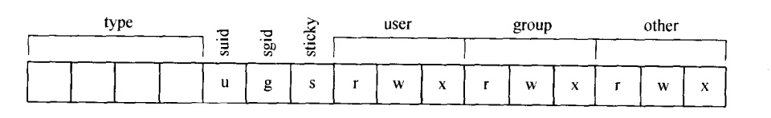

### chapter3 目录与文件属性

#### 章节知识总结

磁盘上有文件和目录，文件和目录都有内容和属性（目录其实也可以看做一个文件）。文件的内容可以是任意的数据，目录的内容只能是文件名/子目录名的列表。

对于操作系统（例如内核）而言，文件名前面的"."没有任何特殊的含义，它只对`ls`的使用者有意义。

磁盘上的文件和目录被组织成一棵目录树，每个节点都是目录或文件,甚至光盘这些移动存储介质也被挂到文件树的某一个子目录来处理。

目录中文件名/子目录名指向文件和其他的目录，内核提供了系统调用过来读取目录的内容、读取和修改文件的属性。

* opendir(filename):打开一个目录
* readdir(dirp):读取目录中的内容
* closedir(dirp):关闭目录

文件类型、文件的访问权限和特殊属性被编码存储在一个16位整数中(如下图所示)，可以通过掩码技术来读取这些信息。

  * 三个特殊的位:
    * `set-user-ID`位:`SUID`告诉内核，运行这个程序的时候认为由文件所有者在运行这个程序
    * `set-group-ID`位:`SGID`告诉内核，运行这个程序的时候认为由该文件所在组的某一个用户运行一样
    * `sticky`位:对于文件来说，`sticky`位告诉内核即使没有人在使用程序，也要把它放在交换空间中;对于目录来说，`sticky`位使得目录里的文件只能被创建者删除



文件所有者和组信息都是以ID(`uid`和`gid`)的形式保存的，它们与用户名和组名的联系保存在`passwd`和`group`数据库中。

  * 注意，一个用户可以同时属于多个组


每个文件都有3个时间:最后修改(modification)时间、最后访问(access)时间和属性(如用户所有者ID、许可权限)最后修改时间。

  * `utime`系统调用可以用来设置最后修改时间和最后访问时间

#### ls指令实现

`ls`指令实现如下:

```cpp
/*
    ls指令简易实现
*/
#include<stdio.h>
#include<dirent.h>      //for struct dirent
#include<sys/stat.h>    //for struct stat
#include<time.h>        //for ctime()
#include<pwd.h>         //for struct passwd
#include<grp.h>         //for struct group

#define MAXLEN 256

//函数声明
void do_ls(char[]);
void show_stat(char*,char*);
void show_file_info(char*,struct stat*);
char *uid_to_name(int);
char *gid_to_name(int);
void mode_to_letter(int,char[]);

int main(int ac,char* av[]){
    if(ac==1){
        do_ls(".");
    }
    else{
        while(--ac){
            do_ls(*++av);
        }
    }
    return 0;
}

void do_ls(char* dirname){
    DIR* dir;
    struct dirent* dirbufp;
    char* fullpath=(char*)malloc(strlen(dirname)+MAXLEN+1);
    if((dir=opendir(dirname))==NULL){
        //打开目录失败
        perror(dirname);
        exit(1);
    }
    else{
        while((dirbufp=readdir(dir))!=NULL){
            sprintf(fullpath, "%s/%s",dirname,dirbufp->d_name);
            show_stat(fullpath,dirbufp->d_name);
        }
        closedir(dir);
    }
}

void show_stat(char* fullpath,char* filename){
    struct stat info;
    if(stat(fullpath,&info)==-1)
        perror(filename);
    else
        show_file_info(filename,&info);
}

void show_file_info(char* filename, struct stat* info_p){
    char modestr[11];
    //将数值mode转为字符串mode
    mode_to_letter(info_p->st_mode,modestr);

    printf("%s",modestr);
    printf("%4d ",info_p->st_nlink);
    printf("%-8s ",uid_to_name(info_p->st_uid));
    printf("%-8s ",gid_to_name(info_p->st_gid));
    printf("%-8ld",info_p->st_size);
    printf("%.12s ",4+ctime(&info_p->st_mtime));
    printf("%s\n",filename);
}

void mode_to_letter(int mode,char str[]){

    strcpy(str,"----------");
    if(S_ISDIR(mode)) str[0]='d';
    if(S_ISCHR(mode)) str[0]='c';
    if(S_ISBLK(mode)) str[0]='b';

    if(mode & S_IRUSR) str[1]='r';
    if(mode & S_IWUSR) str[2]='w';
    if((mode & S_ISUID) && (mode & S_IXUSR)) str[3]='s';
    else if((mode & S_ISUID) && !(mode & S_IXUSR)) str[3]='S';
    else if(mode & S_IXUSR) str[3]='x';

    if(mode & S_IRGRP) str[4]='r';
    if(mode & S_IWGRP) str[5]='w';
    if((mode & S_ISGID) && (mode & S_IXGRP)) str[6]='s';
    else if((mode & S_ISGID) && !(mode & S_IXGRP)) str[6]='S';
    else if(mode & S_IXGRP) str[6]='x';

    if(mode & S_IROTH) str[7]='r';
    if(mode & S_IWOTH) str[8]='w';
    if((mode & S_ISVTX) && (mode & S_IXOTH)) str[9]='t';
    else if((mode & S_ISVTX) && !(mode & S_IXOTH)) str[9]='T';
    else if(mode & S_IXOTH) str[9]='x';
}

char* uid_to_name(int uid){
    struct passwd* pwd;
    char numstr[10];
    if((pwd=getpwuid(uid))==NULL){
        fprintf(numstr,"%d",uid);
        return numstr;
    }
    else{
        return pwd->pw_name;
    }
}

char* gid_to_name(int gid){
    struct group* grp_ptr;
    char numstr[10];
    if((grp_ptr=getgrgid(gid))==NULL){
        fprintf(numstr,"%d",gid);
        return numstr;
    }
    else
        return grp_ptr->gr_name;
}
```
