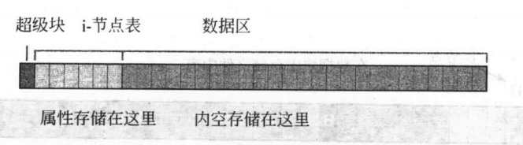
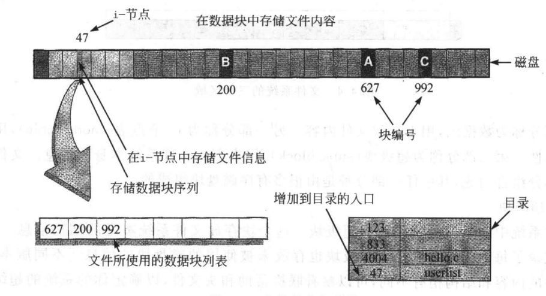
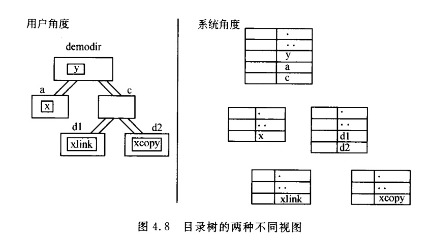
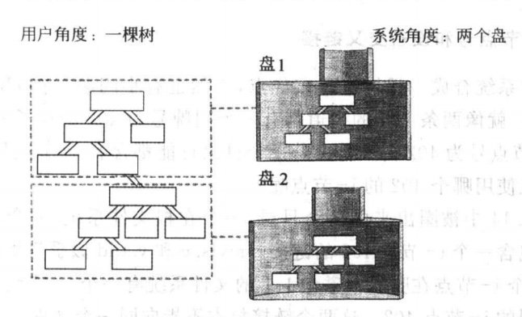

### chapter4文件系统

#### 章节知识总结

一个磁盘可以被划分成分区，每个分区都可以被看做是一个独立的磁盘。

一个硬盘由一些`磁性盘片`组成，每个盘片的表面都被划分为很多同心圆，这些`同心圆称作磁道`，每个磁道又进一步被划分成`扇区`.`扇区`是磁盘上的基本存储单元，现在的磁盘包含大量的扇区。

磁盘上存储数据的软件给磁盘上每条磁道上的每个块分配了一个序号，文件系统将被编号的磁盘块划分为3部分：

* 超级块:用来存放文件系统本身的信息(这些信息包括未使用的磁盘块的信息等)
* i-节点表(inode table):用来存放文件属性
* 数据区：用来存放文件内容，文件的内容保存在这个区域，磁盘上所有块的大小都是一样的。



文件创建主要操作包括:

1. 存储属性：内核先找到一个空的i-节点，内核把文件的信息记录其中
2. 存储数据：内核从自由块的列表中找出满足条件的自由块，将数据复制到这些自由块中
3. 记录分配情况：内核在i-节点的`磁盘分布区`记录上述的块序列
4. 添加文件名到目录：内核将i-节点编号添加到目录文件




在文件系统内部，目录是一个包含文件名与i-节点对的列表的文件。从用户的角度看到的是一个文件名的列表，而从Unix的角度看到的是一个被命名的指针的列表。



从上图我们可以知道:

* "文件在目录中"的真正含义：目录包含的是文件的引用，每个引用被称为链接，而文件的内容存储在数据块中。
* "目录有一个父目录"的真正含义：目录中".."是父目录的保留名字

在Unix的文件系统中，文件没有文件名，但是链接具有名字。文件仅仅具有i-节点号。

Unix运行将一个磁盘的存储组织成一棵由多棵树相互连接的树，每个磁盘或磁盘上的每个分区都包含一棵目录树。这些独立的树被连接成一棵单一的几乎无缝的树。



在Unix中，装载文件系统是指将它嵌入到已有的系统以获得某些支持，子树的根目录被嵌入到根文件系统的一个目录中，子树所在的目录被称作第二个系统的`装载点`。

```shell
#使用mount指令列出当前所装载的文件系统以及它们的装载点
> mount
/dev/disk1s4 on /System/Volumes/VM (apfs, local, noexec, journaled, noatime, nobrowse)
/dev/disk1s2 on /System/Volumes/Preboot (apfs, local, journaled, nobrowse)
/dev/disk1s6 on /System/Volumes/Update (apfs, local, journaled, nobrowse)
/dev/disk1s1 on /System/Volumes/Data (apfs, local, journaled, nobrowse)
```

由于一棵目录树可能由多棵子树连接而成的，这就导致一个i-节点号并不唯一地标识一个文件了，从而使得有些命令，比如`link`拒绝创建跨越设备的链接，`rename`拒绝在不同的稳健性同间进行i-节点号的转移。

### pwd指令实现

pwd指令的工作过程如下:

1. 得到"."的i-节点号，称其为n(使用`stat`)
2. chdir"..":由于i-节点的名字记录在父节点中，所以需要跳转到父节点
3. 找到i-节点号n链接的名字(使用`opendir`,`readdir`,`closedir`)
重复（直到到达树的顶端，当"."和".."的i-节点号相同时，就可以认为已经到达文件树的顶端）

```cpp
#include<stdio.h>
#include<sys/stat.h>    //for stat()
#include<dirent.h>      //for struct dirent
#include<unistd.h>      //for chdir()

#define BUFSIZE 1024

int get_node(char*);
void print_path_to(ino_t);
void inum_to_name(ino_t,char*,int);

int main(){
    print_path_to(get_node("."));
    printf("\n");
    return 0;
}

//打印路径
//实现方法：递归遍历目录树
void print_path_to(ino_t this_node){
    // printf("this_node:%d\n",this_node);
    char this_name[BUFSIZE];
    //递归打印路径
    if(get_node("..")!=this_node){
        chdir("..");
        //根据inode-id获取文件名
        inum_to_name(this_node,this_name,BUFSIZE);
        ino_t next_node=get_node(".");
        // printf("next_node:%d",next_node);
        print_path_to(next_node);
        printf("/%s",this_name);
    }
}

//通过inode-id获取文件名
//实现方法:通过readdir()获得文件名
void inum_to_name(ino_t this_node,char* filename,int buf_len){
    //打开目录
    DIR* dp;
    if((dp=opendir("."))==NULL){
        perror("opendir");
        exit(1);
    }
    //读取目录内容
    struct dirent* dir_buf;
    while((dir_buf=readdir(dp))!=NULL){
        //找到当前目录"."
        if(dir_buf->d_ino==this_node){
            strncpy(filename,dir_buf->d_name,buf_len);
            filename[buf_len-1]='\0';
            closedir(dp);
            return;
        }
    }
}

//获取文件的inode-id
//实现方法：通过stat()获取文件的inode-id信息
int get_node(char* filename){
    struct stat stat_buf;
    if(stat(filename, &stat_buf)==-1){
        perror(filename);
        exit(1);
    }
    return stat_buf.st_ino;
}
```