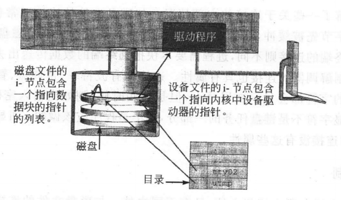
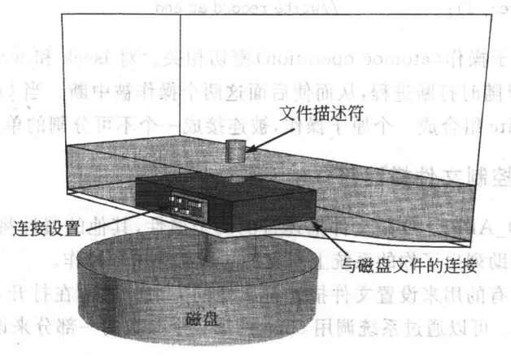

### chapter5 连接控制：学习stty

#### 章节知识总结

对于Unix来说，声卡、终端、鼠标和磁盘文件是同一种对象。在Unix系统中，每个设备都被当做一个文件。

每个设备都有一个文件名、一个i-节点号、一个文件所有者、一个权限位的集合和最近修改时间。

按传统定义，终端是键盘和显示单元，但实际可能包括打印机等.终端最重要的功能就是接受来自用户的字符输入和将输出信息显示给用户。

相比于普通文件的属性，设备文件比较特殊的地方在于:

* 设备文件的i-节点存储的是指向内核子程序的指针，而不是文件的大小和存储列表
* 设备文件的大小,比如"136,2",其中136和2这两个数被称为设备的主设备号和从设备号。主设备号确定处理该设备实际的子程序，而从设备号被作为参数传输到该子程序。



i-节点的类型被记录在结构`stat`的成员变量`st_mode`的类型区域中。

如果文件是磁盘文件，那么内核通过访问块分配表来读取数据。如果文件是设备文件，那么内核通过调用该设备驱动程序的read部分来读取数据。

系统调用`open`用于在进程和磁盘文件之间创建一个连接，该连接含有若干个属性，可以通过`fcntl`函数来进行设置，下面是两个小例子:

```cpp
//例子一

//关闭文件描述符的缓冲
int set_sync(){
    int fd=open("test.txt",O_RDONLY);
    if(fd==-1){
        perror("open file error");
        exit(1);
    }
    //读取连接属性
    int s=fcntl(fd,F_GETFL);
    //修改连接属性
    s |= O_SYNC;
    //写回连接属性
    if(fcntl(fd,F_SETFL,s)==-1){
        perror("setting SYNC");
        exit(1);
    }
    //判断是否设置成功
    if(fcntl(fd,F_GETFL) & O_SYNC)
        printf("set SYNC to 1.\n");
    else
        printf("set SYNC to 0.\n");
    close(fd);

    return 0;
}
```

```cpp
//例子二

//启动自动添加模式
//自动添加模式：每次对write的调用前先自动调用lseek，且内核将lseek和write组合成一个原子操作
int set_append(){
    int fd=open("test.txt",O_RDONLY);
    if(fd==-1){
        perror("open file error");
        exit(1);
    }
    int s=fcntl(fd,F_GETFL);
    s |= O_APPEND;
    if(fcntl(fd,F_SETFL,s)==-1){
        perror("setting APPEND");
        exit(1);
    }
    //判断是否设置成功
    if(fcntl(fd,F_GETFL) & O_APPEND)
        printf("set APPEND to 1.\n");
    else
        printf("set APPEND to 0.\n");
    close(fd);
}
```



处理进程和外部设备间数据流的内核子程序的集合被称为终端驱动程序或tty驱动程序。驱动程序包含很多控制设备操作的设置。进程可以读、修改和重置这些驱动控制标志。通过指令在`tcgetattr()`和`tcsetattr()`分别进行终端设备的控制标志的读和写。


#### stty指令部分实现

`stty`指令的一小部分代码实现如下:

```cpp
#include<stdio.h>
#include<termios.h>     //for struct termios

//显示终端的回显位的状态
int echostate(){
    struct termios ter_buf;
    //文件描述符0表示标注输入
    if(tcgetattr(0,&ter_buf)==-1){
        perror("tcgetattr");
        exit(1);
    }
    if(ter_buf.c_lflag & ECHO)
        printf("echo is on,since its bits is 1\n");
    else
        printf("echo is off,since its bits is 0\n");

    return 0;
}

//改变终端的回显位的状态
int echoset(int ac,char* av[]){
    if(ac==1) exit(1);
    struct termios ter_buf;
    //读取状态位
    if(tcgetattr(0,&ter_buf)==-1){
        perror("tcgetattr");
        exit(1);
    }
    //修改状态位
    if(av[1][0]=='y'){
        //置位
        ter_buf.c_lflag |=ECHO;
    }
    else
        //清除位
        ter_buf.c_lflag &=~ECHO;
    //写回状态位
    if(tcsetattr(0,TCSANOW,&ter_buf)==-1){
        perror("tcsetattr");
        exit(1);
    }
    return 0;
}

int main(int ac,char* av[]){
    echoset(ac,av);
    echostate();
    return 0;
}
```