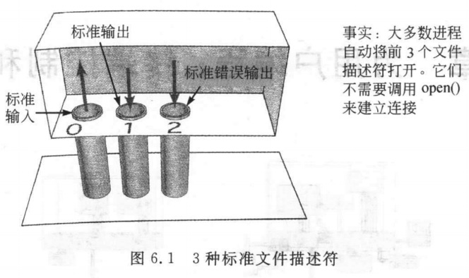
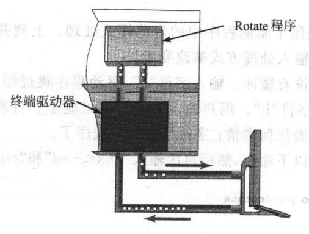

### chapter6 为用户编程：终端控制和信号

#### 章节知识总结

软件工具从标准输入读取字节，进行一些处理，然后将包含结果的字节流写到标准输出。工具发送错误消息到标准错误输出，它们也被当做简单的字节流来处理。



终端驱动程序完成缓冲、回显、编辑和控制键处理等操作。**缓冲和编辑包含在规范处理**，当这些特征被启动，终端连接被称为处于规范模式。

  * 规范模式，也被称为`cooked`模式，是用户常见的模式。驱动程序输入的字符保存在缓冲区，并且仅在接受到回车键时才将这些缓冲的字符发送到程序。缓冲数据使驱动程序可以实现最基本的编辑功能，如删除字符、单词或整行。可以通过命令`stty`或系统调用`tcsetter`来修改
  * 当`缓冲`和`编辑功能`被关闭时，连接被称为处于非规范模式。如果用非规范模式编写程序，并且希望用户能够编辑它们的输入，需要在你的程序中实现编辑功能。

可以通过指令`stty -canon`关闭终端驱动程序中的规范模式处理。



**Unix中的软件中断被称为信号(`signal`)**,信号由内核产生，生成信号的请求来自3个地方:

1. 用户:用户能够通过输入`Crtl-C`、`Ctrl-\`等生成信号
2. 内核:当进程执行出错时，内核给进程发送一个信号;内核也利用信号通知进程特定事件的发生
3. 进程:一个进程可以通过系统调用`kill`给另一个进程发送信号。一个进程可以和另一个进程通过信号通信

常见的信号有:
* `Crtl+c`产生`SIGINT`中断信号
* `Crtl+\`产生`SIGQUIT`退出信号
* 计时器产生`SIGALRM`信号


当进程接受到信号时，有3个选择:

1. 接受默认处理（通常是消亡）
2. 忽略信号
3. 调用一个函数：在信号到来时被调用的函数被称为信号处理函数

信号处理的简单例子:

```cpp
#include<stdio.h>
#include<signal.h>

void main(){
    void f(int);
    int i;
    signal(SIGINT,f);
    for(i=0;i<5;++i)
    {
        printf("hello\n");
        sleep(1);
    }
}
void f(int signum)
{
    printf("OUCH!\n");
}
```

对于系统管理员（和程序员）来说,Unix有两个信号是不能被忽略和捕捉的，这两个信号是`SIGSTOP(Crtl+Z)`和`SIGKILL`。

#### 系统调用

##### signal

| | signal |
| :----: | :----: |
| 用途| 简单的信号处理 |
| 头文件 | #include<signal.h> |
| 函数原型 | result=signal(int signum,void(*action)(int)) |
| 参数 | signum: 需响应的信号; action: 信号处理函数 |
| 返回值 | -1: 遇到错误； prevaction: 前一个处理函数，值是指向函数的指针 |

