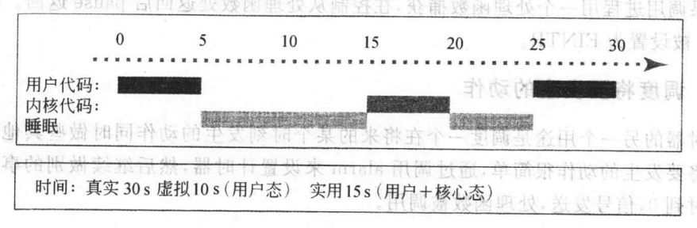

### chapter7 事件驱动编程

#### 章节知识总结

`curses`库是一组函数，程序员可以用它们来设置光标的位置和终端屏幕上显示的字符样式。一个小的demo如下:

```cpp
#include<stdio.h>
#include<curses.h>

//在终端显示"Hello world"
int main(){
    initscr();
    clear();
    move(10,20);
    addstr("Hello world");
    move(LINES-1,0);
    refresh();
    getch();
    endwin();
}
```

`sleep`调用可以通过`alarm`和`pause`两个操作实现:

```cpp
int main(){
    void wakeup(int);
    //模拟sleep(4)
    signal(SIGALRM,wakeup);     //为SIGALRM设置一个处理函数
    alarm(4);                   //调用alarm
    pause();                    //调用pause
    printf("Morning so sonn?\n");
}
```

进程可以使用3种方式来计时:



1. `ITIMER_REAL`:计量真实事件
2. `ITIMER_VIRTUAL`:只有进程在用户态时才计时
3. `ITIMER_PROF`:这个计时器在进程运行于用户态或由该进程调用而陷入核心态时计时。当这个计时器用尽，发送`SIGPROF`消息。

Unix提供了间隔计时器这种更精确的计时器，可以通过`setitimer`和`getitimer`来搭配使用间隔计时器。

一个计时器是内核的一种机制。通过这种机制，内核在一定的时间之后向进程发送`SIGALRM`.`alarm`系统调用用在特定的实际秒数之后发送`SIGALRM`给进程。`setitimer`系统调用以更高的精度控制计时器，同时能够以固定的时间间隔发送信号。

在第六章中我们知道，一个进程调用`signal`在以下3种处理信号的方法之中选择:

1. 默认操作（一般是终止进程），比如`signal(SIGALRM,SIG_DFL)`
2. 忽略信号，比如`signal(SIGALRM,SIG_IGN)`
3. 调用一个函数，比如`signal(SIGALRM,handler)`

`signal`提供了一种简单但是不完整的信号处理机制。`POSIX`接口，即`sigaction`提供了复杂的、明确定义的方法来控制进程如何对各种信号组合做出反应。


一段修改一个数据结构的代码如果在运行时被打断将导致数据的不完整或损毁，**则称这段代码为临界区**。

在Unix,我们可以使用`sigprocmask`将一些信号处理，其函数原型为`int res=sigprocmask(int how,const sigset_t* sigs,sigset_t* prev)`,其中`sigs`指向使用的信号列表的指针.

以下函数用来添加或删除信号列表:

* sigemptyset(sigset_t *setp):清除有setp指向的列表中的所有信号
* sigfillset(sigset_t* setp):添加所有的信号到setp指向的列表
* sigaddset(sigset_t* setp,int signum):添加signum到setp指向的列表
* sigdelset(sigset_t* setp,int signum):从setp指向的列表中删除signum所标识的信号

一个小的阻塞用户信号demo:

```cpp
sigset_t sigs,prevsigs;         //define two signal sets
sigempty(&sigs);
sigaddset(&sigs,SIGINT);
sigaddset(&sigs,SIGQUIT);
sigprocmask(SIG_BLOCK,&sigs,&prevsigs);
//...
sigprocmask(STG_SET,&prevsigs,NULL);        //restore previous mask
```

一个信号处理者或者一个函数，如果在激活状态下能被调用而不引起任何问题就称之为可重入的。

`kill`向一个进程发送一个信号。**发送信号的进程的用户ID必须和目标进程的用户ID相同，或者发送信号的进程的拥有者是一个超级用户。一个进程可以向自己发送信号。**

Unix有两个信号可以被用户程序使用，它们是`SIGUSR1`和`SIGUSR2`,这两个信号没有预定义任务，可以使用它们以避免使用已经有预定义语义的信号。

Unix有两个异步输入系统，一种方法是当输入就绪时发送信号，另一个系统当输入被读入时发送信号。`UCB`中通过设置文件描述块的`O_ASYNC`尾来实现第一个方法，第二种方法是POSIX标准，它调用`aio_read`。

其中`UCB`的主要处理流程如下:

```cpp
void enable_kbd_signals(){
    int fd_flags;

    //告诉内核发送通知消息给进程
    fcntl(0,F_SETOWN,getpid());
    //取得文件描述符
    fd_flags=fcntl(0,F_GETFL);
    //设置O_ASYNC和写入
    fcntl(0,F_SETFL,(fd_flags|O_ASYNC));
}
```

#### 系统调用

##### alarm、setitimer 和 getitimer

| | alarm |
| :----: | :----: |
| 用途 | 设置发送信号(`SSIGALRM`)的计时器 |
| 头文件 | #include<unistd.h> |
| 函数原型 | unsigned old=alarm(unsigned seconds) |
| 参数 | seconds等待的时间（秒）|
| 返回值 | -1:出错 ; old:计时器剩余时间 |

| | setitimer,getitimer |
| :----: | :----: |
| 用途 | 取得或设置间隔计时器 |
| 头文件 | #include<sys/time.h> |
| 函数原型 | result=getitimer(int which,struct itimerval& val);  result=setitimer(int which,const struct itimerval* newval, struct itimerval* oldval) |
| 参数 | which: 获取或设置的计时器(三种); val:向当前设置值的指针 ; newval: 指向要被设置值的指针 ; oldval:指向被替换的设置值的指针 |
| 返回值 | -1：出错 ; 0: 成功 |

##### pause 和 kill

| | pause |
| :----: | :----: |
| 用途 | 挂起进程直到一个信号到达 |
| 头文件 | #include<unistd.h> |
| 函数原型 | result=pause() |
| 参数 | 没有参数 |
| 返回值 | 总是-1 |

| | kill |
| :----: | :----: |
| 用途 | 向一个进程发送一个信号 |
| 头文件 | #include<sys/types.h> #include<signal.h> |
| 函数原型 | int kill(pid_t pid,int sig) |
| 参数 | pid:目标进程id; sig:要被发送的信号 |
| 返回值 | -1:失败 ; 0:成功 |


##### sigaction 和 sigprocmask

| | sigaction |
| :----: | :----: |
| 用途 | 指定一个信号的处理函数 |
| 头文件 | #include<signal.h> |
| 函数原型 | res=sigaction(int signum,const struct sigaction* action, struct sigaction* prevaction); |
| 参数 | signum:要处理的信号; action:指针，指向描述操作的结构；prevaction:指针，指向描述被替换操作的结构 |
| 返回值 | -1:失败; 0:成功 |

| | sigprocmask |
| :----: | :----: |
| 用途 | 修改当前的信号挡板 |
| 头文件 | #include<signal.h> |
| 函数原型 | int res=sigprocmask(int how,const sigset_t* sigs,sigset_t* prev); |
| 参数 | how:如果修改信号挡板(`SIG_BLOCK`添加信号,`SIG_UNBLOCK`删除信号,`SIG_SET`替换信号); sigs:指向使用的信号列表的指针 ; prev: 指向之前的信号挡板列表的指针（或为null）
| 返回值 | -1:失败 ; 0:成功 |

