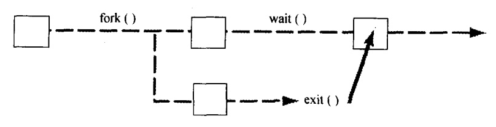
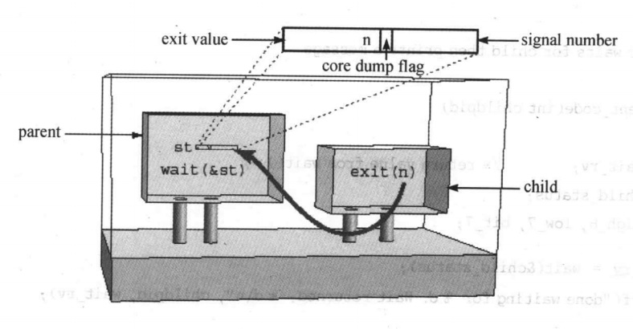

### chapter8 进程和程序：编写命令解释器sh

#### 章节知识总结

一个程序时存储在文件中的机器指令序列。一般它是由编译器将源代码编译成二进制格式的代码。运行一个程序意味着将这个机器指令序列载入内存然后让处理器逐条执行这些指令。

每个进程都有一个可以唯一标识它的数字，被称为进程ID。

Unix系统中的内存分为`系统空间`和`用户空间`。进程存在于用户空间。

建立一个进程有点像建立一个磁盘文件，内核要找到一些用来存放程序指令和数据的空闲内存页，内核还要建立数据结构来存放相应的内存分配情况和进程属性。

一个命令解释器sh的主要处理流程可以分为三步:

1. shell用`fork`建立新进程
2. 用`exec`在新进程中运行用户指定的程序
3. shell用wait等待新进程结束

进程通过调用`fork`来建立新的进程。进程调用`fork()`,当控制转移到内核中的`fork`代码后，内核做:

1. 分配新的内存块和内核数据结构
2. 复制原来的进程到新的进程
3. 向运行进程集添加新的进程
4. 将控制返回给两个进程

程序调用`execvp`，可以使得一个程序运行另一个程序。`execvp(file,argv)`载入由`file`指定的程序到当前进程，然后试图运行它。`execvp`将以`NULL`结尾的字符串列表传给程序。`execvp`在环境变量`PATH`所指定的路径中查找`file`文件。

`execvp`的执行流程如下：

1. 将指定的程序复制到调用它的进程
2. 将指定的字符串数组作为`argv[]`传给这个程序
3. 运行这个程序

进程可以调用`wait`等待子进程结束。系统调用`wait`做两件事：首先,`wait`暂停调用它的进程直到子进程结束；然后，`wait`取得子进程结束时传给`exit`的值(最终子进程会结束任何并调用`exit(n)`,n是0到255的一个数字)。



`exit`是`fork`的逆操作，进程通过调用`exit`来停止运行。`fork`创建一个进程,`exit`删除进程。

`exit(n)`将子进程的弥留之言`n`存放在内核直到这个进程的父进程通过`wait`系统调用取回这个值。如果父进程没有在等这个值，那么它将被保存在内核直到父进程调用`wait`，那时内核将通告这个父进程子进程的结束，并转达子进程的弥留之言。

   * `exit(n)`的弥留之言分为三部分：8个bit是记录退出值，7个bit是记录信号序号,另一个bit用来指明发生错误并产生了内核映像



`_exit()`主要包括以下这些操作:

1. 关闭所有文件描述符合目录描述符
2. 将该进程的PID置为`init`进程的PID
3. 如果父进程调用`wait`或`waitpid`来等待子进程结束，则通知父进程
4. 向父进程发送`SIGCHLD`(注意：就算父进程没有调用`wait`，内核也会向它发送`SIGCHLD`消息,一般对`SIGCHLD`消息的默认处理方法是忽略的)

如果父进程在子进程之前退出，那么子进程将能继续运行，而不会成为“孤儿”，它们将是`init`进程的“子女”。


#### 系统调用

| | execvp |
| :----: | :----: |
| 用途 | 在指定路径中查找并执行一个文件 |
| 头文件 | #include<unistd.h> |
| 函数原型 | result=execvp(const char* file,const char* argv[]) |
| 参数 | file:要执行的文件名 ； argv:字符串数组 |
| 返回值 | -1:如果出错 |

| | fork |
| :----: | :----: |
| 用途 | 创建进程 |
| 头文件 | #include<unistd.h> |
| 函数原型 | pid_t result=fork(void) |
| 参数 | 没有 |
| 返回值 | -1:如果错误;0:返回到子进程；(fork()将子进程的进程ID传给父进程) |

| | wait |
| :----: | :----: |
| 用途 | 等待进程结束 |
| 头文件 | #include<sys/types.h> #include<sys/wait.h> |
| 函数原型 | pid_t result=wait(int* statusptr) |
| 参数 | statusptr子进程的运行结果 |
| 返回值 | -1:遇到错误; pid:结束进程的进程id |

#### sh简易实现(版本一)

sh简易实现如下(下一章会有更完整的实现):

```cpp
#include<stdio.h>
#include<string.h>
#include<unistd.h>
#include<sys/wait.h>

#define MAXARGS 20
#define ARGLEN 100

char* makestr(char*);
void execute(char* arglist[]);

int main(){
    char* arglist[MAXARGS];
    char argbuf[ARGLEN];
    int numarg=0;
    while(numarg<MAXARGS){
        printf("Arg[%d]?",numarg);
        if(fgets(argbuf,ARGLEN,stdin)&&*argbuf !='\n')
            arglist[numarg++]=makestr(argbuf);
        else{
            if(numarg>0){
                arglist[numarg]=NULL;
                execute(arglist);
                numarg=0;
            }
        }
    }
    return 0;
}

void execute(char* arglist[])
{
    int pid=fork();
    int existstate;
    switch(pid){
        case -1: perror("fork"); exit(1);
        case 0:
            execvp(arglist[0],arglist);
            perror("execvp failed");
            exit(1);
        default:
            while(wait(&existstate)!=pid);
            printf("child exited with status %d,%d\n",existstate>>8,existstate&0377);   //0377: 00000000 11111111
    }
}

char* makestr(char* argbuf)
{
    argbuf[strlen(argbuf)-1]='\0';
    char* newbuf=malloc(strlen(argbuf)+1);
    if(newbuf==NULL) printf("no memory");
    strcpy(newbuf,argbuf);
    return newbuf;
}
```