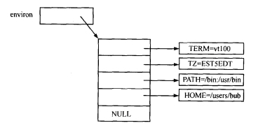
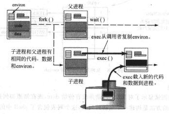

### chapter9 可编程的shell、shell变量和环境

#### 章节知识总结

Unix shell运行一种称为脚本的程序，一个shell脚本可以运行程序、接受用户输入、使用变量和使用复杂的控制逻辑。

if..then语句依赖于下述惯例：Unix程序返回0以表示成功。shell使用wait来得到程序的退出状态。

Unix允许用户在`环境`中以变量的形式存放个性化设置。

环境是每个程序都可以存取的一个字符串数组。每个数组中的字符串都以`var=value`这样的形式出现，数组的地址被存放在一个名为`environ`的全局变量里。环境就是`environ`指向的字符串数组，读环境就是读这个字符串数组，改变环境就是改变字符串。



在讨论exec系统调用时我们知道，对它的调用就像换脑，用目标程序的代码和数据替换调用程序的代码和数据。但是`environ`指针指向的数组是唯一的例外，当内核执行系统调用`exec`时，它将数组和字符串复制到新的程序的数据空间。



通过上图，我们也可以知道，子程序中环境的设置是父进程环境的副本，子进程不能修改父进程的环境。因为在进程调用`fork`和`exec`时整个环境都被自动的复制了，所以通过环境来传递数据比较方便、快捷。

修改环境的小demo如下:

```cpp
#include<stdio.h>

extern char** environ;

main()
{
    char* table[3];
    table[0]="TERM=vt100";
    table[1]="HOME=/on/the/range";
    table[2]=0;     //最后一个指针指向NULL

    environ=table;

    execlp("env","env",NULL);
    //输出:
    //      TERM=vt100
    //      HOME=/on/the/range
}
```

#### 简易版shell实现（版本二）

shell版本二实现参考[github](https://github.com/lingqing97/Unix_Linux_bookcode/blob/main/ch09/smsh2.c)