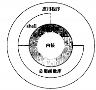

### chapter01 UNIX基础知识

#### UNIX系统结构

从严格意义上来说，可将操作系统定义为一种软件，它控制计算机硬件资源，提供程序运行环境，我们通常将这种软件称为`内核(kernel)`。



#### 登录

用户登录UNIX系统时，先键入登录名，然后键入口令。

系统再其口令(通常是`/etc/passwd`文件)中查看登录名。口令文件中的登录项由7个以冒号分隔的字段组成，依次是:`登录名`、`加密口令`、`数字用户ID`、`数字组ID`、`注释字段`、`起始目录`以及`shell程序(/bing/ksh)`.

`shell`是一个命令行解释器。系统从口令文件中相应用户登录项的最后一个字段中了解到应该为该登录用户执行哪一个`shell`.

#### 文件和目录

目录是一个包含目录项的文件。在逻辑上，可以认为每个目录项都包含一个文件名，同时还包含说明该文件属性的信息。通过`stat`和`fstat`函数返回包含所有文件属性的一个信息结构。

创建新目录时会自动创建了两个文件名:`.`和`..`。`.`指向当前目录，`..`指向父目录。在最高层次的根目录中，`..`和`.`相同。

每个进程都有一个工作目录，登录时，工作目录设置为起始目录，该起始目录从口令文件中相应用户的登录项中取得。

##### 实例：列出一个目录中的所有文件

```cpp
#include<stdio.h>
#include<dirent.h>

#define oops(m,x) { perror(m); exit(x);}

int main(int ac,char* av[])
{
    DIR *dp;
    struct dirent *dirp;

    if(ac!=2){
        fprintf(stderr,"usage: ls directory_name");
        exit(1);
    }
    //打开目录
    if((dp=opendir(av[1]))==NULL)
        oops("opendir");
    //读取目录
    while((dirp=readdir(dp))!=NULL)
        printf("%s\n",dirp->d_name);
    //关闭目录
    closedir(dp);
    exit(0);        //0表示正常退出
}
```

#### 输入和输出

`文件描述符`通常是一个小的非负整数，内核用以标识一个特定进程正在访问的文件。

按惯例，每当运行一个新程序时，所有的shell都为其打开3个文件描述符，即标准输入(standard input)、标准输出(standard output)以及标准错误(standard error)。

函数`open`,`read`,`write`,`lseek`以及`close`提供了不带缓冲的`I/O`,这些函数都使用文件描述符.

##### 实例：将标准输入复制到标准输出

```cpp
#include<unistd.h>

#define BUFSIZE 4096
#define oops(m,x) { perror(m); exit(x);}

int main(void)
{
    int n;
    char buf[BUFSIZE];

    while((n=read(STDIN_FILENO,buf,BUFSIZE))>0)
        if(write(STDOUT_FILENO,buf,n)!=n)
            oops("write error",1);

    if(n<0>)
        oops("read error",2);
    exit(0);
}
```

#### 程序和进程

程序是一个存储在磁盘上某个目录中的可执行文件。内核使用`exec`函数将程序读入内存，并执行程序。某些操作系统用`任务(task)`表示正在被执行的程序。

Unix系统确保每个进程都有一个唯一的数字标识符，称为`进程ID(process ID)`,进程ID总是一个非负整数，且Unix按顺序为进程分配进程ID。

与进程相同，线程也用ID标识。但是，线程ID只在它所属的进程内其作用。一个进程中的线程ID在另一个进程中没有意义。

##### 实例：从标准输入读命令并执行

```cpp
#include<stdio.h>
#include<string.h>
#include<unistd.h>
#include<sys/wait.h>

int main(void)
{
    char buf[MAXLINE];
    pid_d pid;      //Unix系统保证pid_d类型的数保存在一个长整型中
    int status;

    printf("%% ");
    while(fgets(buf,MAXLINE,stdin)!=NULL){
        if(buf[strlen(buf)-1]=='\n')
            buf[strlen(buf)-1]=0;
        if((pid=fork())<0)
            oops("fork error",1);
        else if(pid==0){
            /* child */
            execlp(buf,buf,NULL);   //buf是"date","ls"这样的指令，通过execlp执行这些指令
            oops("couldn't execute: %s",buf);
            exit(127);
        }
        /* parent */
        if((pid=waitpid(pid,&status,0))<0)  //等待pid子进程结束
            oops("waitpid error",2);
        printf("%% ");
    }
    exit(0);
}
```

#### 出错处理

