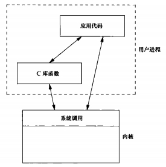

### chapter01 UNIX基础知识

#### UNIX系统结构

从严格意义上来说，可将操作系统定义为一种软件，它控制计算机硬件资源，提供程序运行环境，我们通常将这种软件称为`内核(kernel)`。


#### 登录

用户登录UNIX系统时，先键入登录名，然后键入口令。

系统再其口令(通常是`/etc/passwd`文件)中查看登录名。口令文件中的登录项由7个以冒号分隔的字段组成，依次是:`登录名`、`加密口令`、`数字用户ID`、`数字组ID`、`注释字段`、`起始目录`以及`shell程序(/bing/ksh)`.

`shell`是一个命令行解释器。系统从口令文件中相应用户登录项的最后一个字段中了解到应该为该登录用户执行哪一个`shell`.

#### 文件和目录

目录是一个包含目录项的文件。在逻辑上，可以认为每个目录项都包含一个文件名，同时还包含说明该文件属性的信息。通过`stat`和`fstat`函数返回包含所有文件属性的一个信息结构。

创建新目录时会自动创建了两个文件名:`.`和`..`。`.`指向当前目录，`..`指向父目录。在最高层次的根目录中，`..`和`.`相同。

每个进程都有一个工作目录，登录时，工作目录设置为起始目录，该起始目录从口令文件中相应用户的登录项中取得。

##### 实例：列出一个目录中的所有文件

```cpp
#include<stdio.h>
#include<dirent.h>

#define oops(m,x) { perror(m); exit(x);}

int main(int ac,char* av[])
{
    DIR *dp;
    struct dirent *dirp;

    if(ac!=2){
        fprintf(stderr,"usage: ls directory_name");
        exit(1);
    }
    //打开目录
    if((dp=opendir(av[1]))==NULL)
        oops("opendir");
    //读取目录
    while((dirp=readdir(dp))!=NULL)
        printf("%s\n",dirp->d_name);
    //关闭目录
    closedir(dp);
    exit(0);        //0表示正常退出
}
```

#### 输入和输出

`文件描述符`通常是一个小的非负整数，内核用以标识一个特定进程正在访问的文件。

按惯例，每当运行一个新程序时，所有的shell都为其打开3个文件描述符，即标准输入(standard input)、标准输出(standard output)以及标准错误(standard error)。

函数`open`,`read`,`write`,`lseek`以及`close`提供了不带缓冲的`I/O`,这些函数都使用文件描述符.

##### 实例：将标准输入复制到标准输出

```cpp
#include<unistd.h>

#define BUFSIZE 4096
#define oops(m,x) { perror(m); exit(x);}

int main(void)
{
    int n;
    char buf[BUFSIZE];

    while((n=read(STDIN_FILENO,buf,BUFSIZE))>0)
        if(write(STDOUT_FILENO,buf,n)!=n)
            oops("write error",1);

    if(n<0>)
        oops("read error",2);
    exit(0);
}
```

#### 程序和进程

程序是一个存储在磁盘上某个目录中的可执行文件。内核使用`exec`函数将程序读入内存，并执行程序。某些操作系统用`任务(task)`表示正在被执行的程序。

Unix系统确保每个进程都有一个唯一的数字标识符，称为`进程ID(process ID)`,进程ID总是一个非负整数，且Unix按顺序为进程分配进程ID。

与进程相同，线程也用ID标识。但是，线程ID只在它所属的进程内其作用。一个进程中的线程ID在另一个进程中没有意义。

##### 实例：从标准输入读命令并执行

```cpp
#include<stdio.h>
#include<string.h>
#include<unistd.h>
#include<sys/wait.h>

int main(void)
{
    char buf[MAXLINE];
    pid_d pid;      //Unix系统保证pid_d类型的数保存在一个长整型中
    int status;

    printf("%% ");
    while(fgets(buf,MAXLINE,stdin)!=NULL){
        if(buf[strlen(buf)-1]=='\n')
            buf[strlen(buf)-1]=0;
        if((pid=fork())<0)
            oops("fork error",1);
        else if(pid==0){
            /* child */
            execlp(buf,buf,NULL);   //buf是"date","ls"这样的指令，通过execlp执行这些指令
            oops("couldn't execute: %s",buf);
            exit(127);
        }
        /* parent */
        if((pid=waitpid(pid,&status,0))<0)  //等待pid子进程结束
            oops("waitpid error",2);
        printf("%% ");
    }
    exit(0);
}
```

#### 出错处理

在UNIX系统函数出错时，通常会返回一个负值，而且整型变量`errno`通常被设置为具有特定信息的值。文件`<errno.h>`中定义了`errno`以及可以赋予它的各种变量。

对于`errno`应当注意两条规则：

1. 如果没有出错，其值不会被例程清除
2. 任何函数都不会将`errno`值设置为0

通常使用`perror`函数在标准错误上产生一条出错信息，使用`strerror`函数将`errno`映射为一个出错消息字符串，并且返回此字符串的指针。

```cpp
#include<stdio.h>
#include<errno.h>

int main(int argc,char* argv[])
{
    fprintf(stderr,"EACCES: %s\n",strerror(EACCES));
    errno=ENOENT;
    perror(argv[0]);
    exit(0);
}
```

可将在`<error.h>`中定义的各种出错分成两类：致命性的和非致命性的。

* 对于致命性的错误，无法执行恢复动作，最多能多的就是在用户屏幕打印一条出错消息或将一条出错消息写入日志文件中，然后退出。
* 对于非致命性的错误，有时可以较妥善地进行处理。

#### 用户标识

口令文件登录项中的`用户ID(userID)`是一个数值，它向系统标识各个不同的用户。系统管理员在确定一个用户的登录名的同时，确定其用户ID。用户不能更改其用户ID。通常每个用户有一个唯一的用户ID

用户ID为0的用户为根用户或超级用户。

口令文件登录项也包括用户的`组ID(groupID)`，它是一个数值。组ID也是由系统管理员在指定用户登录名时分配的。除了在口令文件中对一个登录名指定一个组ID外，大多数UNIX系统版本还运行一个用户属于另外一些组，这些组是附属组。

组文件将组名映射为数值的组ID。组文件通常是`/etc/group`。

> 补充: 使用数值的用户ID和数值的组ID设置权限是历史上形成的。对于磁盘上的每个文件，文件系统都存储该文件所有者的用户ID和组ID。存储这两个值只需4个字节（假定每个都以双字节的整型值存放）。如果使用完整ASCII登录名和组名，则需要更多的磁盘空间。

#### 信号

`信号(signal)`用于通知进程发生了某种情况。进程有以下3种处理信号的方式:

1. 忽略信号
2. 按系统默认方式处理:系统默认方式是终止进程
3. 提供一个信号处理函数进行处理

终端键盘上有两种产生信号的方法，分别称为`中断键`(通常是`Delete`键或`Ctrl+C`键)和退出键(通常是`Ctrl+\`),它们被用于中断当前运行的进程。

使用`kill`函数也可以产生信号，不过通过`kill`函数向一个进程发送信号时，我们必须是那个进程的所有者或者是超级用户。

#### 时间值

历史上，UNIX系统使用过两种不同的时间值:

1. 日历时间: 该值是自协调世界时`1970年1月1日 00:00:00`这个特定时间以来所经历的秒数累计值。系统基本数据类型`time_t`用于保存这种时间值.
2. 进程时间: 也被称为CPU时间，用以度量进程使用的中央处理器资源。进程时间以时间滴答计算。每秒钟曾经取50,60和100个时钟滴答。系统基本数据类型`clock_t`保存这种时间值。

#### 系统调用和库函数

各种版本的UNIX系统都提供良好定义、数量有限、直接进入内核的入口点，这些入口点被称为`系统调用(system call)`.

C语言定义了一些更加高级的函数称为库函数，从实现者的角度来看，系统调用和库函数之间有根本的区别，但从用户角度来看，其区别并不重要。

