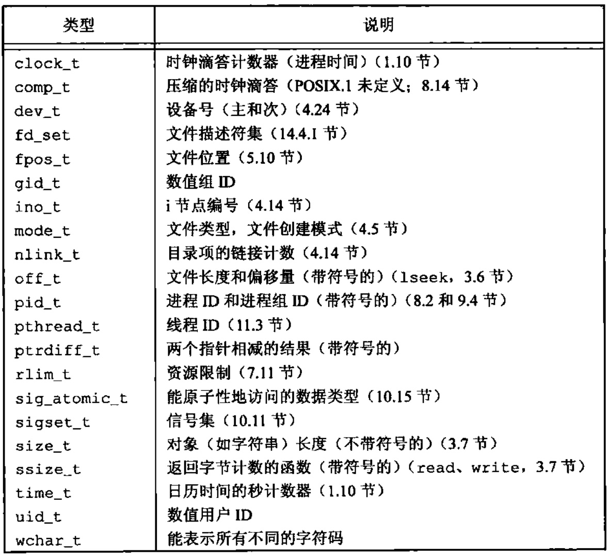

### chapter02 UNIX标准及实现

####   限制ISO C

ISO C标准的意图是提供C程序的可移植性，ISO C标准现在由ISO/IEC的C程序设计语言国际标准工作组维护和开发。

#### IEEE POSIX

POSIX是一个最初由IEEE(Institute of Electrical and Electronics Engineers,电气和电子工程师学会)制定的标准族。POSIX原来指的只是IEEE标准1003.1-1988(操作系统接口)，后来则扩展成包括很多标记为1003的标准和标准草案。

2001年的1003.1版本与以前各版本有较大的差别，它组合了多个1003.1的修正、1003.2标准以及Single UNIX Speeification(SUS)第2版的若干部分，这形成了IEEE标准1003 1-2001.

#### Single UNIX Specification

Single UNIX Specification(SUS,单一UNIX规范)是POSIX.1标准的一个超集，它定义了一些附加接口扩展了POSIX.1规范提供的功能.

#### 限制

UNIX系统实现定义了很多幻数和常量，其中有很多已被硬编码到程序中，或用特定的技术确定。

以下两种类型的限制是必需的.

1. 编译时限制(例如，短整型的最大值是什么?)
2. 运行时限制(例如，文件明有多少个字符?)

编译时限制可在头文件中定义。程序在编译时可以包含这些头文件。但是，运行时限制则要求进程调用一个函数获得限制值。

#### 基本系统数据类型

头文件`<sys/types.h>`中定义了某些与实现有关的数据类型，它们被称为`基本系统数据类型`(一些常用的基本数据类型如下图所示).

