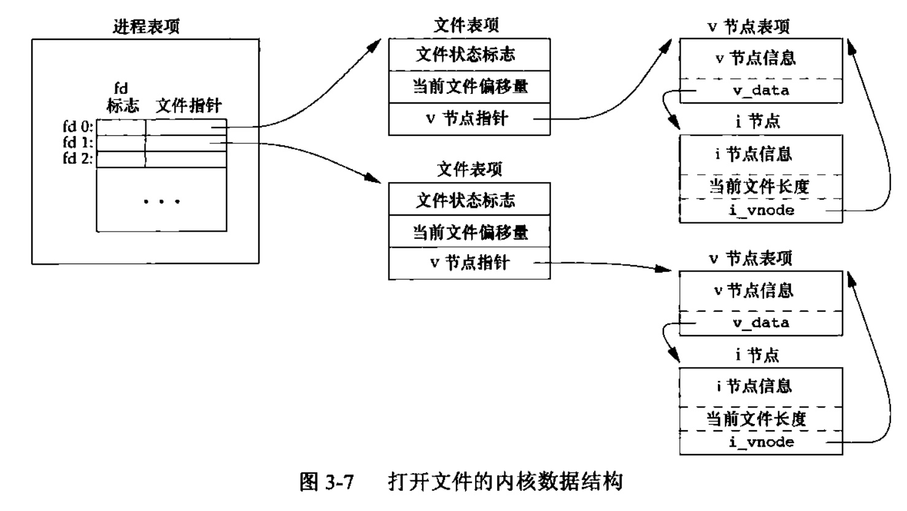

### chapter03 文件I/O

#### 引言

UNIX系统中的大多数文件I/O只需用到5个函数:`open`,`read`,`write`,`lseek`以及`close`,这些函数经常被称为`不带缓冲的I/O(unbuffered I/O)`.术语`不带缓冲`指的是每个`read`和`write`都调用内核中的一个系统调用。

这些不带缓冲的I/O函数不是ISO C的组成部分，但是，它们是POSIX.1和Single UNIX Specification的组成部分.

#### 文件描述符

对于内核而言，所有打开的文件都通过文件描述符引用。文件描述符是一个非负整数。当打开一个现有文件或创建一个新文件时，内核向进程返回一个文件描述符。文件描述符的变化范围是`0~OPEN_MAX-1`.

在符合POSIX.1的应用程序中，幻数0,1,2虽然已被标准化，但应当把它们替换成符号常量`STDIN_FILENO`,`STDOUT_FILENO`,`STDERR_FILENO`以提高可读性。这些常量都在头文件`<unistd.h>`中定义.

#### 函数open和openat

调用`open`或`openat`函数可以打开或创建一个文件

```cpp
#include<fcntl.h>

int open(const char* path,int oflag,...)
int openat(int fd,const char* path,int oflag)
```

`path`参数是要打开的或创建文件的名字，`oflag`参数可用来说明此函数的多个选项，比如`O_RDONLY`,`O_WRONLY`,`O_RDWR`,`O_EXEC`,`O_SEARCH`(这五个常量中必须指定一个且只能指定一个)或`O_APPEND`等.

> 有`open`和`openat`函数返回的文件描述符一定是最小的未用描述符数值

关于`openat`函数

1. `path`参数指定的是绝对路径，此时`fd`参数被忽略
2. `path`参数指定的是相对路径名，`fd`参数指出了相对路径名在文件系统中的开始地址。`fd`参数是通过打开相对路径名所在的目录来获取的。
3. `path`参数指定了相对路径名，`fd`参数具有特殊值`AT_FDCWD`。在这种情况下，路径名在当前工作目录中获取，`openat`函数在操作上与`open`函数类似.

> 在系统调用函数中，还有许多命名方式如`openat`的函数，比如`fchmodat`等，此类函数中关于`path`与`fd`的关系基本一样

#### 函数creat

调用`creat`创建一个新文件

```cpp
#include<fcntl.h>

int creat(const char* path,mode_t mode);
```

`creat`函数等价于`open(path,O_WRONLY | O_CREAT | O_TRUNC,mode)`,这也表明`creat`是以`只写`方式打开所创建的文件的。

要想创建一个具有读写权限的文件可以使用下列方式(是原子操作，安全)

```cpp
open(path,O_RDWR | O_CREAT | O_TRUNC ,mode);
```

#### 函数close

调用`close`函数关闭一个打开文件

```cpp
#include<unistd.h>

int close(int fd);
```

关闭一个文件时还会释放该文件上的所有记录锁。同时，当一个进程终止时，内核自动关闭它所有的打开文件。(这一功能可以通过修改文件的文件描述符标志关闭)

#### 函数lseek

每个打开文件都有一个与其相关联的”当前文件偏移量(current file offset)“。它通常是一个非负整数，用以度量从文件开始处计算的字节数。通常，读写操作都从当前文件偏移量处开始，并使偏移量增加所读写的字节数。

调用`lseek`显式地为一个打开文件设置偏移量:

```cpp
#include<unistd.h>

off_t lseek(int fd,off_t offset,int whence);    //若lseek成功执行，则返回新的文件偏移量
```

对参数`offset`和解释与参数`whence`的值有关:

* 若`whence`是`SEEK_SET`,则将该文件的偏移量设置为距文件开始处`offset`个字节
* 若`whence`是`SEEK_CUR`,则将该文件的偏移量设置为其当前值加`offset`，`offset`可为正或负
* 若`whence`是`SEEK_END`,则将该文件的偏移量设置为文件长度加`offset`,`offset`可正可负

文件偏移量可以大于文件的当前长度，在这种情况下，对该文件的下一次写将加长该文件，并在文件中构成一个`空洞`,位于文件中但是没有写过的字节都被读为0.

#### 函数read

调用`read`函数从打开文件中读数据

```cpp
#include<unistd.h>

ssize_t read(int fd,void* buf,size_t nbytes);       //返回值：读到的字节数
```

有多张情况可使实际读到的字节数少于要求读的字节数:

1. 读普通文件时，在读到要求字节数之前已到达了文件尾端
2. 当从终端设备读时，通常一次最多读取一行
3. 当从网络读时，网络中的缓冲机制可能造成返回值小于所要求读的字节数
4. 当从管道或FIFO读时，如若管道包含的字节少于所需的数量，那么read将只返回实际可用的字节数
5. 当从某些面向记录的设备（如磁带）读时，一次最多返回一个记录
6. 当一信号造成中断，而已经读了部分数据量时，一次最多返回一个记录

#### 函数write

调用`write`函数向打开文件写数据

```cpp
#include<unistd.h>

ssize_t write(int fd,const void* buf,size_t nbytes);    //返回值：若成功，返回已写的字节数
```

`write`出错的一个常见原因是磁盘已写满，或者超过一个给定进程的文件长度限制。


#### 文件共享

UNIX系统支持在不同进程间共享打开文件.

(***) 内核使用3种数据结构表示打开文件

1. **每个进程在进程表中都有一个记录项**，记录项中包含一张**打开文件描述符表**,可将其视为一个矢量，每个描述符占用一项。与每个文件描述符相关联的是:
    * 文件描述符标志
    * 指向一个文件表项的指针

2. 内核为所有打开文件维持一张文件表。每个文件表项包含:
    * 文件状态标志(读，写，添写，同步或非阻塞等)
    * **当前文件偏移量**
    * 指向该文件v节点表项的指针

3. 每个打开文件(或设备)都有一个v节点(v-node)结构。v节点包含了文件类型和对此文件进行各种操作函数的指针。对于大多数文件，v节点还包含了该文件的i节点(i-node,索引节点)



关于上图有了两点需要注意:

* 由于每个进程都获得自己的文件表项，这可以使每个进程都有它自己的对该文件的当前偏移量
* 打开同一个文件两次，进程为其分配不同的文件描述符和不同的文件表项

#### 原子操作

一般而言,`原子操作`指的是由多步组成的一个操作。如果该操作原子地执行，则要么执行完所有步骤，要么一步不执行，不可能只执行所有步骤的一个子集。

SUS标准将`lseek`和`read`两个操作通过`pread`封装成了一个原子操作:

```cpp
#include<unistd.h>

ssize_t pread(int fd,void* buf,size_t nbytes,off_t offset);
ssize_t pwrite(int fd,const void* buf,size_t nbytes,off_t offset);

```

调用`pread`相当于调用`lseek`后调用`read`,而调用`pwrite`相当于调用`lseek`后调用`write`.


#### 函数dup和dup2

通过`dup`和`dup2`可以用来复制一个现有的文件描述符:

```cpp
#include<unistd.h>

int dup(int fd);
int dup2(int fd,int fd2);   //将fd2重定向到fd

// 两函数的返回值：若成功，返回新的文件描述符
```

由`dup`返回的新文件描述符一定是**当前可用文件描述符中的最小数值**。对于`dup2`，可以用`fd2`参数指定新描述符的值。如果`fd2`已经打开，则先将其关闭。如若`fd`等于`fd2`，则`dup2`返回`fd2`,而不关闭它

#### 函数sync,fsync和fdatasync

`内核有缓冲区`:传统的UNIX系统实现在内核设有缓冲区高速缓存或页高速缓存，大多数磁盘I/O都通过缓冲区进行。

当我们向文件写入数据时，内核通常先将数据复制到缓冲区中，然后排入队列，晚些时候再写入磁盘。这种方式被称为`延迟写`.通常，当内核需要重用缓冲区来存放其他磁盘块数据时，它会把所有延迟写数据块写入磁盘。

UNIX系统提供了三个函数将缓冲区中的内容同步到磁盘上:

```cpp
#include<unistd.h>

int fsync(int fd);
int fdatasync(int fd);

void sync(void);
```

`sync`只是将**所有修改过的块缓冲区**排入写队列，然后就返回，它并不等待实际写磁盘操作结束。

`fsync`函数只对由文件描述符`fd`指定的一个文件起作用，并且等待写磁盘操作结束才返回.

`fdatasync`函数类似`fsync`，但它只影响文件的数据部分。而除数据外，`fsync`还会同步更新文件的额属性

#### 函数fcntl(***)

`fcntl`函数可以改变已经打开文件的属性:

```cpp
#include<fcntl.h>

int fcntl(int fd,int cmd,...);  //返回值：若成功，则依赖于cmd
```

(***) `fcntl`函数有以下5种功能:

1. 复制一个已有的描述符(`cmd=F_DUPDF`或`F_DUPFD_CLOEXEC`)
2. 获取/设置文件描述符标志(`cmd=F_GETFD`或`F_SETFD`)
3. 获取/设置文件状态标志(`cmd=F_GETFL`或`F_SETFL`)
4. 获取/设置异步I/O所有权(`cmd=F_GETOWN`或`F_SETOWN`)
5. 获取/设置记录锁(`cmd=F_GETLK、F_SETLK`或`F_SETLKW`)

##### 实例：对一个文件描述符开启一个或多个文件状态标志

```cpp
#include<stdio.h>
#include<unistd.h>
#include<fcntl.h>

void set_f1(int fd,int flags)
{
    int val;

    if((val=fcntl(fd,F_GETFL,0))<0){
        fprintf(stderr,"fcntl GETFL error");
        exit(1);
    }

    val |=flags;

    if(fcntl(fd,F_SETFL,0)<0){
        fprintf(stderr,"fcntl SETFL error");
        exit(1);
    }
}

int main(void)
{
    set_f1(STDOUT_FILENO,O_SYNC);   //O_SYNC标志与fsync函数的作用相同,使用O_SYNC标志会增加系统时间和时钟时间
}
```

注意：修改文件描述符标志或文件状态标志时必须谨慎，先要获得现在的标志值，然后按照期望修改它，最后设置新标志值。不能只是执行`F_SETFD`或`F_SETFL`命令，这样会关闭以前设置的标志位。

#### 函数ioctl

`ioctl`函数一直是I/O操作的杂物箱。不能用本章其他函数表示的I/O操作通常都能用`ioctl`表示。

比如磁带操作使我们可以在磁带上写一个文件结束标志，倒带，越过指定个数的文件或记录等，用本章中的其他函数（`read`,`write`,`lseek`等）都难于表示这些操作，所以，对这些设备进行操作最容易的方法就是使用`ioctl`.

#### /dev/fd

较新的系统都提供名为`/dev/fd`的目录，其目录项是名为0、1、2等的文件。打开文件`/dev/fd/n`等效于复制描述符n(假定描述符n是打开的)

在下列函数调用中:

```cpp
fd=open("dev/fd/0",mode);   //等效于dp=dup(0)
```

注意，大多数系统会忽略上述语句所指定的mode.

