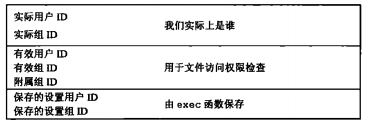
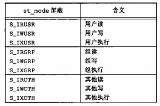
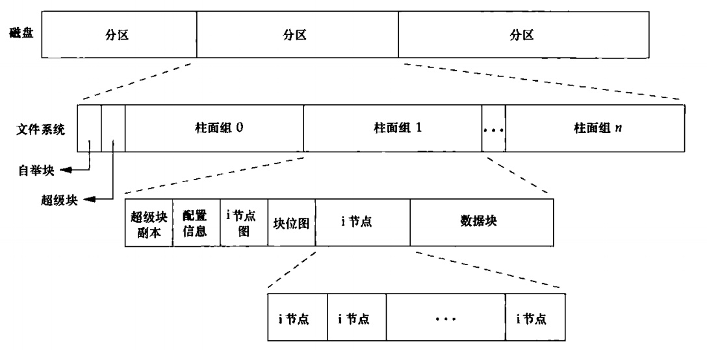
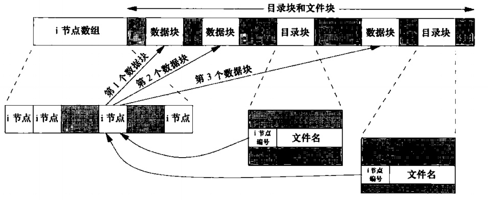
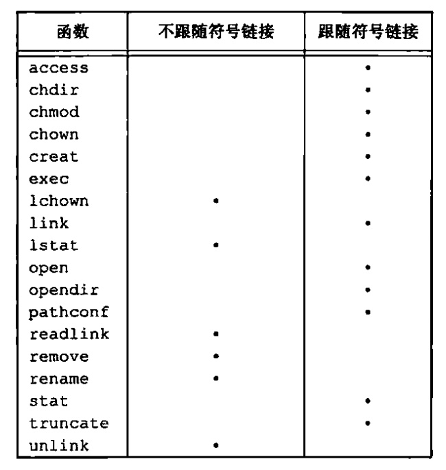

[toc]

### chapter04 文件和目录


#### 函数stat,fstat,fstatat和lstat

通过`stat`,`fstat`,`fstatat`和`stat`四个函数可以返回文件的详细信息:

```cpp
#include<sys/stat.h>

int stat(const char* restrict pathname, struct stat* restrict buf);

int fstat(int fd,struct stat* buf);

int lstat(const char* restrict pathname,struct stat* restrict buf);

int fstatst(int fd,const char* restrict pathname,struct stat* restrict buf);
```

`lstat`函数类似于`stat`,但是当命名的文件是一个符号链接时，`lstat`返回给符号链接的有关信息，而不是由该符号链接引用的文件的信息.

> `fstat`函数传入文件描述符，在Unix中很多以`f`开头的函数相比于不是`f`开头的函数的区别就是传入的参数是不是文件描述符`fd`,比如`fchmod`，`fchown`,`ftruncate`等

上面四个函数通过填充由`buf`指向的结构来返回文件信息，该结构的实际定义可能随具体实现有所不同，但其基本形式是:

(***)stat结构

```cpp
struct stat{
    mode_t      st_mode;        //记录文件类型+读写权限
    ino_t       st_ino;         //记录i节点编号
    dev_t       st_dev;         //记录设备号
    dev_t       st_rdev;        //记录实际设备号，只有当文件是块设备或字符设备时才有
    nlink_t     st_nlink;       //指向i节点的链接数
    uid_t       st_uid;         //用户ID
    gid_t       std_gid;        //组ID
    off_t       st_size;        //size in bytes, for regular files
    struct timespec st_atime;   //文件最后访问时间
    struct timespec st_mtime;   //文件最后修改时间
    struct timespce st_ctime;   //文件最后状态更新时间(记录在i节点上)
    blksize_t   st_blksize;     //best I/O block size
    blkcnt_t    st_blocks;      //number of disk blocks allocated
};
```

其中`timespec`结构类型按照秒和纳秒定义了时间，至少包括下面两个字段:

```cpp
time_t tv_sec;
long tv_nsec;
```

#### 文件类型

(***)UNIX中的文件类型包括以下几种:

1. 普通文件(regular file)
2. 目录文件(directory file)
3. 块特殊文件(block specila file)
4. 字符特殊文件(character special file)
5. FIFO(也被称为命名通道)
6. 套接字(socket)
7. 符号链接

##### 实例：通过定义的宏判断文件类型

```cpp
#include<stdio.h>
#include<sys/stat.h>

#define oops(m,x) { perror(m); exit(x); }

int main(int ac,char* av[])
{
    int i;
    struct stat buf;
    char *ptr;
    for(i=1;i<ac;++i)
    {
        if(lstat(av[i], &buf)<0)
            oops("lstat",1);
        if(S_ISREG(buf.st_mode))
            ptr="regular";
        else if(S_ISDIR(buf.st_mode))
            ptr="directory";
        else if(S_ISCHR(buf.st_mode))
            ptr="char";
        else if(S_ISBLK(buf.st_mode))
            ptr="block";
        else if(S_ISFIFO(buf.st_mode))
            ptr="FIFO";
        else if(S_ISLNK(buf.st_mode))
            ptr="link";
        else if(S_ISSOCK(buf.st_mode))
            ptr="socket";
        else
            ptr="unkown";
        printf("%s\n",ptr);
    }
    return 0;
}
```

#### 设置用户ID和设置组ID

与一个进程相关联的ID有6个或更多:



通常，有效用户ID等于实际用户ID，有效组ID等于实际组ID。当执行一个程序文件时，进程的有效用户ID通常就实际用户ID，有效组ID通常就是实际组ID.

(***) 但是可以在文件模式字(st_mode)中设置一个特殊标志，其含义是”执行此文件时，将进程的有效用户ID设置为文件所有者的用户ID(st_uid)“。与此类似，在文件模式字中可以设置另一位，它将执行此文件的进程的有效组ID设置文件的组所有者ID(st_gid)。在文件模式字中的这两位被称为`设置用户ID(set-user-ID)位`和`设置组ID(set-group-ID)位`.


#### 文件访问权限

所有文件类型(目录、字符特别文件等)都有访问权限(access permission)。很多人认为只要普通文件有访问权限，这是一种误解。

每个文件有9个访问权限位，可将它们分为3类:



(***)进程每次打开、创建或删除一个文件时，内核就进行文件访问权限测试，内核进行的测试具体如下:

1. 若进程的有效用户是0(超级用户),则允许访问。
2. 若进程的有效用户ID等于文件的所有者(也就是进程拥有此文件)，那么如果所有者适当的访问权限位被设置，则允许访问(比如要对文件进行写操作，则该进程有效用户应该有写权限)
3. 若进程的有效组ID或进程的附属组ID之一等于文件的组ID，那么如果组适当的访问权限位被设置，则允许访问；否则拒绝访问

注意，上述测试顺序执行，即如果进程拥有此文件(第2步),则按用户权限访问批准或拒绝该进程对文件的访问---不查看组访问权限。


#### 新文件和目录的所有权

新文件的用户ID设置为进程的有效用户ID。关于组ID，POSIX.1允许实现选择下列之一作为新文件的组ID。

1. 新文件的组ID可以是进程的有效组ID
2. 新文件的组ID可以是它所在目录的组ID

#### 函数access和faccessat

有时，进程也希望按其实际用户ID和实际组ID来测试其访问能力。例如，当一个进程使用设置用户ID或设置组ID功能作为另一个用户（或组）运行时，就可能会有这种需要。

通过`access`和`faccessat`可以判断实际用户是否有相应权限:

```cpp
#include<unistd.h>

int access(const char* pathname,int mode);

int faccessat(int fd,const char* pathname,int mode,int flag);
```

其中，如果测试文件是否存在,`mode`就为`F_OK`;否则`mode`是下表所列常量的按位或:

| mode | 说明 |
| :----: | :----:
| R_OK | 测试读权限 |
| W_OK | 测试写权限 |
| X_OK | 测试执行权限 |

##### 实例：access函数实例

```cpp
#include<stdio.h>
#include<unistd.h>
#include<fcntl.h>

#define oops(m,x) { perror(m); exit(x); }

int main(int ac,char* av[])
{
    if(ac!=2){
        fprintf(stderr,"usage: a.out <pathname>");
        exit(1);
    }
    if(access(av[1],R_OK)<0){           //测试读权限
        printf("read access ERROR\n");
    }
    else{
        printf("read access OK\n");
    }
    if(open(av[1],O_RDONLY)<0){
        oops("open",2);
    }
    else{
        printf("open for reading OK\n");
    }
    exit(0);
}
```

#### 函数umask

`umask`函数为进程设置文件模式创建屏蔽字，并返回之前的值。

```cpp
#include<sys/stat.h>

mode_t umask(mode_t cmask);
```

##### 实例:umask函数实例

```cpp
#include<stdio.h>
#include<unistd.h>
#include<fcntl.h>

#define RWRWRW (S_IRUSR | S_IWUSR | S_IRGRP | S_IWGRP | S_IROTH | S_IWOTH)

int main(void)
{
    umask(0);
    if(creat("foo",RWRWRW)<0)
        printf("creat error\n");
    umask(S_IRGRP | S_IWGRP | S_IROTH | S_IWOTH);   //umask值禁止所有组和其他用户的读写权限
    if(creat("bar",RWRWRW)<0)
        printf("creat error\n");
    exit(0);
}
```

需要注意的是，更改进程的文件模式创建屏蔽字并不影响其父进程(常常是shell)的屏蔽字

#### 函数chmod、fchmod和fchmodat

`chmod`,`fchmod`和`fchmodat`这3个函数使我们可以更改现有文件的访问权限

```cpp
#include<sys/stat.h>

int chmod(const char* pathname,mode_t mode);
int fchmod(int fd,mode_t mode);
int fchmodat(int fd,const char* pathname,mode_t mode,int flag);
```

其中参数`mode`是前面的文件权限位。且为了改变一个文件的权限位，进程的有效用户ID必须等于文件的所有者ID，或者进程必须具有超级用户权限。

#### 粘着位

`S_ISVTX`位被称为`粘着位`(sticky bit).后来的`UNIX`版本称它为`保存正文位`.

现在的系统扩展了粘着位的使用范围，`Single UNIX Specification`允许对目录设置粘着位。如果**对一个目录设置了粘着位**，只有**对该目录具有写权限的用户**并且满足下列条件之一，才能删除或重命名该目录下的文件:

* 拥有此文件
* 拥有此目录
* 是超级用户

目录`/tmp`和`/var/tmp`是设置粘着位的典型候选者————任何用户都可在这两个目录中创建文件。任一用户(用户、组合其他)对这两个目录的权限通常都是读、写和执行。但是用户不应能删除或重命名属于其他人的文件，为此在这两个目录的文件模式中都设置了粘着位。

#### 函数chown,fchown,fchownat和lchown

下面几个`chown`函数可用于更改文件的用户ID和组ID。如果两个参数`owner`或`group`中的任意一个是`-1`,则对应的ID不变:

```cpp
#include<unistd.h>

int chown(const char* pathname,uid_t owner,git_t group);
int fchown(int fd,uid_t owner,git_t group);
int fchownat(int fd,const char* pathname,uid_t owner,git_t group,int flag);
int lchown(const char* pathname,uid_t owner,git_t group);
```

> 这里的`lchown`可以更改符号链接本身，UNIX中很多命名以`l-`开头的函数都可以改变符号链接本身，而不是跟随符号链接.

#### 文件长度

`stat`结构成员`st_size`表示以字节为单位的文件的长度。此字段只对普通文件、目录文件和符号链接有意义:

* 对于普通文件，其文件长度可以是0，在开始读这种文件时，将得到文件结束(end-of-file)指示
* 对于目录，文件长度通常是一个数(如16或512)的整倍数
* 对于符号链接，文件长度是在文件名中的实际字节数，比如`lib->user/lib`这样的符号链接，文件长度7就是路径名`usr/lib`的长度

空洞是由所设置的偏移量超过文件尾端，并写入某些数据后造成的。**需要注意的是，空洞不会实际写入字节数据，但是如果使用实用程序复制这个文件，那么所有这些空洞都会被填满，其中所有实际数据字节皆填写为0**.

#### 文件截断

为了截断文件可以调用函数`truncate`和`ftruncate`,所谓文件截断，可以理解为将文件长度设为指定值。

```cpp
#include<unistd.h>

int truncate(const char* pathname,off_t length);

int ftruncate(int fd,off_t length);
```

#### 文件系统

我们可以把一个磁盘分成一个或多个分区。每个分区可以包含一个文件系统。i节点是固定长度的记录项，它包含有关文件的大部分信息。



更加详细的柱面组合i节点核数据块如下图所示:



以下几点需要注意:

1. 每个i节点中都有一个链接计数，其值是指向该i节点的目录项数。只有当链接计数减少至0时，才可删除该文件。在stat结构中，链接计数包含在`st_nlink`成员中，这种链接类型也称为`硬连接`。在POSIX.1中`LINK_MAX`指定了一个文件链接数的最大值。
2. 另外一种链接类型称为`符号链接`.`符号链接`文件的实际内容包含了该符号链接所指向的文件的名字
3. i节点包含了文件有关的所有信息：文件类型、文件访问权限位、文件长度和指向文件数据块的指针等。`stat`结构中的大多数信息都取自i节点，**只有两项重要数据存放在目录项中:文件名和i节点编号**.
4. 因为目录项中的i节点编号指向同一文件系统中的相应i节点，一个目录项不能指向另一个文件系统的i节点
5. 当在不更换文件系统的情况下一个文件重命名时，该文件的实际内容并未移动，只需构造一个指向现有i节点的新目录项，并删除老的目录项。链接计数不会改变。

#### 函数link、linkat、unlink、unlinkat和remove

任何一个文件可以有多个目录项指向其i节点。创建一个指向现有文件的(硬)链接的方法是使用`link`函数或`linkat`函数

```cpp
#include<unistd.h>

int link(const char* existingpath,const char* newpath);
int linkat(int efd,const char* existingpath,int nfd,const char* newpath,int flag);
```

这两个函数创建一个新目录项`newpath`,它引用现有文件`existingpath`.

当现有文件是符号链接时，由`flag`参数来控制`linkat`函数是创建指向现有符号链接的链接还是创建指向现有符号链接所指向的文件的链接。如果在`flag`参数中设置了`AT_SYMLINK_FOLLOW`标志，就创建指向符号链接目标的链接。如果这个标志被清除了，则创建一个指向符号链接本身的链接。

为了删除一个现有的目录项，可以调用`unlink`函数:

```cpp
#include<unistd.h>

int unlink(const char* pathname);
int unlink(int fd,const char* pathname,int flag);
```

当链接计数达到0时，该文件的内容才可被删除。另一个条件也会阻止删除文件的内容————只要有进程打开了该文件，其内容也不能删除。关闭一个文件时，内核首先检查打开该文件的进程个数；如果这个计数达到0，内核再去检查其链接计数；如果计数也是0，那么就删除该文件的内容。

我们也可以用`remove`函数解除对一个文件或目录的链接。对于文件，`remove`的功能与`unlink`相同。对于目录,`remove`的功能与`rmdir`相同

```cpp
#include<stdio.h>

int remove(const char* pathname);
```

##### 实例:打开一个文件，然后unlink它

```cpp
#include "apue.h"
#include<fcntl.h>

int main(void)
{
    if(open("tempfile",O_RDWR)<0)
        err_sys("open error");
    if(unlink("tempfile")<0)
        err_sys("unlinnk error");
    printf("file unlinked\n");
    sleep(15);
    printf("done\n");
    exit(0);
}
```

`unlink`这种特性可以用于处理程序崩溃时，创建的临时文件也不会遗留下来。

#### 函数rename和renameat

文件或目录可以用`rename`函数或者`renameat`函数进行重命名

```cpp
#include<stdio.h>

int rename(const char* oldname,const char* newname);
int renameat(int oldfd,const char* oldname,int newfd,const char* newname);
```

使用`rename`有以下几点需要注意:

1. 如若`oldname`或`newname`引用符号链接，则处理的是符号链接本身，而不是它所引用的文件
2. 不能对`.`或`..`重命名。更确切地说，`.`和`..`都不能出现在`oldname`和`newname`的最后部分
3. 作为一个特例，如果`oldname`和`newname`引用同一文件，则函数不做任何更改而成功返回

#### 符号链接

符号链接是对一个文件的间接指针，它与上一节所述的硬连接有所不同，硬链接直接指向文件的i节点。引入符号链接的原因是为了避免硬链接的一些限制：

1. 硬链接通常要求链接和文件位于同一文件系统中
2. 只有超级用户才能创建指向目录的硬链接

当使用以名字引用文件的函数时，应当了解该函数是否处理符号链接。也就是该函数是否跟随符号链接到达它所链接的文件。如若该函数具有处理符号链接的能力，则其路径名参数引用由符号链接指向的文件。否则，一个路径名参数引用链接本身，而不是由该链接指向的文件。

各个函数对符号链接的处理如下图所示:



使用符号链接可能在文件系统中引入循环。大多数查找路径名的函数在这种情况发生时都将出错返回，`errno`值为`ELOOP`.对于符号链接造成的循环很容易消除，因为`unlink`并不跟随符号链接，所以可以用`unlink`消除循环。但是如果创建了构成循环的硬循环，那么就很难消除它，这就是为什么`link`函数不允许构造指向目录的硬链接的原因。

#### 创建和读取符号链接

可以用`symlink`或`symlinkat`函数创建一个符号链接:

```cpp
#include<unistd.h>

int symlink(const char* actualpath,const char* sympath);
int symlink(const char* actualpath,int fd,const char* sympath);
```

函数创建一个指向`actualpath`的新目录项`sympath`,在创建此符号链接时，并不要求`actualpath`已经存在，并且`actualpath`和`sympath`并不需要位于同一文件系统中

因为`open`函数跟随符号链接，所以需要有一种方法打开该链接本身，并读该链接中的名字。`readlink`和`readlinkat`函数提供了这种功能

```cpp
#include<unistd.h>

ssize_t readlink(const char* restrict pathname,char* restrict buf,size_t bufsize);
ssize_t readlinkat(int fd,const char* restrict pathname,char* restrict buf,size_t bufsize);

```

#### 文件的时间

对每个文件都维护了3个时间字段，分别是`st_atim`(文件数据的最后访问时间)、`st_mtim`(文件数据的最后修改时间)、`st_ctim`(i节点状态的最后更改时间).而每个文件属性所保存的实际精度依赖于文件系统的实现，对于把时间戳记录在秒级的文件系统来说，纳秒这个字段就会被填充为0.对于时间戳的记录精度高于秒级的文件系统来说，不足秒的值被转换成纳秒并记录在纳秒这个字段中.

注意，修改时间(st_mtim)和状态更改时间(st_ctim)之间的区别，修改时间是文件内容最后一次被修改的时间，状态更改时间是该文件的i节点最后一次被修改的时间。同时，系统并不维护一个i节点的最后一次访问时间，所以`access`和`stat`函数并不更改这3个时间中的任一个。

#### 函数futimens、utimensat和utimes

```cpp
#include<sys/stat.h>

int futimens(int fd,const struct timespec times[2]);
int utimensat(int fd,const char* path,const struct timespec times[2],int flag);
```

这两个函数的`times`数组参数的第一个元素包含访问时间，第二元素包含修改时间，当调用这两个函数时，状态更改时间会自动更新。

SUS标准定义`utimes`函数修改时间:

```cpp
#include<sys/time.h>

int utimes(const char* pathname,const struct timeval times[2]);
```

同理，使用`utimes`时，状态更新时间会自动更新。


#### 函数mkdir、mkdirat和rmdir

