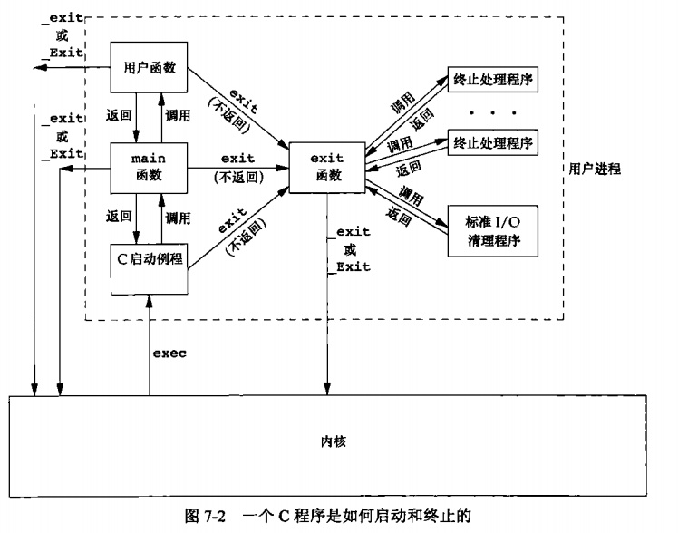
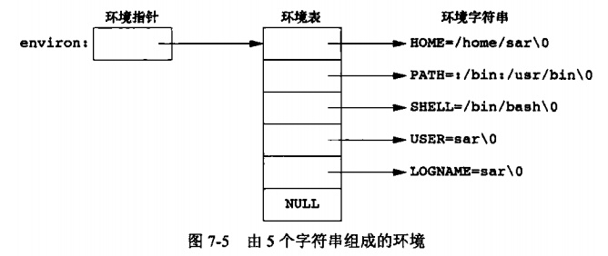
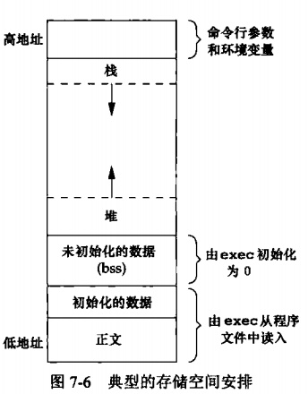

### chapter07 进程环境

#### 章节知识总结

在Unix中有8种方式使进程终止，其中5种为正常终止，它们是:

1. 从main返回；
2. 调用exit;
3. 调用_exit或_Exit
4. 最后一个线程从其启动例程返回
5. 从最后一个线程调用pthread_exit

异常终止有3种方式，它们是:

6. 调用abort
7. 接到一个信号
8. 最后一个线程对取消请求做出响应


`exit`、`_exit`、`_Exit`这3个函数用于正常终止一个程序，而`exit`则现在执行一些清理处理，然后返回内核。这3个退出函数都带一个整型参数，称为`终止状态`(或`退出状态`,exit status).

关于进程的终止状态有以下规定:

* 如果调用这些函数不带终止状态，或`main`执行了一个无返回值的`return`语句，或`main`没有声明返回类型为整型，则该进程的终止状态是`未定义的`
* 但是，如果`main`的返回类型是整型，并且`main`执行到最后一条语句时返回，那么该进程的终止状态是`0`

```cpp
#include<stdio.h>

//没有声明返回类型为整型，且没有return语句，该main函数的终止状态是未定义的
main()
{
    printf("hello,world\n");
}
```

由于历史原因，`exit`函数总是执行一个标准I/O库的清理关闭操作：先调用终止处理程序，之后对于所有打开流调用`fclose`函数。

按照`ISO C`的规定，一个进程可以登记多至32个函数，这些函数将由`exit`自动调用。我们称这些函数为`终止处理程序(exit handler)`，并调用`atexit`函数来登记这些函数。需要注意的是`exit`调用终止处理程序的顺序与它们登记时候的顺序相反。同一函数如若登记多次也会被调用多次。

```cpp
#include<stdlib.h>

int atexit(void (*func)(void));
```

##### 实例：使用atexit函数

```cpp
#include<stdio.h>
#include<stdlib.h>

#define oops(m,x) { perror(m); exit(x); }

static void my_exit1(void);
static void my_exit2(void);

/*
输出:
    main is done
    I'm exit1
    I'm exit1
    I'm exit2
*/

int main(int ac,char* av[])
{
    if(atexit(my_exit2)<0)
        oops("axexit my_exit2",1);
    if(atexit(my_exit1)<0)
        oops("axexit my_exit1",1);
    if(atexit(my_exit1)<0)
        oops("axexit my_exit1",1);
    printf("main is done\n");
    return 0;
}

static void my_exit1(void)
{
    printf("I'm exit1\n");
}

static void my_exit2(void)
{
    printf("I'm exit2\n");
}

```



**注意，内核使程序执行的唯一方法是调用一个exec函数。进程自愿终止的唯一方法是显式或隐式地（通过调用exit）调用_exit或_Exit**。进程也可非自愿地由一个信号使其终止。


当执行一个程序时，调用`exec`的进程可将命令行参数传递给该新程序。

每个程序都接收到一张`环境表`，与参数表一样，环境表也是一个字符指针数组，其中每个指针包含一个以`null`结束的C字符串的地址，全局变量`environ`则包含了该指针数组的地址:

```cpp
char** environ;
```

我们称`environ`为`环境指针`,指针数组为`环境表`,其中各指针指向的字符串为`环境字符串`.



环境字符串的形式`name=value`,通过`getenv`、`setenv`可以分别获取和设置环境变量值。

由于**环境表和环境字符串通常存放在进程存储空间的顶部（栈之上）**，所以对环境表的操作比较讲究。删除一个字符串很简单，只要在环境表中找到该指针，然后将所有后续指针都向环境表首部顺次移动一个位置，但是增加一个字符串或修改一个现有的字符串，可以就需要通过`malloc`或`remalloc`在堆中为环境表分配额外的空间。


(***)历史沿袭至今，C程序一直由下列几部分组成:

1. 正文段：这是CPU执行的机器指令部分，通常是可共享的，另外**正文段常常是只读的**，以防止程序由于意外而修改其指令
2. 初始化数据段:通常称此段为`数据段`,它包含了程序中需明确地赋初值的变量，例如C程序中任何函数之外的声明
3. 未初始化数据段:通常将此段称为`bss`段,在程序开始执行之前，**内核将此段的数据初始化为0或空指针**
4. 栈:自动变量以及每次函数调用时所需保存的信息都存放在此段中
5. 堆:通常在堆中进行动态存储分配。由于历史上形成的惯例，堆位于未初始化数据段的栈之间



**注意，未初始化数据段的内容并不存放在磁盘程序文件中，其原因是，内核在程序开始运行前将它们都设置为0.需要存放在磁盘程序文件中的段只有正文段和初始化数据段.**

`ISO C`说明了3个用于存储空间动态分配的函数(**这3个函数返回的指针都是对齐的**):

1. `malloc`,分配指定字节数的存储区，**此存储区中的初始值不确定**
2. `calloc`,为指定数量指定长度的对象分配存储空间。**该空间中的每一位(bit)都初始化为0**
3. `realloc`，增加或减少以前分配区的长度。当增加长度时，可能需将以前分配区的内容移到另一个足够大的区域，以便在尾端提供增加的存储区，而**新增区域内的初始值则不确定**

```cpp
#include<stdlib.h>

void* malloc(size_t size);
void* calloc(size_t nobj,size_t size);
void* realloc(void* ptr,size_t newsize);

//释放动态分配的内存
void free(void* ptr);
```

`泄露`:若如一个进程调用`malloc`函数，但却忘记调用`free`函数，那么该进程占用的存储空间就会连续增加，这被称为`泄露`.

##### 补充：排查内存泄露的方法

1. 使用`top`指令，若进程的`MEM`一直增加，则说明存在内存泄露的风险
2. 使用`mcheck`库，跟踪`malloc`等内存分配情况

