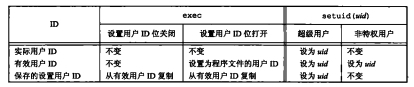

### chapter08 进程控制

#### 章节知识总结

每个进程都有一个非负整型表示的唯一进程ID，且进程ID是复用的。当一个进程终止后，其进程ID就成为复用的候选者，大多数UNIX系统实现延迟复用算法，使得赋予新建进程的ID不同于最近终止进程所使用的ID。

系统中有一些专用进程：ID为0的进程通常是调用进程，常常被称为`交换进程(swapper)`,该进程是内核的一部分，它并不执行任何磁盘上的程序，因此也被称为系统进程；ID为1的进程是`init`进程，在自举过程结束时由内核调用。

获取`进程ID`的相关函数如下:

```cpp
#include<unistd.h>

pid_t getpid(void);     //返回值:调用进程的进程ID

pid_t getppid(void);    //返回值:调用进程的父进程ID

uid_t getuid(void);     //返回值:调用进程的实际用户ID

uid_t geteuid(void);    //返回值:调用进程的有效用户ID

gid_t getgid(void);     //返回值:调用进程的实际组ID

gid_t getegid(void);    //返回值:调用进程的有小组ID
```

一个现有进程可以调用`fork`函数创建一个新进程:

```cpp
#include<unistd.h>

pid_t fork(void);       //返回值：子进程返回0，父进程返回子进程ID；若出错，返回-1
```

调用`fork`后，子进程是父进程的副本，例如，子进程获得父进程数据空间、堆和栈的副本。注意，这是子进程所拥有的副本。父进程和子进程并不共享这些存储空间部分，父进程和子进程共享正文段。

下面这里例子很经典：

* 子进程是父进程的副本，所以不会影响父进程的数据
* 执行`./a.out > test.txt`后由于是全缓冲，所以打印两份`before fork`

```cpp
#include<stdio.h>
#include<unistd.h>
#include<fcntl.h>


#define oops(m,x) { perror(m); exit(x); }

int globval=6;
char buf[]="a write to stdout\n";

/*
执行./a.out 输出:
a write to stdout
before fork
pid=14972, glob=7,var=89
pid=14971, glob=6,var=88

执行./a.out > test.txt 输出:
a write to stdout
before fork
pid=15056, glob=7,var=89
before fork
pid=15055, glob=6,var=88
*/

int main(void)
{
    int var;
    pid_t pid;

    var=88;
    if(write(STDOUT_FILENO,buf,sizeof(buf)-1)!=sizeof(buf)-1)
        oops("write",1);

    printf("before fork\n");

    if((pid=fork())<0){
        oops("fork error",2);
    }
    else if(pid==0){
        globval++;
        var++;
    }
    else{
        sleep(2);
    }
    printf("pid=%ld, glob=%d,var=%d\n",(long)getpid(),globval,var);
    exit(0);
}
```

需要注意的是，`fork`的一个特性是父进程的所有打开文件描述符都被复制到子进程中，这意味着父进程和子进程共享同一个文件偏移量


在`fork`之后处理文件描述符有以下两种常见情况：

1. 父进程等待子进程完整，这种情况下，父进程无需对其描述符做任何处理
2. 父进程和子进程各自执行不同的程序段：这种情况下，在`fork`之后，父进程和子进程各自关闭它们不需使用的文件描述符，这样就不会干扰对方使用的文件描述符。这种方法是网络服务进程经常使用的。

是`fork`失败的两个主要原因是：

1. 系统已经有太多的进程
2. 该实际用户ID的进程总数超过了系统限制

`fork`有以下两种用法:

1. 一个父进程希望复制自己，使父进程和子进程同时执行不同的代码段。这在网络服务进程中是常见的：父进程调用`fork`后，使子进程处理此情况，而父进程则继续等待下一个服务情况
2. 一个进程要执行一个不同的程序。这对`shell`是常见的情况。在这种情况下，子进程从`fork`返回后立刻调用`exec`

函数`vfork`也用于创建一个新进程(有些系统不支持，可移植的应用程序不应该使用这个函数)，与`fork`的不同之处有两点:

1. `vfork`创建的新进程**与父进程共享地址空间**
2. `vfork`保证子进程先运行在，在它调用`exec`或`exit`之后父进程才可能调用运行

由于与父进程共享地址空间，所以子进程对数据的修改会影响父进程，如下面这个例子所示:

```cpp
#include<stdio.h>
#include<unistd.h>

#define oops(m,x) { perror(m); exit(x); }

int globvar=6;

/*
执行./a.out 输出
before vfork
pid=29572,glob=7,var=89
*/

int main(void)
{
    int var;
    pid_t pid;

    var=88;
    printf("before vfork\n");
    if((pid=vfork())<0){
        oops("vfork error",1);
    }
    else if(pid==0)
    {
        globvar++;
        var++;
        _exit(0);
    }
    printf("pid=%ld,glob=%d,var=%d\n",(long)getpid(),globvar,var);
    exit(0);
}
```

如前面所述，不管进程如何终止，最后都会执行内核中的同一段代码，这段代码为相应进程关闭所有打开描述符，释放它所使用的存储器等。

这里对子进程与父进程的结束顺序进行相关讨论:

1. 子进程后于父进程结束：对于父进程已经终止的所有进程，**它们的父进程都改变为`init`进程**。我们称这些进程由`init`进程收养。其操作过程大致是：在一个进程终止时，内核逐个检查所有活动进程，以判断它是否是正要终止进程的子进程，如果是，则该进程的父进程ID就更改为1（`init`进程的ID）,这样就保证了每个进程都有一个父进程。因为`init`被编写成无论何时只要有一个子进程终止，`init`就会调用一个`wait`函数取得其终止状态。所以,"一个init的子进程"可能指的是`init`直接产生的进程，也可能是其父进程已终止，由`init`收养的进程。

2. 子进程先于父进程结束：内核为每个终止子进程保存了一定量的信息，所以当终止进程的父进程调用`wait`或`waitpid`时，可以得到这些信息。在UNIX术语中，一个已经终止、但是其父进程尚未对其进行善后处理（获取终止子进程的有关信息、释放它仍占用的资源）的进程被称为`僵死进程(zombie)`。

##### UNXI处理僵死进程

1. 使用`top`指令，若`zombie`不为0表示有僵死进程
2. 使用`ps -A -ostat,ppid,pid,cmd | grep -e '^[zZ]'`查找僵死进程
3. 使用`kill -HUP ppid`清理僵死进程

当一个进程正常或异常终止时，**内核就向其父进程发送`SIGCHLD`信号**。当进程接收到`SIGCHLD`信号时，我们希望调用`wait`或`waitpid`进行处理，这是`wait`和`waitpid`会立刻返回。但是如果在随机时间点调用`wait`或`waitpid`，则进程可能会阻塞。

```cpp
#include<sys/wait.h>

//两个函数返回值：若成功，返回进程ID；若出错，返回0
pid_t wait(int *statloc);   //如果statloc不是一个空指针，则终止进程的终止状态就存放在它所指向的单元内
pid_t waitpid(pid_t pid,int *statloc,int options);      //可选等待哪个进程结束
```

`wait`和`waitpid`这两个函数有以下两个区别:

* 在一个子进程终止前，`wait`使其调用者阻塞，而`waitpid`有一选项，可使调用者不阻塞。
* `waitpid`并不等待其调用之后的第一个终止子进程，它有若干个选项，可以控制它所等待的进程。

对于`waitpid`函数中`pid`参数的作用解释如下:

1. `pid==-1`：等待任一子进程，此种情况下，`watpid`与`wait`等效
2. `pid>0`：等待进程ID与pid相等的子进程
3. `pid==0`：等待组ID等于调用进程组ID的任一子进程
4. `pid<-1`：等待组ID等于pid绝对值的任一子进程

`waitpid`含提供了`wait`函数没有提供的3个功能:

1. `waitpid`可等待一个特定的进程，而`wait`则返回任一终止子进程的状态
2. `waitpid`提供了一个`wait`的非阻塞版本。有时希望获取一个子进程的状态，但不想阻塞
3. `waitpid`通过`WUNTRACKED`和`WCONETINUED`选项支持作业控制

##### 实例:两次fork阻止僵死进程的产生

```cpp
#include<stdio.h>
#include<unistd.h>
#include<sys/wait.h>


#define oops(m,x) { perror(m); exit(x); }

/*
通过两次fork，使得第二个子进程由init进程接管
避免了僵尸进程的产生
*/

int main(void)
{
    pid_t pid;
    if((pid=fork())<0){
        oops("fork error",1);
    }
    else if(pid==0){    /* first child */
        if((pid=fork())<0){
            oops("fork error",1);
        }
        else if(pid>0)
            exit(0);

        sleep(2);       //这里需要sleep(2),否则second child和first child的执行顺序不确定，无法保证second child被init接管
        printf("seoncd child,parent pid = %ld\n", (long)getppid());
        exit(0);
    }
    if(waitpid(pid,NULL,0)!=pid){
        oops("waitpid error",2);
    }
    exit(0);
}
```

UNIX还提供了其他更加复杂的`wait`系列函数，比如`waitid`、`wait3`、`wait4`等.

函数`exec`：当进程调用一种`exec`函数时，该进程执行的程序会完全替换为新程序，而新程序则从其`main`函数开始执行。

因为调用`exec`并不创建新进程，所以前后的进程ID并未改变。`exec`只是用磁盘上的一个新程序替换了当前进程的正文段、数据段、堆段和栈段。

```cpp
#include<unistd.h>

/*
对exec函数名称的总结：
1. 带`l`的：传入以NULL结尾的可变形参
2. 带`v`的：传入以NULL结尾形参数组
3. 带`p`的：传入程序的名称，在PATH环境变量中查找该名称(即传入参数filename的)
4. 带`e`的：传入环境变量
*/

int execl(const char* pathname,const char* arg0,.../* (char*)0 */);
int execv(const char* pathname,char* const argv[]);
int execle(const char* pathnme,const char* arg0,.../* (char*)0,char* const envp[]*/)
int execve(const char* pathname,char* const argv[],char* const envp[]);
int execlp(const char* filename,const char* arg0,.../* (char*)0 */);
int execvp(const char* filename,char* const argv[]);
int fexecve(int fd,char* const argv[],char* const envp[]);

```

##### 实例：使用exec函数

```cpp
#include<stdio.h>
#include<unistd.h>
#include<sys/wait.h>

#define oops(m,x) { perror(m); exit(x); }

char* env_init[]={"USER=unknown","PATH=/tmp",NULL};

int main(void)
{
    pid_t pid;
    if((pid=fork())<0){
        oops("fork error",1);
    }
    else if(pid==0){
        if(execle("/home/XXX/programHome/Unix_book_code/chapter08/c8_8_17","c8_8_17","myarg1","MY ARG2",NULL,env_init)<0){
            oops("execle error",2);
        }
    }
    if(waitpid(pid,NULL,0)<0){
        oops("waitpid error",3);
    }
    if((pid=fork())<0){
        oops("fork error",1);
    }
    else if(pid==0){
        //在PATH环境变量下查找
        //所以需要先用export PATH=${PATH}:/home/XXX/programHome/Unix_book_code/chapter08 指令将当前目录添加到PATH环境变量中
        if(execlp("c8_8_17","c8_8_17","only 1 arg",NULL)<0){
            oops("execlp error",4);
        }
    }
    exit(0);
}
```

```cpp
//c8_8_17.c
#include<stdio.h>
#include<unistd.h>

int main(int argc,char* argv[])
{
    int i;
    char** ptr;
    extern char** environ;

    for(i=0;i<argc;++i)
        printf("argv[%d]:%s\n",i,argv[i]);

    for(ptr=environ;*ptr!=0;++ptr)
        printf("%s\n",*ptr);

    exit(0);
}
```

UNIX组关于用户ID:

1. 实际用户ID(RUID):用于标识一个系统用户是谁，一般在登录之后，就被唯一确定
2. 有效用户ID(EUID):用于系统决定用户对系统资源的权限，用户做任何操作时，都是在判断有效用户ID是否有权限
3. 保存设置用户ID(SUID):是有效用户ID的副本，它的作用是为了以后恢复有效用户ID用的

在UNIX中可以通过`setuid`来设置用户ID或有效用户ID

```cpp
#include<unistd.h>

int setuid(uid_t uid);
```

(***)使用`setuid`更改用户ID的规则如下:

1. 若进程具有超级用户特权，则`setuid`函数将实际用户ID、有效用户ID以及保存的设置用户ID(saved set-user-ID)设置为uid
2. 若进程没有超级用户特权，但是`uid`等于实际用户ID或保存的设置用户ID，则`setuid`只将有效用户ID设置为`uid`。不更改实际用户ID和保存的设置用户ID

这里将更改用户ID的不同方法总结如下图:


UNIX中还包含两个函数`seteuid`和`setegid`用于更改有效用户ID和有效组ID

```cpp
#include<unistd.h>

int seteuid(uid_t uid);
int setegid(git_t gid);
```

一个非特权用户可将其有效用户ID设置为其实际用户ID或其保存的设置用户ID。对于一个特权用户则可将有效用户ID设置为uid(这区别于`setuid`函数，它更改所有3个用户ID)。

所有现今的UNIX系统都支持解释器文件。这种文件是文本文件，其起始行的形式是:

```shell
#! pathname[optional-argument]
```

比如常见的解释器以下列行开始:

```shell
#! /bin/sh
```

##### 执行一个解释器文件的程序

```cpp
#include<stdio.h>
#include<unistd.h>
#include<sys/wait.h>

#define oops(m,x) { perror(m); exit(x); }

/*
部分输出:
argv[0]:/home/wushukun/programHome/Unix_book_code/chapter08/c8_8_17
argv[1]:foo
argv[2]:/home/wushukun/programHome/Unix_book_code/chapter08/testingterp
argv[3]:myarg1
argv[4]:MY ARG2

可以看出当运行解释器文件时，execl传入的参数后移了
*/

int main(void)
{
    pid_t pid;

    if((pid=fork())<0){
        oops("fork error",1);
    }
    else if(pid==0){
        if(execl("/home/XXX/programHome/Unix_book_code/chapter08/testingterp","testringterp","myarg1","MY ARG2",NULL)<0){
            oops("execl error",2);
        }
    }
    if(waitpid(pid,NULL,0)<0){
        oops("waitpid error",3);
    }
    exit(0);
}
```

`testingterp`解释器文件如下:

```shell
#! /home/wushukun/programHome/Unix_book_code/chapter08/c8_8_17 foo
```

UNIX系统定义了`system`函数使得用户可以直接使用系统指令:

```cpp
#include<stdlib.h>

int system(const char* cmdstring);  //运行一条指令
```

因为`system`在其实现中调用了`fork`、`exec`和`waitpid`，因此有3种返回值

##### system函数的简单实现(没有对信号进行处理)

```cpp
#include<stdio.h>
#include<unistd.h>
#include<sys/wait.h>
#include<errno.h>

#define oops(m,x) { perror(m); exit(x); }

/*
输出
2021年 03月 20日 星期六 12:34:58 CST
exit status:0
sh: 1: nosuchcommand: not found
exit status:127
maokaige pts/2        2021-03-09 21:57 (tmux(9073).%0)
exit status:44
*/

int system(const char* cmdstring)
{
    pid_t pid;
    int status;

    if(cmdstring==NULL)
        return 1;

    if((pid=fork())<0){
        oops("fork error",1);
    }
    else if(pid==0){
        execl("/bin/sh","sh","-c",cmdstring,NULL);      //调用sh解释器执行指令
        _exit(127);
    }
    else{
        while(waitpid(pid,&status,0)<0){
            if(errno!=EINTR){   //子进程遇到信号会将errno置于EINTR
                status=-1;
                break;
            }
        }
    }
    return status;
}

int main(void)
{
    int status;

    if((status= system("date"))<0){
        oops("system() error",1);
    }

    printf("exit status:%d\n",status>>=8);

    if((status=system("nosuchcommand"))<0){
        oops("system() error",1);
    }

    printf("exit status:%d\n",status>>=8);

    if((status=system("who; exit 44"))<0){
        oops("system() error",1);
    }

    printf("exit status:%d\n",status>>=8);

    exit(0);
}
```

