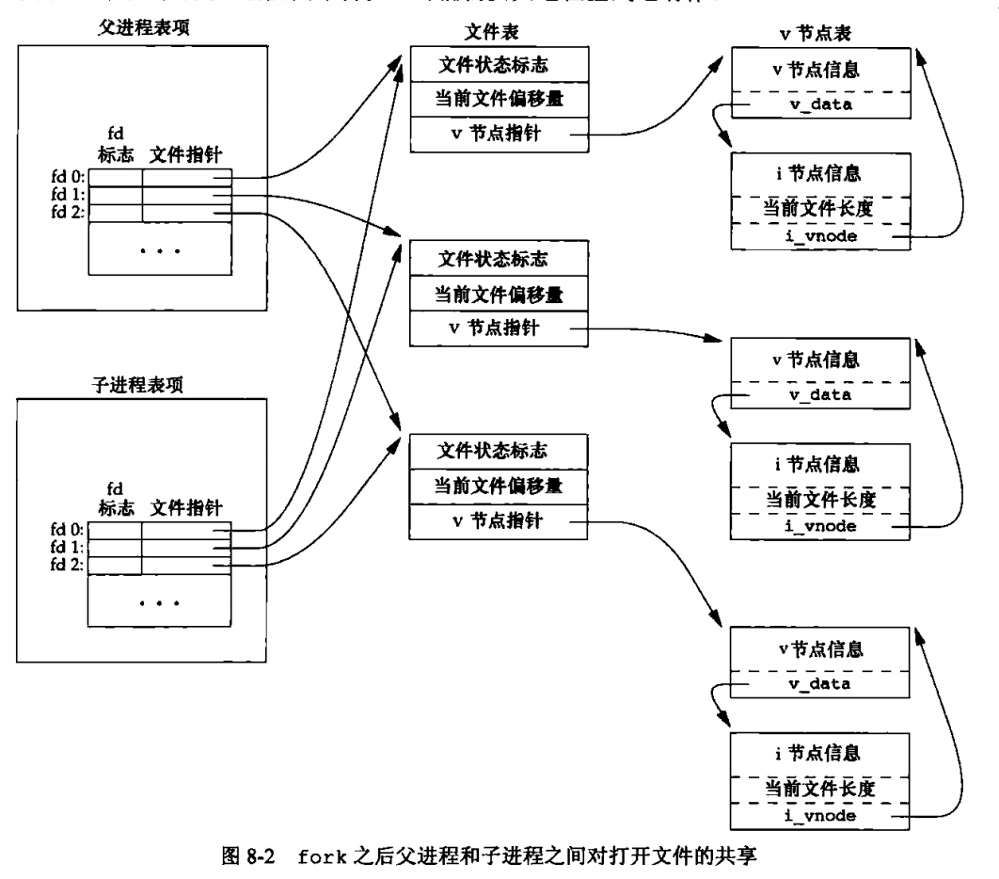

### chapter08 进程控制

#### 章节知识总结

每个进程都有一个非负整型表示的唯一进程ID，且进程ID是复用的。当一个进程终止后，其进程ID就成为复用的候选者，大多数UNIX系统实现延迟复用算法，使得赋予新建进程的ID不同于最近终止进程所使用的ID。

系统中有一些专用进程：ID为0的进程通常是调用进程，常常被称为`交换进程(swapper)`,该进程是内核的一部分，它并不执行任何磁盘上的程序，因此也被称为系统进程；ID为1的进程是`init`进程，在自举过程结束时由内核调用。

获取`进程ID`的相关函数如下:

```cpp
#include<unistd.h>

pid_t getpid(void);     //返回值:调用进程的进程ID

pid_t getppid(void);    //返回值:调用进程的父进程ID

uid_t getuid(void);     //返回值:调用进程的实际用户ID

uid_t geteuid(void);    //返回值:调用进程的有效用户ID

gid_t getgid(void);     //返回值:调用进程的实际组ID

gid_t getegid(void);    //返回值:调用进程的有小组ID
```

一个现有进程可以调用`fork`函数创建一个新进程:

```cpp
#include<unistd.h>

pid_t fork(void);       //返回值：子进程返回0，父进程返回子进程ID；若出错，返回-1
```

调用`fork`后，子进程是父进程的副本，例如，子进程获得父进程数据空间、堆和栈的副本。注意，这是子进程所拥有的副本。父进程和子进程并不共享这些存储空间部分，父进程和子进程共享正文段。

下面这里例子很经典：

* 子进程是父进程的副本，所以不会影响父进程的数据
* 执行`./a.out > test.txt`后由于是全缓冲，所以打印两份`before fork`

```cpp
#include<stdio.h>
#include<unistd.h>
#include<fcntl.h>


#define oops(m,x) { perror(m); exit(x); }

int globval=6;
char buf[]="a write to stdout\n";

/*
执行./a.out 输出:
a write to stdout
before fork
pid=14972, glob=7,var=89
pid=14971, glob=6,var=88

执行./a.out > test.txt 输出:
a write to stdout
before fork
pid=15056, glob=7,var=89
before fork
pid=15055, glob=6,var=88
*/

int main(void)
{
    int var;
    pid_t pid;

    var=88;
    if(write(STDOUT_FILENO,buf,sizeof(buf)-1)!=sizeof(buf)-1)
        oops("write",1);

    printf("before fork\n");

    if((pid=fork())<0){
        oops("fork error",2);
    }
    else if(pid==0){
        globval++;
        var++;
    }
    else{
        sleep(2);
    }
    printf("pid=%ld, glob=%d,var=%d\n",(long)getpid(),globval,var);
    exit(0);
}
```

需要注意的是，`fork`的一个特性是父进程的所有打开文件描述符都被复制到子进程中，这意味着父进程和子进程共享同一个文件偏移量



在`fork`之后处理文件描述符有以下两种常见情况：

1. 父进程等待子进程完整，这种情况下，父进程无需对其描述符做任何处理
2. 父进程和子进程各自执行不同的程序段：这种情况下，在`fork`之后，父进程和子进程各自关闭它们不需使用的文件描述符，这样就不会干扰对方使用的文件描述符。这种方法是网络服务进程经常使用的。

是`fork`失败的两个主要原因是：

1. 系统已经有太多的进程
2. 该实际用户ID的进程总数超过了系统限制

`fork`有以下两种用法:

1. 一个父进程希望复制自己，使父进程和子进程同时执行不同的代码段。这在网络服务进程中是常见的：父进程调用`fork`后，使子进程处理此情况，而父进程则继续等待下一个服务情况
2. 一个进程要执行一个不同的程序。这对`shell`是常见的情况。在这种情况下，子进程从`fork`返回后立刻调用`exec`

函数`vfork`也用于创建一个新进程(有些系统不支持，可移植的应用程序不应该使用这个函数)，与`fork`的不同之处有两点:

1. `vfork`创建的新进程**与父进程共享地址空间**
2. `vfork`保证子进程先运行在，在它调用`exec`或`exit`之后父进程才可能调用运行

由于与父进程共享地址空间，所以子进程对数据的修改会影响父进程，如下面这个例子所示:

```cpp
#include<stdio.h>
#include<unistd.h>

#define oops(m,x) { perror(m); exit(x); }

int globvar=6;

/*
执行./a.out 输出
before vfork
pid=29572,glob=7,var=89
*/

int main(void)
{
    int var;
    pid_t pid;

    var=88;
    printf("before vfork\n");
    if((pid=vfork())<0){
        oops("vfork error",1);
    }
    else if(pid==0)
    {
        globvar++;
        var++;
        _exit(0);
    }
    printf("pid=%ld,glob=%d,var=%d\n",(long)getpid(),globvar,var);
    exit(0);
}
```

