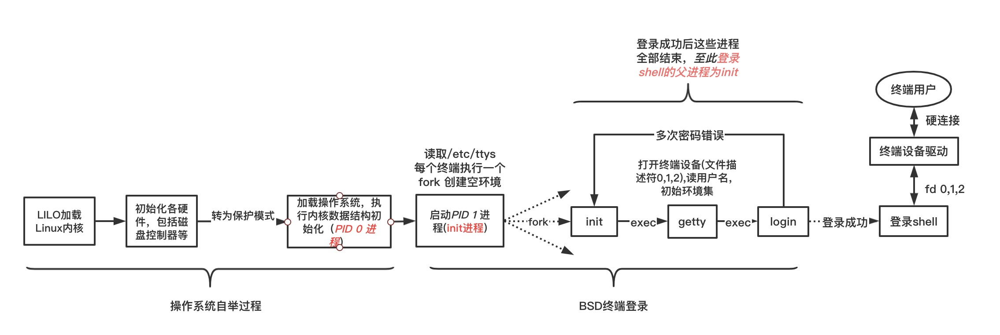
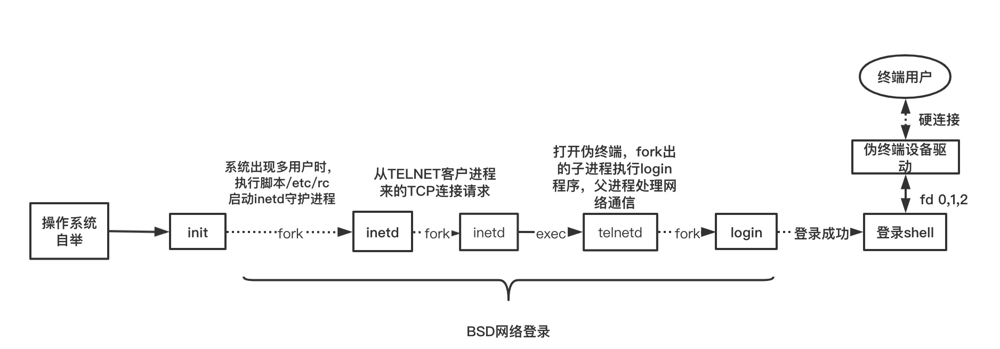
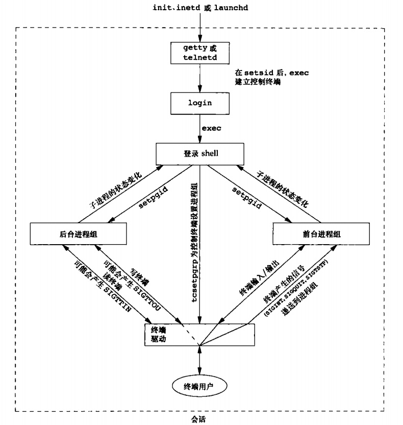
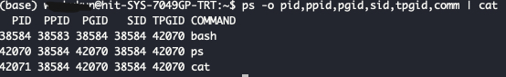
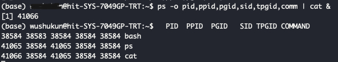

[toc]

### chapter09 进程关系

#### 终端登录

大多数Linux系统的`终端登录`方式与`BSD终端登录`方式大同小异，这里以`BSD终端登录`为例进行说明.



对于上图有以下几点需要注意:

1. 当系统自举后，内核创建进程ID为1的进程，也就是`init`进程：`init`进程使系统进入多用户模式，`init`读取文件`/etc/ttys`，对每一个运行登录的终端设备，`init`调用一次`fork`,它所生成的子进程则`exec getty`程序
2. `getty`程序对终端设备调用`open`函数，一旦设备被打开，则文件描述符0,1,2就被设置到该设备。然后`getty`输出`login:`之类的信息，并等待用户键入用户名；当用户键入用户名后，就以`exec`的方式调用`login`程序
3. `login`能处理多项工作
    * 当用户几次键入的口令都无效时，`login`调用`exit(1)`表示登录失败。父进程`init`了解到子进程的终止情况后，将再次调用`fork`,其后又执行了`getty`，对此终端重复上述过程
    * 如果用户登录等差，`login`就将完成如下工作:
        * 将当前工作目录更改为该用户的起始目录(`chdir`)
        * 调用`chown`更改该终端的所有权，使登录用户成为它的所有者
        * 将对该终端设备的访问权限改变成"用户读和写"
        * 调用`setgid`及`initgroups`设置进程的组ID
        * 用login得到的信息初始化环境
        * `login`进程更改登录用户的用户ID`setuid`(由于`setuid`是由超级用户调用，所以三个用户ID都会变成`uid`)并调用该用户的登录shell(`execl("/bin/sh","-sh",(char*)0)`)

#### 网路登录

这里也以`BSD网络登录`为例进行说明(同时以`talnet`连接为例).



对于上图有以下几点需要注意:

1. 作为系统启动的一部分，`init`调用一个`shell`，使其执行shell脚本`/etc/rc`，由此shell脚本启动一个守护进程`inetd`,一旦`shell脚本结束`，`inetd`的父进程就变成`init`,`inetd`等待`TCP/IP`连接
2. 当一个连接请求到达时，`inetd`执行`fork/exec`执行相应的请求，这里以`TELNET`连接为例，则产生一个`telnetd`服务进程
3. 然后`telnetd`服务进程打开一个伪终端设备，并用`fork`分成两个进程。父进程处理通过网络连接的通信，子进程则执行`login`程序。父进程和子进程通过伪终端相连接


这里需要理解的重点是:当通过终端或网络登录时，我们得到一个`登录shell`，其标准输入、标准输出和标准错误要么连接到一个终端设备，要么连接到一个伪终端设备上。

#### 进程组

每个进程组有一个领头进程，进程组是一个或多个进程的集合，通常它们与一组作业相关联，可以接受来自同一终端的各种信号。每个进程组有一个唯一的进程组ID。进程组ID类似于进程ID，它是一个正整数。

```cpp
#include<unistd.h>

//函数getpgrp 返回调用进程的进程组ID
pid_t getpgrp(void);

//函数setpgid 可以加入一个现有的进程组或创建一个新进程组
//一个进程只能为它自己或它的子进程设置进程组ID,在它的子进程调用exec后，它就不再更改该子进程的进程组ID
int setpgid(pid_t pid,pid_t pgid);  //将pid进程的进程组ID设置为pgid
```

> 在大多数作业控制`shell`中，在`fork`之后调用`setpgid`，使父进程设置其子进程的进程组ID，并且也使子进程设置其自己的进程组ID。这两个调用都是必要的，因为父进程和子进程运行的先后次序不确定，会因为子进程的组员身份取决于哪个进程首先执行而产生竞争条件，而使用两个调用，可以保证子进程确实进入了进程组中。

#### 会话

会话`session`是一个或多个进程组的集合.比如一条管道指令中的额多个进程属于同一进程组:

```shell
proc1 | proc2 &
proc3 | proc4 | proc5
```

关于会话有以下特性:

* 一个会话可以有控制终端，这通常是终端设备（终端登录情况下）或伪终端设备（网络登录情况下）
* 建立与控制终端连接的会话首进程被称为控制进程
* 一个会话中的几个进程组可被分为一个前台进程组以及一个或多个后台进程组
* 如果一个会话有一个控制终端，则它有一个前台进程组，其他进程组为后台进程组
* 终端产生的信号会发送给前台进程组中的所有进程
* 只有前台进程组接受终端输入，如果后台进程组试图读取终端，这并不是一个错误，但是终端驱动程序将检测这种情况情况，并且向后台发送一个特定`SGITTIN`信号，该信号通常会停止此后台作业

对于会话总结如下图:



与会话有关的函数有:

```cpp
#include<unistd.h>

//函数setsid创建一个新会话
pid_t setsid(void);

//函数getsid返回会话首进程ID
pid_t getsid(pid_t pid);

//函数tcgetpgrop返回前台进程组ID,它与fd上打开的终端相关联
pid_t tcgetpgrp(int fd);

```

#### 作业控制

`作业控制`是`BSD`在1980年左右增加的一个特性。它允许在一个终端上启动多个作业(进程组)，它控制哪一个作业可以访问该终端以及哪些作业在后台运行。（在不支持`作业控制`的系统中，不区分前台进程和后台进程）

#### shell执行顺序

仔细体会下面这个例子:

(`ps`和`cat`都属于同一前台进程组)



(`ps`和`cat`都属于同一后台进程组)



#### 孤儿进程组

(***)POSIX.1将`孤儿进程组`定义为：该组中每个成员的父进程要么是该组的一个成员，要么不是该组所属会话的成员。

如果进程组不是孤儿进程组，那么在属于同一会话的另一个组中的父进程就有机会重新启动该组中停止的进程。

**POSIX.1要求向新孤儿进程组中处于停止状态的每一个进程发送挂断信号`SIGHUP`，接着又向其发送继续信号`SIGCONT`**

##### 例子

```cpp

#include<stdio.h>
#include<unistd.h>
#include<signal.h>
#include<errno.h>

#define oops(m,x) { perror(m); exit(x); }

static void sig_hup(int signo)
{
    printf("SIGHUP received,pid = %ld\n",(long)getpid());
}

static void pr_ids(char* name)
{
    printf("%s: pid=%d,ppid=%ld,pgrp=%ld,tpgrp=%ld\n",
            name,(long)getpid(),(long)getppid(),(long)getpgrp(),
            (long)tcgetpgrp(STDIN_FILENO));
    fflush(stdout);
}
/*
输出:
parent: pid=46705,ppid=46275,pgrp=46705,tpgrp=46705
child: pid=46706,ppid=46705,pgrp=46705,tpgrp=46705
SIGHUP received,pid = 46706
child: pid=46706,ppid=1,pgrp=46705,tpgrp=46705
read error 5 on controlling TTY
*/

int main(void)
{
    char c;
    pid_t pid;

    pr_ids("parent");
    if((pid=fork())<0){
        oops("fork error",1);
    }
    else if(pid>0){
        sleep(5);
    }
    else{
        pr_ids("child");
        signal(SIGHUP,sig_hup);
        kill(getpid(),SIGTSTP); //给自己发送停止指令，等待父进程结束，从而导致该进程进入init的孤儿进程组
        pr_ids("child");
        if(read(STDIN_FILENO,&c,1)!=1){     //后台进程试图读取终端会触发异常
            printf("read error %d on controlling TTY\n",errno);
        }
    }
    exit(0);
}
```