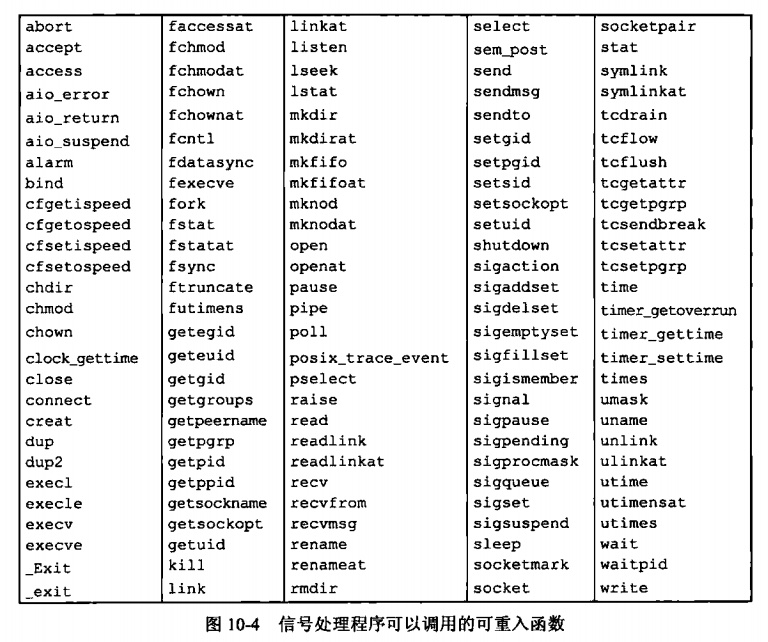

[toc]

### chapter10 信号

#### 信号概念

`信号`是软件中断，在头文件`<signal.h>`中，信号名都被定义为正整数常量。不存在编号为`0`的信号。

> POSIX.1 将信号编号0定义为一个空信号，使用指令`kill(pid,0)`可以用来确定一个特定进程是否仍然存在，如果向一个并不存在的进程发送空信号，则`kill`返回`-1`.

当造成信号的事件发生时，向一个进程发送一个信号。这里的`事件`可以是硬件异常(如除以0)、软件条件(如alarm定时器超时)、终端产生的信号或调用`kill`函数.

在一个信号出现时，可以告诉内核按下列3种方式之一进行处理:

1. 忽略此信号，但有两种信号决不能被忽略，它们是`SIGKILL`和`SIGSTOP`，这两种信号不能被忽略的原因是：它们向内核和超级用户提供了使进程终止或停止的可靠方法
2. 捕捉信号，这是需要编写一个对应的信号处理函数
3. 执行系统默认动作，注意，对大多数信号，系统的默认动作是终止该进程

#### 函数signal

UNIX系统信号机制最简单的接口是`signal`函数

```cpp
#include<signal.h>

void (*signal(int signo,void (*func)(int)))(int);
```

上面所示的`signal`函数原型也可以写成:

```cpp
typedef void Sigfunc(int);

Sigfunc *signal(int,Sigfunc*);      //返回值：若成功，返回以前的信号处理配置；若出错，返回SIG_ERR
```

`signo`参数表示信号量，`func`可以取以下三种值:

1. `SIG_IGN`:向内核表示忽略此信号(记住有两个信号`SIGKILL`和`SIGSTOP`不能忽略)
2. `SIG_DFL`:表示接到此信号后的动作是系统默认动作
3. 指定函数地址：则在信号发生时，调用此函数，我们称这种处理为捕捉该信号，称此函数为`信号处理程序(signal handler)`或`信号捕捉函数(signal-catching function)`.

这里有两点需要注意:

1. 调用`exec`:`exec`函数将原先设置为要捕捉的信号都更改为默认动作，因为信号捕捉函数的地址很可能在所执行的新程序文件中已无意义了
2. 调用`fork`:当一个进程调用`fork`时，其子进程继承父进程的信号处理方式，因为子进程在开始时复制了父进程内存映像，所以信号捕捉函数的地址在子进程中石油意义的

##### 实例：捕捉SIGUSR1和SIGUSR2的简单程序

`SIGUSR1`和`SIGUSR2`是UNIX系统预留给用户的两个未定义信号

```cpp
#include<stdio.h>
#include<unistd.h>
#include<signal.h>

#define oops(m,x) { perror(m); exit(x); }

static void sig_usr(int);

/*
执行:
kill -USR1 1158
kill -USR2 1158
kill 1158       ---> kill指令默认发送SIGTERM信号
*/

int main(void)
{
    if(signal(SIGUSR1,sig_usr)==SIG_ERR)
        oops("signal error",1);
    if(signal(SIGUSR2,sig_usr)==SIG_ERR)
        oops("signal error",1);
    for(;;) pause();
    return 0;
}

static void sig_usr(int signo)
{
    if(signo==SIGUSR1)
        printf("receive SIGUSR1.\n");
    else if(signo==SIGUSR2)
        printf("receive SIGUSR2.\n");
    else
        printf("receive signal.\n");
}
```

#### 不可靠信号

在早期的UNIX版本中，信号是不可靠的，不可靠在这里指的是，信号可能会丢失：一个信号发生了，但进程却可能一直不知道这一点。

**早期版本中的一个问题是在进程每次接到信号对其进行处理时，随即将该信号动作重置为默认值。**

典型的例子是：在早期的UNIX系统中，如果进程在执行一个**低速系统调用**而阻塞期间捕捉到一个信号，则该系统调用就被中断不再继续执行。

其中，系统调用可以分为两类：`低速系统调用`和`其他系统调用`;低速系统调用时可能会使进程永远阻塞的一类系统调用。

为了使被中断的系统调用恢复，典型的代码程序如下:

```cpp
if((n=read(fd,buf,BUFSUZE))<0){
    if(errno==EINTR)    /* 阻塞期间捕捉到信号会中断系统调用，同时将errno置为EINTR */
        goto again;     /* 将由于这种情况而中断的系统调用恢复 */
}
```

为了帮助应用程序使其不必处理被中断的系统调用，4.2BSD引进了某些被中断系统调用的`自动重启动`。自动重启动的系统调用包括:`ioctl`、`read`、`readv`、`write`、`writev`、`wait`和`waitpid`.如前所述，**其中前5个函数只有对低速设备进场操作时才会被信号中断。而`wati`和`waitpid`在捕捉到信号时总是被中断**。

#### 可重入函数

`Single UNIX Specification`说明了在信号处理程序中保证调用安全的函数(如下图)，这些函数是`可重入`的并被称为是`异步信号安全的`.



以下函数通常是不可重入的:

1. 已知它们使用静态数据结构
2. 它们调用`malloc`或`free`
3. 它们是标准I/O函数，标准I/O库的很多实现都以不可重入方式使用全局数据结构

> 需要注意的是，即使信号处理程序调用的是可重入的函数，由于每个线程都有一个`errno`变量，所以信号处理程序可能会修改其原先值。因此，作为一个通用的规则，在信号处理程序中调用可重用函数时，应当在调用前保存`errno`，在调用后恢复`errno`.

#### 可靠信号术语和语义

在信号产生和传递之间的时间间隔内，称信号是`未决的(pending)`.

进程可以选用"阻塞信号递送"。如果为进程产生了一个阻塞的信号，而且对该信号的动作是系统默认动作或捕捉该信号，则为该进程将此信号保持未`未决状态`,直到进程对此信号解除了阻塞，或者将对此信号的动作更改为忽略。（每个进程都有一个信号屏蔽字，它规定了当前要阻塞递送到该进程的信号集）

需要注意的是，大多数系统对递送了多次的信号只递送一次。（在会对信号排队的系统中，信号会被递送多次）

#### 函数kill和raise

`kill`函数将信号发送给进程或进程组，`raise`函数则允许进程向自身发送信号：

```cpp
#include<signal.h>

//两个函数返回值：若成功，返回0；若出错，返回-1
int kill(pid_t pid,int signo);
int raise(int signo);      // <==>  等价于 kill(getpid(),signo);
```

#### 函数alarm和pause

使用`alarm`函数可以设置一个定时器(闹钟时间)，在将来的某个时刻该定时器会超时。当定时器超时时，产生`SIGALRM`信号。如果忽略或不捕捉此信号，则此默认动作是终止调用该`alarm`函数的进程.

```cpp
#include<unistd.h>

//返回值：0或以前设置的闹钟时间的余留秒数
unsigned int alarm(unsigned int seconds);
```

`重置闹钟`:每个进程只能有一个闹钟时间，如果在调用`alarm`时，之前已为该进程注册的闹钟时间还没有超时，则该闹钟时间的余留值作为本次`alarm`函数调用的值返回。以前注册的闹钟时间则被新值替代.
`关闭闹钟`:如果有以前注册的尚未超过的闹钟时间，而且本次调用的`seconds`值是0,则取消以前的闹钟时间，其余留值仍作为`alarm`函数的返回值.

`pause`函数使调用进程挂起直至捕捉到一个信号

```cpp
#include<unistd.h>

//返回值：-1,errno设置为EINTR
int pause(void);
```

只有执行了一个信号处理程序并从其返回时，`pause`才返回.


#### 常见信号总结