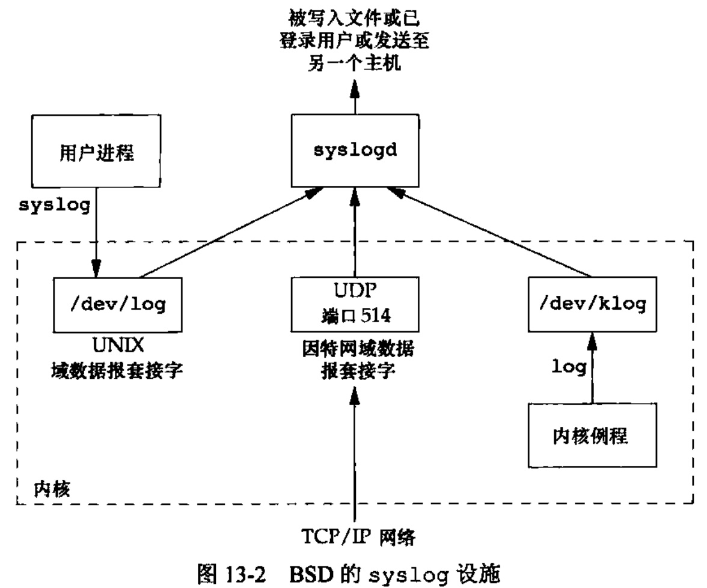

[toc]

### chapter13 守护进程

`守护进程(daemon)`是生存期长的一种进程，它们常常在系统引导装入时启动，仅在系统关闭是才终止。

注意，大多数守护进程都以超级用户(root)特权运行。所有的守护进程都没有控制终端，其终端名设置为问号。最后，应当引起注意的是用户层守护进程的父进程是init进程。

### 守护进程编写规则

在编写守护进程程序时需遵循一些基本规则：

1. 首先要做的是调用`umak`将文件模式创建屏蔽字设置为一个已知值(通常是0)
2. 调用`fork`,然后使父进程`exit`
3. 调用`setsid`创建一个新会话，之后使调用进程称为新会话的首进程、成为一个新进程组的组长进程、没有控制终端
4. 将当前工作目录更改为根目录
5. 关闭不再需要的文件描述符
6. 某些守护进程打开`/dev/null`使其具有文件描述符`0`、`1`和`2`,这样，任何一个试图读标准输入、写标准输出或标准错误的库例程都不会产生任何效果

### 出错记录

通过`syslog`可以集中对守护进程的出错记录进行统一管理。

有3种产生日志消息的方法：

1. 内核例程可以调用`log`函数，任何一个用户进程都可以通过打开`open`并读取`read` `/dev/klog`设备来读取这些消息
2. 大多数用户进程(守护进程)调用`syslog`函数来产生日志消息，这些消息被发送到`UNIX`域数据报套接字`/dev/log`
3. 无论一个用户进程是在此主机上，还是在通过`TCP/IP`网络连接到此主机的其他主机上，都可将日志消息发向`UDP`端口`514`



`syslog`设施的接口是`syslog`函数:

```cpp
#include<syslog.h>

//可设置相应优先级的日志
void syslog(int priority, const char* format,...)

```
