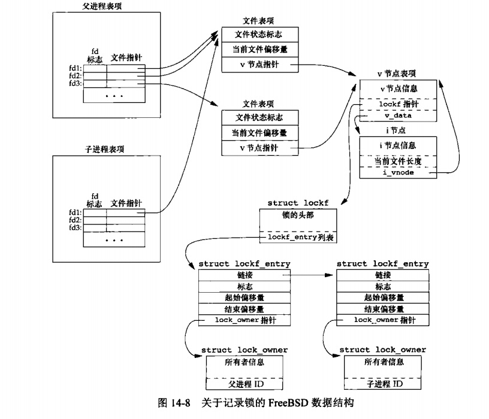
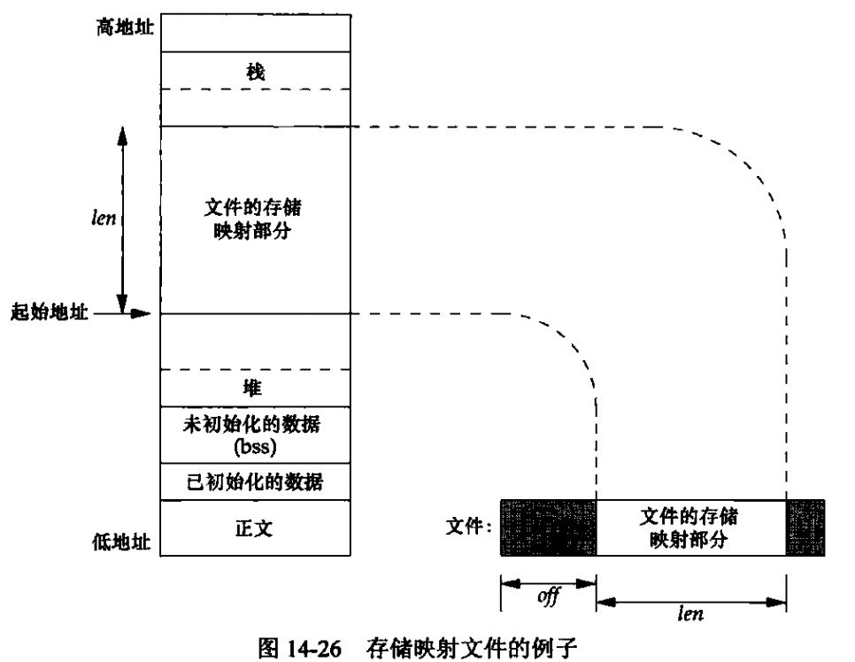

[toc]

### chapter14 高级I/O

#### 非阻塞I/O

非阻塞I/O使我们可以发出`open`、`read`和`write`这样的I/O操作，并使这些操作不会永远阻塞。如果这种操作不能完成，则调用立刻出错返回，表示该操作如继续执行将阻塞。

对于一个给定的描述符，有两种为其指定非阻塞I/O的方法:

1. 如果调用`open`获得描述符，则可指定`O_NONBLOCK`标志
2. 对于已经打开的一个描述符，则可调用`fcntl`,由该函数打开`O_NONBLOCK`文件状态标志

#### 记录锁

`记录锁(record locking)`的功能是：当第一个进程正在读或修改文件的某个部分时，使用记录锁可以阻止其他进程修改同一文件区。（一个更适合的术语可能是`字节范围锁`,因为它锁定的只是文件中的一个区域）

通过`fcntl`可以对记录锁进行相应的设置:

```cpp
#include<fcntl.h>
int fcntl(int fd,int cmd,.../* struct flock *flockptr */)
```

`fcntl`可以设置的3中cmd为`F_GETLK`(判断锁是否会被阻塞),`F_SETLK`(设置记录锁),`F_STELKW`(`F_SETLK`的阻塞版本)

`fcntl`可以设置两种类型的锁:`共享读锁`和`独占性写锁`。基本规则是：任意多个进程在一个给定的字节上可以有一把共享的读锁，但是在一个给定字节上只能有一个进程有一把独占写锁。

上面的基本规则并不适用于单个进程提出的多个锁请求：如果一个进程对一个文件区间已经有了一把锁，后来该进程又企图在同一文件区间再加一把锁，那么新锁将替换已有锁。比如，若一进程在某文件的16~32字节区间有一把写锁，然后又试图在16~32字节区间加一把读锁，那么该请求将成功执行，原来的写锁会被替换为读锁。

死锁：如果两个进程相互等待对方持有并且不释放（锁定）的资源时，则这两个进程就处于死锁状态。当`fcntl`检测到死锁时，内核必须选择一个进程接收出错返回。

关于记录锁的自动继承和释放有3条规则:

1. 锁与进程和文件两者相关联：当一个进程终止时，它所建立的锁全部释放；无论一个描述符何时关闭，该进程通过这一描述符引用可以将其锁释放。

```cpp
//例子一：锁与文件相关联
fd1=open(pathname,...);
read_lock(fd1,...);
fd2=dup(fd1);
close(fd2);     //在close(fd2)后，在fd1上设置的锁会被释放

//例子二：锁与文件相关联
fd1=open(pathname,...);
read_lock(fd1,...);
fd2=open(pathname,...);
close(fd2);     //在close(fd2)后，在fd1上设置的锁会被释放

//解释：后面会介绍，lockf指针是在v节点表项中，同一文件描述符对同一v节点表项操作，所以无论是dup和open，调用close之后都会将fd1上设置的锁释放
```

2. 由`fork`产生的子进程不继承父进程所设置的锁。如果子进程通过`fork`继承父进程的锁，则父进程和子进程就可以同时写同一个文件，则显然是不合理的。

3. 在执行`exec`后，新程序可以继承原执行程序的锁。但是注意，如果对一个文件描述符设置了执行时关闭标志，将释放相应文件的所有锁？

锁机制可以分为`建议性锁机制`和`强制性锁机制`:

1. `建议性锁机制`:每个使用文件的进程都要主动检查文件是否有锁存在（这只是建议，是否执行取决于进程本身，有的进程忽略该类锁强制读写文件）

2. `强制性锁机制`:强制性锁会让内核检查每一个`open`、`read`和`write`,验证调用进程是否违背了正在访问的文件上的某一把锁。（强制性锁有时也被称为强迫方式锁）

`FreeBSD`中记录锁机制的实现细节如下:



在父进程中，关闭fd1,fd2或fd3中的任意一个都将释放父进程设置的写锁。在关闭这3个描述符中的任意一个时，内核会从该描述符所关联的i节点开始，逐个检查`lockf`链接表中的各项，并释放由调用进程持有的各把锁。**内核并不清楚(也不关心)父进程是用这3个描述中的哪一个来设置这把锁的。**


#### I/O多路转接

`I/O多路转接`:先构建一张我们感兴趣的描述符（通常都不止一个）的列表，然后调用一个函数，直到这些描述符中的一个已准备好进行I/O时，该函数才返回。

`poll`,`pselect`和`select`这3个函数使我们能够执行I/O多路转接。在从这些函数返回时，进程会被告知哪些描述符已准备好可以进行I/O.

在所有POSIX兼容的平台上，`select`函数使我们可以执行I/O多路转接。传给`select`的参数告诉内核:

1. 我们所关心的描述符
2. 对于每个描述符我们所关心的条件（是否想从一个给定的描述符读，是否想写一个给定的描述符，是否关心一个给定描述符的异常条件）
3. 愿意等待多长时间（可以永远等待，等待一个固定的时间或者根本不等待）

```cpp
#include<sys/select.h>

//maxfdp1d:最大文件描述符编号加1
int select(int maxfdp1, fd_set* restrict readfds, fd_set* restrict writefds, struct timeval* restrict tvptr);
```

`poll`函数类似于`select`,但是程序员接口有所不同,`poll`函数可用于任何类型的文件描述符.

```cpp
#icnlude<poll.h>

//fdarray: 描述符集
//nfds: fdarray元素数
//timeout: 等待时间
int poll(struct pollfd fdarray[],nfds_t nfds,int timeout);

struct pollfd{
    int fd;         //文件描述符
    short events;   //感兴趣的事件
    short revents;  //由内核设置返回，用于说明描述符发生了哪些时间
};
```

#### POSIX异步I/O

`异步I/O`:利用这种技术，进程可以告诉内核，当描述符准备好可以进行I/O时，用一个信号通知它。

POSIX异步I/O接口使用`AIO`控制块来描述I/O操作，`aiocb`结构定义了AIO控制块，该结构至少包括下面这些字段:

```cpp
struct aiocb{
    int aio_fildes;     //文件描述符
    off_t aio_offset;
    volatile void *aio_buf;
    size_t aio_nbtyes;
    int aio_reqprio;
    struct sigevent aio_sigevent;
    int ail_lio_opcode;
};
```

在进行异步I/O之前需要先初始化AIO控制块，之后可以调用`aio_read`函数来进行异步读操作，或调用`aio_write`函数来进行异步写操作。

```cpp
#include<aio.h>

//当这些函数返回成功时，异步I/O请求便已经被操作系统放入等待处理的队列中了
//这些函数的返回值与实际I/O操作的结果没有任何关系
int aio_read(struct aiocb* aiocb);

int aio_write(struct aiocb* aiocb);
```

```cpp
//阻塞等待异步I/O的完成
int aio_suspend(const struct aiocb* const list[],int nent,
                const struct timespec *timeout);
```


#### 函数readv和writev

`readv`和`writev`函数用于在一次函数调用中读、写多个非连续缓冲区。有时也将这两个函数称为`散布读(scatter read)`和`聚集写(gather write)`.

```cpp
#include<sys/uio.h>

//从fd中读数据，依次填入缓冲区iov[0],iov[1],...中
ssize_t readv(int fd,const struct iovec *iov,int iovcnt);
//从缓冲区iov[0],iov[1],...依次读数据，写入fd
ssize_t writev(int fd,const struct iovec *iov,int iovcnt);
```

#### 存储映射I/O

`存储映射I/O(memory-mapped I/O)`能将一个磁盘文件映射到存储空间中的一个缓冲区上，于是，当从缓冲区中取数据时，就相当于读文件中的相应字节。

```cpp
#include<sys/mman.h>

//将给定的文件映射到一个存储区域中
void *mmap(void* addr,size_t len,int prot,int flag,int fd,off_t off);
```

> 需要注意的是，子进程能通过fork继承存储映射区（因为子进程复制父进程地址空间，而存储映射区是该地址空间的一部分），但是，新程序不能通过exec继承存储映射区

