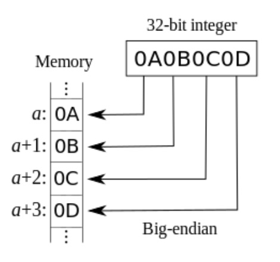
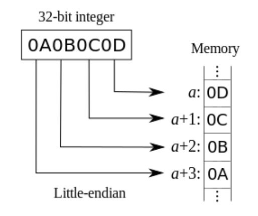

## Day-5

### 问题

> 判断计算机是大端(Big-endian)还是小端(Little-endian)的

### 参考答案

```cpp
//利用联合体所有成员都从低地址开始存放
int main(){
    union test{
        int a;
        char b;
    } c;
    c.a=1;
    //小端时,c.b为1；大端时,c.b为0
    if(c.b==1) printf("little endian");
    else printf("big endian");
    return 0;
}
```

### 知识点

参考:

1. [判断计算机是大端还是小端](https://blog.csdn.net/lwfcgz/article/details/50476051)
2. [联合体（union）的使用方法及其本质](https://blog.csdn.net/huqinweI987/article/details/23597091)

#### `Little-endian` or `Big-endian`

采用`Little-endian`模式的CPU对操作数的存放方式是从低字节到高字节，而`Big-endian`模式对操作数的存放方式从高字节到低字节。(如下图所示)

<table>
    <tr>
        <td ><center>Big-endian</center></td>
        <td ><center>Little-endian</center></td>
    </tr>
</table>

#### 联合体`union`

`联合体(union)`是一种特殊的类。一个`union`可以有多个数据成员，**但是在任意时刻只有一个数据成员可以有值**。当我们给`union`的某个成员赋值之后，该`union`的其他成员就变成未定义的状态了。**分配给一个union对象的存储空间至少要容纳它的最大的数据成员**。

需要注意的是,**`联合体union`的存放顺序是所有成员都从低地址开始存放**。