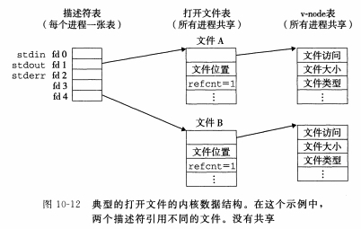
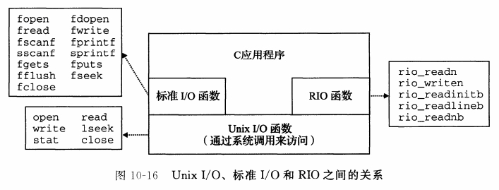

### chapter10:系统级I/O

#### 打开文件的表示

Linux内核用三个相关的数据结构来表示打开的文件：

* 描述符表：**每个进程都有它独立的描述符表**，每个打开的描述符表项指向文件表中的一个表项。
* 文件表:打开文件的集合是一张文件表来表示的，**所有的进程共享这张表**。每个文件表的表项包括当前的文件位置(文件的当前的读写位置),引用计数(即当前指向该表项的描述符表项数)，以及一个指向v-node表中对应表项的指针。
* v-node表:同文件表一样，所有的进程共享这张v-node表。每个表项包含`stat`结构中的大多数信息。



> 每个描述符都有它自己的文件位置，所以对同一个`filename`调用两次`open`函数，这时对应的是两个文件表。

##### 例子

```c
//这里没有写明头文件
int main()
{
    int fd1,fd2;
    char c;

    fd1=Open("foobar.txt",O_RDONLY);
    fd2=Open("foobar.txt",O_RDONLY);
    Read(fd1,&c,1);
    Read(fd2,&c,1);
    printf("c=%c\n",c);     //输出'f'
    exit(0);
}
```

```c
int main()
{
    int fd;
    char c;

    fd=Open("foobar.txt",O_RDONLY);
    if(fork()==0){
        read(fd,&c,1);
        exit(0);
    }
    wait(NULL);
    Read(fd,&c,1);
    printf("c=%c\n",c);     //输出'o'
    exit(0);
}
```

#### RIO

RIO(Robust I/O,健壮的I/O)包，它提供了方便、健壮和高效的I/O。RIO提供了两类不同的函数:
* 无缓冲的输入输出函数：这些函数直接在内存和文件之后传送数据，没有应用级缓冲。
* 带缓冲的输入函数

#### 标准I/O

C语言定义了一组高级输入输出函数，称为标准I/O库，这个库提供了打开和关闭文件的函数(`fopen`和`fclose`)、读和写字节的函数(`fread`和`fwrite`)、读和写字符串的函数(`fgets`和`fputs`)，以及复杂的格式化I/O函数(`scanf`和`printf`).

标准I/O库将一个打开的文件模型化为一个流，对于程序员来说，一个流就是一个指向`FILE`类型的结构的指针。

> 对`FILE`类型的流的理解：类型为`FILE`的流是对底层文件描述符和流缓冲区的高级封装，使得程序员可以忽略这些底层实现，同时可以高效进行读写数据。

#### Unix I/O、标准I/O和RIO之间的关系



Unix中各种I/O的关系如上图所示，在使用I/O时候，有以下这些基本的指导原则:


* G1: 只要有可能就使用标准I/O
* G2: 不要使用`scanf`或`rio_readlined`来读二进制文件
* G3: 对网络套接字的I/O使用RIO函数

在使用输入输出函数时有以下限制:

* 限制一：跟在输出函数之后的输入函数。如果中间没有插入对`fflush`、`fseek`、`fsetpos`或者`rewind`的调用，一个输入函数不能跟随在一个输出函数之后。
* 限制二：跟在输入函数之后的输出函数。如果中间没有输入对`fseek`、`fsetpos`或者`rewind`的调用，一个输出函数不能跟随在一个输入函数之后，除非该输入函数遇到了一个文件描述符。


