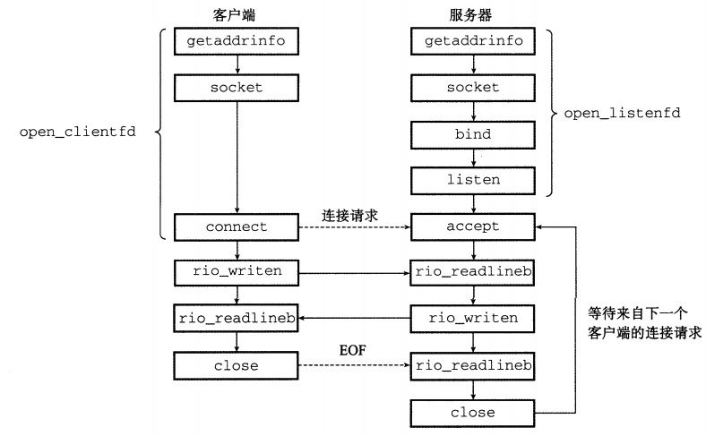
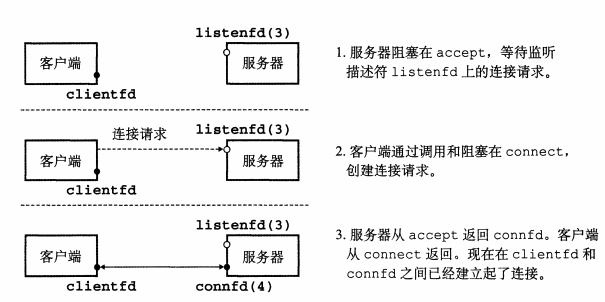
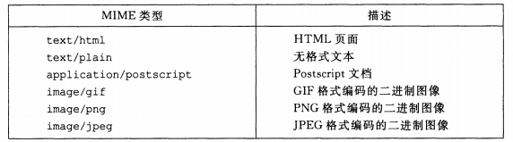
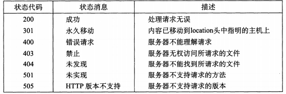

### chapter11 网络编程

#### IP地址

一个IP地址就是一个32位无符号整数。IP地址结构如下:

```c
struct in_addr{
    uint32_t s_addr;        //Address in network byte order
};
```

在IP地址结构中存放的地址总是以**（大端法）网络字节顺序存放**的，即使主机字节顺序是小端法。

#### 因特网连接

一个套接字是连接的一个端点，每个套接字都有相应的套接字地址，是由一个因特网地址和一个16位的整数端口组成的，用“地址：端口”来表示。

当客户端发起一个连接请求时，客户端套接字地址中的端口是由内核自动分配的，称为`临时端口`。然而，服务器套接字地址中的端口通常是某个`知名端口`。在文件`/etc/services`包含一张这台机器提供的知名名字和知名端口之间的映射。

一个连接时由它两端的套接字地址唯一确定的。这对套接字地址叫做`套接字对`，由下列元组来表示:`(cliaddr:cliport,servaddr:servport)`,其中`cliaddr`和`cliport`是客户端的IP地址和端口，`servaddr`和`servport`是服务器的IP地址和端口。

#### 套接字接口

基于套接字接口的Unix网络应用流程可以参考下图:



从Linux内核的角度来看，一个套接字就是通信的一个端点。从Linux程序的角度来看，套接字就是一个有相应描述符的打开文件。

对于服务端， 通过`socket`函数获取`sockfd`,之后`listen`函数将`sockfd`从一个`主动套接字`转化为一个`监听套接字`(监听描述符),该套接字可以接受来自客户端的额连接请求，当有请求到达时，通过`accept`函数将打开一个新的`已连接描述符`.

监听描述符和已连接描述符之间的转换见下图:



##### 为何要有监听描述符和已连接描述符之间的区别

区分监听描述符和已连接描述符，使得我们可以建立并发服务器，它能够同时处理许多客户端连接。例如，每次一个连接请求到达监听描述符时，我们可以派生(fork)一个新的进程，它通过已连接描述符与客户端通信。

#### Web内容

对于Web客户端和服务器而言，内容是与一个`MIME`类型相关的字节序列，如下图所示:



Web服务器以两种不同的方式向客户端提供内容：

* 静态: 取一个磁盘文件，并将它的内容返回给客户端。磁盘文件称为`静态内容`，而返回文件给客户端的过程称为`服务静态内容`.
* 动态: 运行一个可执行文件，并将它的输出返回给客户端。运行时可执行文件产生的输出称为`动态内容`,而运行程序并返回它的输出到客户端的过程称为`服务动态内容`.


#### HTTP事务

Web客户端和服务器之间的交互用的是一个基于文本的应用级协议，叫做`HTTP`(超文本传输协议)。


* HTTP请求

一个HTTP请求的形式是:
```
method URI version
```

HTTP支持许多不同的方法，包括`GET`、`POST`等，HTTP version包括`HTTP/1.0`和`HTTP/1.1`。在实际中，两个版本是相互兼容的，因为`HTTP/1.0`的客户端和服务器会简单地忽略`HTTP/1.1`的报头。

* HTTP响应

一个HTTP响应的形式是:
```
version status-code status-message
```

`version`字段描述的是响应所遵循的HTTP版本，`status-code`状态码是一个3位的正整数，指明对请求的处理。`status-message`状态消息给出与错误代码等价的英文描述。常见的状态码如下图所示:

