### Linux的层次结构

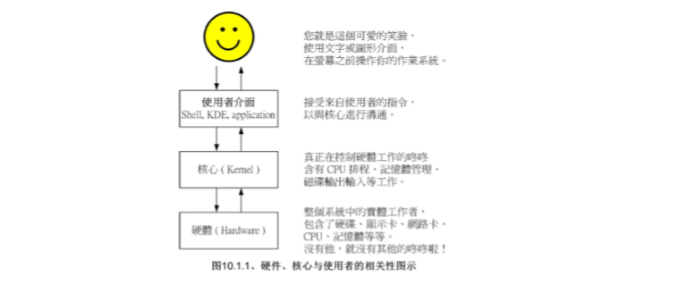

### Bash shell基础

##### 常用快捷键

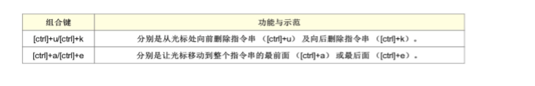

##### 给指令取别名:alias

```shell
#alias:命名别名设置功能  

alias lm='ls -al'  

#取消设置的命令别名:unalias  

unalias lm
```

##### 查看历史命令记录:history

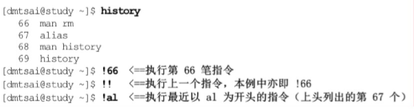

##### 查询指令类型:type

`type [-ta] name`
```shell
选项与参数:
不加任何选项与参数时，type会显示出name是外部指令还是bash内置指令  
-a:会由PATH变量定义的路径中，将所有含有name的指令都列出来，包含alias定义的别名  
-t:当加入-t时，type会以以下字眼显示出他的意义：  
    * file:表示为外部指令
    * alias:表示该命令为别名设置的名称
    * builtin:表示该指令为bash内置的指令功能
```


> 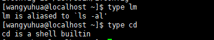  
> 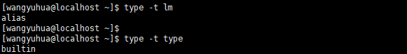  
> 

##### Shell的变量

###### 打印变量:echo

> echo $变量名(不用加括号)  
> 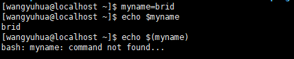

###### 创建变量的规则

1.变量的赋值使用等号"="，且等号两边不能直接接空白符号

```
myname=bird (true)
myname= bird(false,等号右边右空格)
myname=bird tsai(false,等号右侧有空格)

```

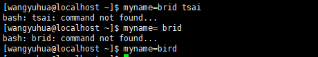  
2.变量名只能是英文字母,数字,下划线，且开头字符不能是数字

```
2myname=bird(false)
my_name=bird(true)

```

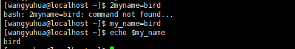  
3.使用''或者""来定义字符串,**双引号内的特殊字符比如$等可以保有原来的特性，单引号内的特殊字符则全部视为一般字符(纯文本0**

```
var='hello wordl!'(true)
var="hello word!"(false,感叹号'!'是bash shell中特殊字符)
var="lang is $LANG"<==等价于var="lang is zh_TW.UTF-8"
var='lang is $LANG' <==等价于var='lang is $LANG'

```

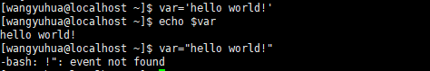  
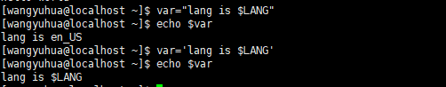  
4.使用""将特殊字符变成一般字符  
  
5.将指令的结果赋值给变量，使用`$(指令)`

```
#将本机版本赋值
version=$(uname -r)
version="the version is $(uname -r)"（注意一定要用双引号,这样才可以保留$的功能）

```

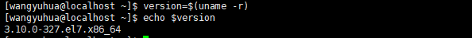  
  
6.改变环境变量，并将该环境变量应用于整个系统,使用export

```
cd ~
vim .bashrc<==.bashrc文件在Linux刚启动时会执行
export PATH="$PATH:/home/bin"<==将PATH修改，并应用于整个系统
source .bashrc

```

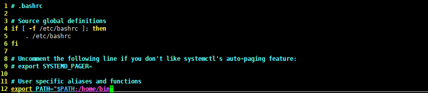  
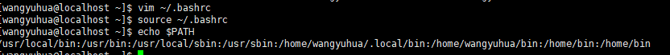  
重启系统后，发现PATH改变  
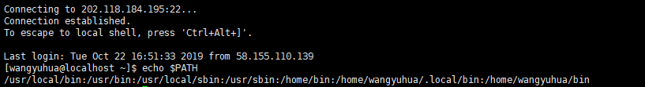  
7.通常大写字符为系统默认变量，自行设置变量可以使用小写字符，方便判断  
8.取消变量的方法为使用unset

```
unset myname<==取消myname这个变量

```


> **Hit:子程序仅会继承父程序的环境变量，子程序不会继承父程序的自订变量**

###### 变量键盘读取

`read [-pt] variable`
```
选项与参数:  
-p: 后面可以接提示字符!  
-t: 后面可以接等待的“秒数”  
```

> 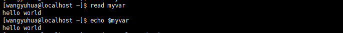  

> 

###### 变量内容的删除、取代与替换（*）

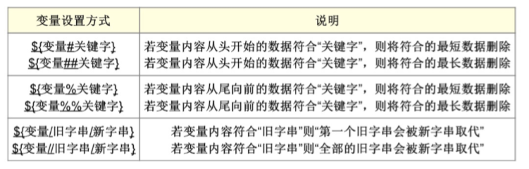

###### 万用字符与特殊符号

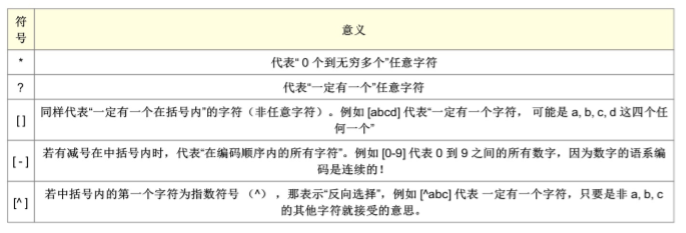  
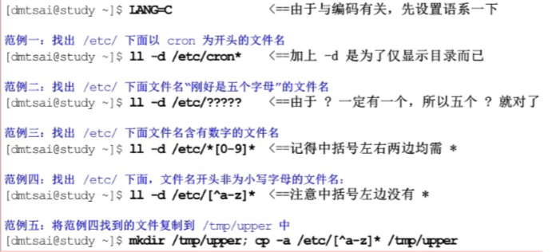

##### 数据流重导向

数据流重导向就是将某个指令执行后应该要出现在屏幕上的数据，给他传输到其他地方，例如文件或者设备(例如打印机之类的)  
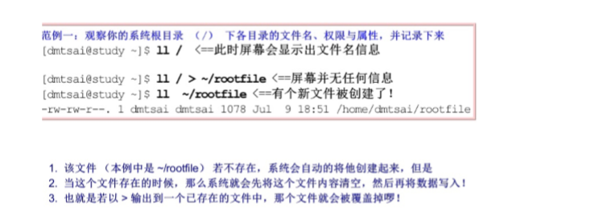  
  
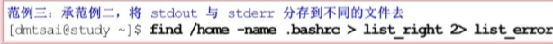

##### 命令的执行顺序

| 指令下达情况 | 说明  |
| --- | --- |
| cmd1;cmd2 | 顺序执行，无论cmd1是否正确执行，都会执行cmd2 |
| cmd1 && cmd2 | 若cmd1执行完毕且正确执行，则开始执行cmd2;若cmd1执行完毕且为错误,则cmd2不执行 |
| cmd1 \| cmd2 | 若cmd1执行完毕且正确执行，则cmd2不执行；若cmd1执行完毕且错误，则开始执行cmd2 |

**识记要点:指令的执行逻辑与程序设计中的执行逻辑类比**

```
#先判断 /tmp/abc目录是否存在,若不存在则创建/tmp/abc这个目录，之后在该目录下创建hehe文件
ls /tmp/abc || mkdir /tmp/abc && touch /tmp/abc/hehe <==等价于(cmd1 || cmd2) && cmd3

#若/tmp/bvirding文件存在就打印"exist",否则就打印"not exist"
ls /tmp/bvirding && echo "exist" || echo "not exist"

```

##### 管道命令

管道命令仅能处理经由前面一个指令传来的正确信息，也就是standard output的信息，对于stdandard error并没有直接处理的能力  
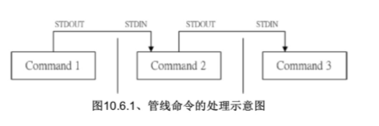

> 简单讲，就是第一个命令正确的处理结果作为第二个命令的输入，以此类推。

###### 截取命令:cut,grep

> cut -d '分割字符' -f 要取的段  
> 选项与参数:  
> -d: 后面接分割字符，与 -f一起使用  
> -f：依据-d的分割字符将一段讯息分区成为数段，用-f取出第几段的意思  
> 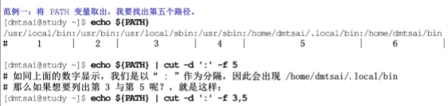  
> 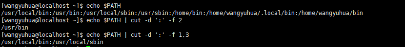  
> grep \[-v\] '搜寻字符' \[file or stdin\]  
> 选项与参数:  
> -v:加上-v表示搜寻不包含搜寻字符的行，不加-v则搜寻包含搜寻字符的行  
> 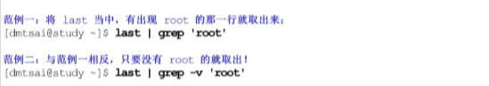

###### 排序命令:sort

> sort \[-futkn\] \[file or stdin\]  
> 选项与参数:  
> -f :忽略大小写的差异，比如A与a视为相同  
> -u:就是uniq,将相同的数据合并，仅显示一行代表  
> -t:与-k配合使用，后面接分割符号，默认按\[tab\]来分割  
> -k:以那个区间来进行排序  
> -n:使用“纯数字”进行排序（默认是以文字体态来进行排序的）  
> 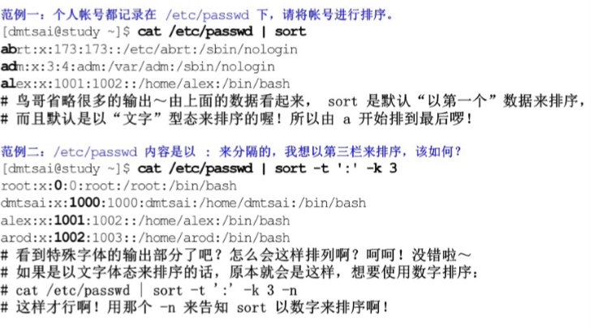

###### 双向重导向:tee

> tee \[-a\] file  
> 选项与参数:  
> -a:以累加的方式，将数据加入file当中  
> 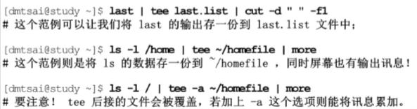

###### 字符转换命令:tr

tr可以用来删除一段讯息当中的文字，或者是进行文字讯息的替换!

> 删除讯息的用法:  
> tr \[-d\] SET1  
> 选项与参数:  
> -d:删除讯息当中的SET1这个字串  
> 替换讯息的用法:  
> tr SET1 SET2  
> 选项与参数：  
> 将所有的SET1替换为SET2  
> 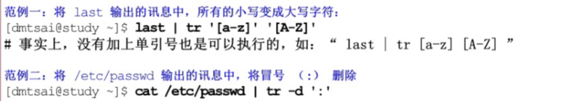

###### 分区命令:split

> split \[-bl\] file \[PREFIX\]  
> 选项与参数:  
> -b:后面可以接欲分区成的文件大小，可加单位，例如b,k,m等  
> -l:以行数来进行分区  
> PREFIX:可以作为分区文件的前导文字  
> 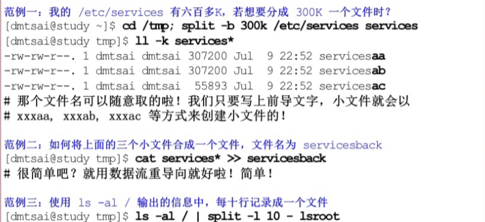

###### 关于减号-的用途

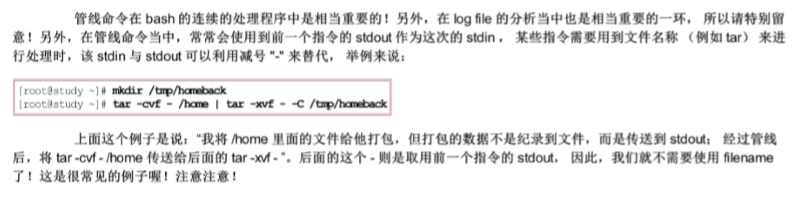