### shell编程

##### shell程序的执行

- 直接指令下达:shell.sh文件必须具备rx权限才可以:
    - 绝对路径:使用/home/dmtsai/shell.sh来下达指令
    - 相对路径：假设工作目录在/home/dmtsail/,则使用./shell.sh来执行
    - 变量PATH功能:将shell.sh放在PATH指定的目录内，例如:~/bin/
- 以bash程序来执行，通过"bash [shell.sh](http://shell.sh)"或者"sh [shell.sh](http://shell.sh)"来执行
- 利用source来执行脚本

##### 指令执行方式的差异

前两种方式执行时，**系统会给与一支新的bash让我们来执行shell脚本，当脚本执行完毕后，子程序bash内的所有数据便会被移除**。
利用source来执行时，是在父程序中执行，在执行完脚本后，各项动作都会在原本的bash内生效

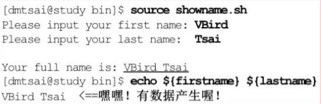


##### 使用变量

```
your_name="linux"
echo $your_name
echo ${your_name}
#变量名外面的花括号是可选的，一般都会加上，便于识别变量的边界

#若不给skill加花括号，则解释器会把skillScript当成一个变量
for skill in Ada Coffe Action Java; do
    echo "I am good at ${skill}Script"
done

```

**注意是花括号!**  
**注意是花括号!**  
**注意是花括号!**

##### shell的默认变量

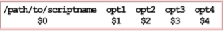

> #:代表后面接的参数格式，以上图为例显示为"4" `$@`:代表"$1""$2""$3""$4"之意 $* 代表"$1 $2 $3 $4"之意
>$@获取的是一个一个的一组数据，$*获取到的是一列数据

```
#$*与$@的区别:
#$*是一个字符串，$@是三个单独的变量
for i in $*
do
    echo $i
done

for i in $@
do
    echo $i
done
=========输出结果=========

-- $* 演示 ---
1 2 3
-- $@ 演示 ---
1
2
3

```

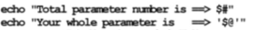  
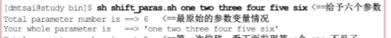

##### 算术表达式:$(())

> 算术表达式用双括号`((算术表达式))`

```
a=5; b=7; c=2$
echo $((a+b*c))《==写成echo $((${a}+${b}*${c}))也可以
19

echo $(((a+b)/c))
6

echo $(((a*b)%c))
1

```

##### shell字符串

```shell
str='this is a string'  
str="this is a string"  
单引号与双引号的区别:  
双引号中可以保留特俗字符的特性，可以有变量，单引号中的都是一般文本字符

#获取字符串长度
string="abcd"
echo ${#string}

#提取子字符串
string="Linux is a great system"
echo ${string:1:4}《==输出inux,从字符串第2个字符开始截取4个字符

```

##### shell数组

bash支持一维数组（不支持多维数组），并且没有限定数组的大小

```
#数组的定义
数组名=（值1 值2 值3 ... 值n）

#例子,三种方式定义数组
array_name=(value0 value1 value2 value3)
array_name=(value0
value1
value2
value3)
array_name[0]=value0
array_name[1]=value1

#读取数组
${数组名[下标]}

#使用@符号可以获取数组中的所有元素
echo ${arrary_name[@]}

#获取数组的长度
length=${#array_name[@]}

#获取数组单个元素的长度
lengthn=${#array_name[n]}

```

#### 条件判断式

##### test判断式

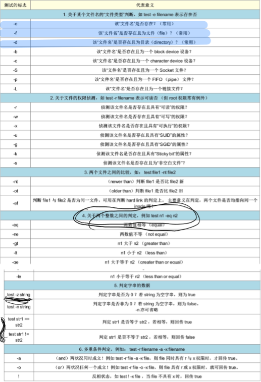

###### 常用test判断式

```
#类型判断
test -e filename <==判断该文件名是否存在
test -f filename <==判断给文件名是否是文件
test -d filename <==判断该文件名是否为目录

#判断字符串数据
test -z string <==判断字符是否为0？若string为空字符串，则为true
test str1 == str2 <==判断str1是否等于str2
test str1 != str2 <==判断str1是否不等于str2

```

##### 判断符号\[\]

>\[ data1 op data2 \]  

* 在中括号\[\]内的每个元件都需要有**空白键**来分割  

* 在中括号内的变量，最好都以**双引号括号**起来  

* 在中括号内的常数，最好都以**单或双引号**括号起来  

> 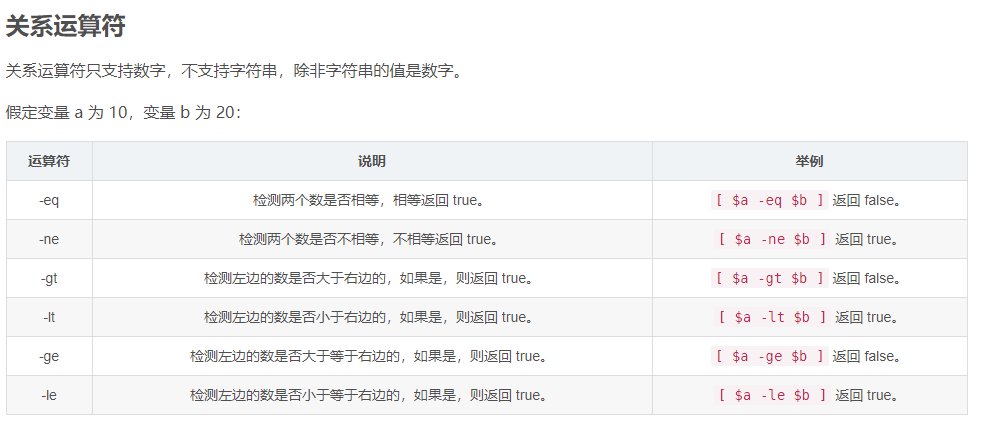  
> 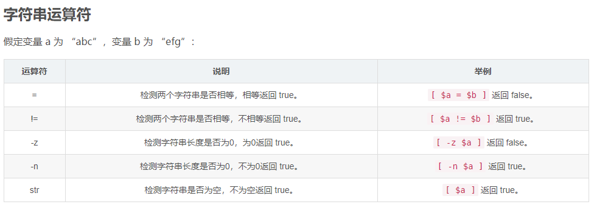

```
[ vrid tsai == "vbird" ](false,这里有vrid,tsai和"vbird"三个数据)
[ "vrid tsai" == "vbird" ](true)
所以说常量最好用双引号或单引号括起来.
```

###### 连接符号 : -a(and)（也可以写成&&） -o(or)(也可以写成||)

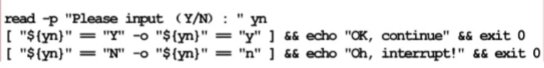

##### 条件判断表达式: if...then..fi

```
#条件判断(if..elif..elif..else)
if [ 条件判断式1 ]
then
    程序段一
elif [ 条件判断式2 ]
then #不要遗漏了这里的then
    程序段二
elif [ 条件判断式3 ]
then
    程序段三
else
    程序段四
fi

```


##### 分支语句:case..esac

```
case ${变量名称} in  <==关键字为case,还有变量前有$
    "第一个变量内容"）<==每个变量内容建议用双引号括起来，关键字则为右小括号
    程序段一
    ; ; <==每个类别结尾使用两个连续的分号来处理
    "第二个变量内容")
    程序段二
    ; ;
    *) <==最后一个变量内容都会用*来代表其他值
   程序段三
    ; ;
esac <==最后的case结尾！“反过来写”思考一下

```

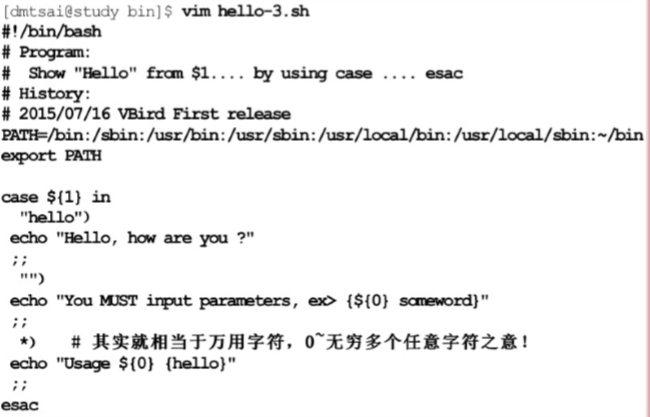

##### while循环，until循环

```
#while循环
while [ 条件表达式 ]
do  <==do是循环的开始！
    程序段
done <==done是循环的结束

#until循环
until [ 条件表达式 ]
do <==do是循环的开始!
    程序段
done <==done是循环的结束

```

> 两者的区别:until循环执行一系列命令直到条件为true时停止。until循环与while循环在处理方式上刚好相反。  
> 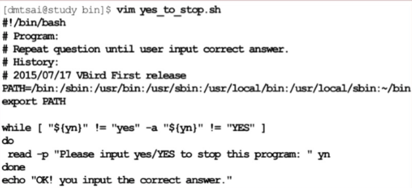  
> 

##### for循环

```
#第一种写法
for var in con1 con2 con3...
do
    程序段
done
#第一次循环时，$var的内容为con1
#第二次循环时，$var的内容为con2
#第三次循环时，$var的内容为con3
#...

#第二种写法，这种写法适合于数值方式的运算当中
for ( ( 初始值；限制值；执行步阶) )
do
    程序段
done
#初始值：某个变量在循环当中的额起始值，直接以类似i=1设置好
#限制值：当变量的值在这个限制值的范围内，就继续进行循环，例如i<=100
#执行步阶:每作一次循环时，变量的变化量。例如i=i+1

```

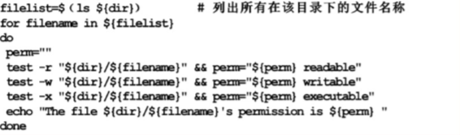  
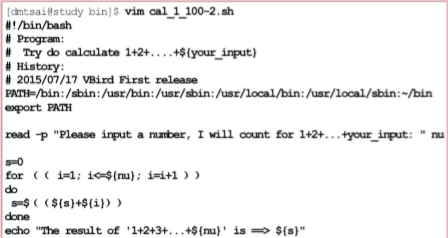

##### break命令和continue命令

break命令运行跳出所有循环；continue表示直接进行下一次循环；两个命令和编程中的用法一样。

#### 函数

```
#函数定义
[function] fname(){
    程序段(外部变量使用$(1),$(2),$(3),.....表示传入的第几个参数)
}
#函数使用
fname [var1] [var2] ....<==var1,var2表示传入的参数

```

> 特别注意：因为shell script的执行方式是由上而下，由左而右，因此在shell脚本当中的function的设置一定要在程序的最前面  

**function函数写在脚本的最前面!!!**

**function函数写在脚本的最前面!!!**

**function函数写在脚本的最前面!!!**

> 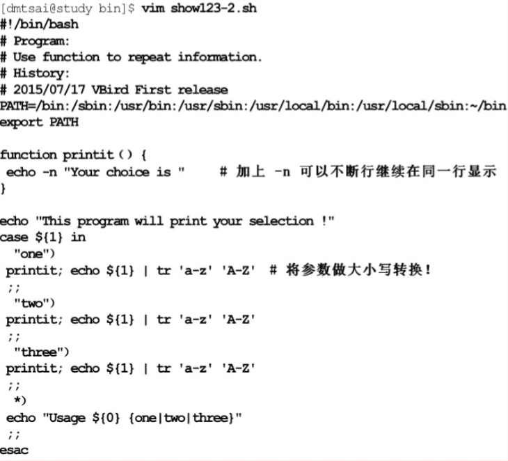  

> 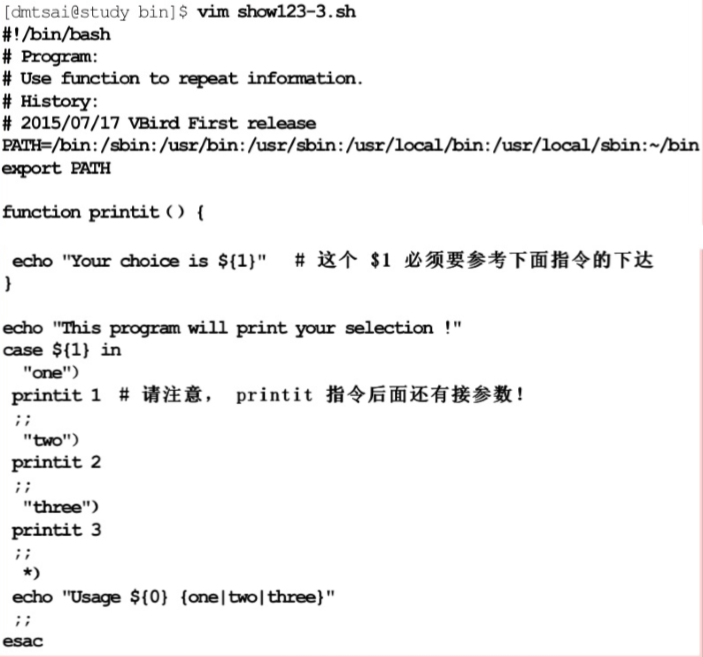

#### shell调试

> sh \[-nvx\] [scripts.sh](http://scripts.sh)  

> 选项与参数:  

> -n:不要执行script,仅查询语法的问题  

> -v:再执行script前，先将scripts的内容输出到屏幕上;  

> -x:将使用到的script内容显示到屏幕上，这是很有用的参数!  

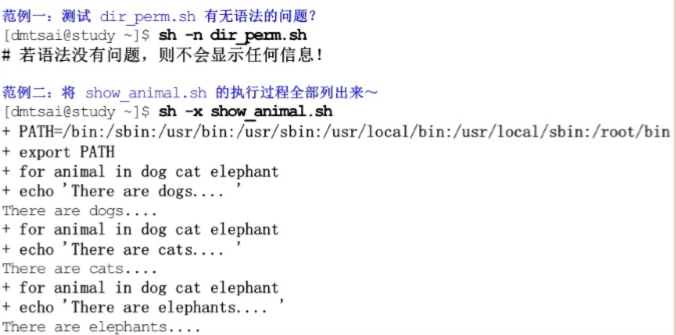


```shell
注意这里测试使用相对路径比较好
sh -n ./test.sh
sh -v ./test.sh
sh -x ./test.sh
```

#### 总结

- shell脚本在系统管理上面是很好的以项工具，但是占用的CPU资源较多，不适合用在处理大量数值运算上
- shell脚本的执行，至少需要r的权限，若需要直接指令下达，则需要拥有r与x的权限
- 良好的shell脚本编写习惯，第一行要宣告shell(#!/bin/bash),第二行以后则宣告程序用途，版本，作者等

#### shell编程习题

1.计算1~100的和

  

2.输入一个数字n并计算1~n的和  

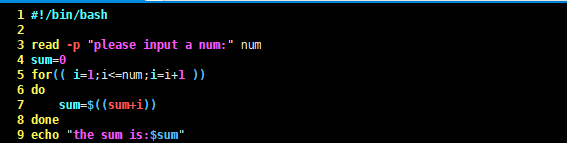

3.当执行一个程序的时候，这个程序会让使用者选择boy或者girl；如果使用者输入B或者b时，就显示：He is a boy；如果使用者输入G或者g时，就显示：He is a girl；如果是除了B/b/G/g以外的其他字符，就显示：I don’t know。

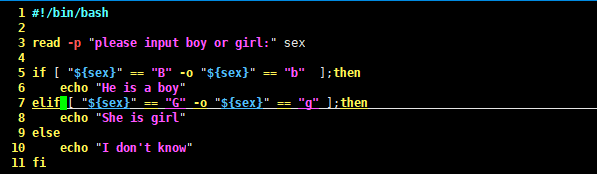  
**注意if与中括号之间有一个空格**  
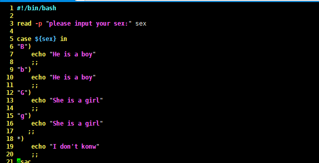  
4.使用while语句打印10条语句  
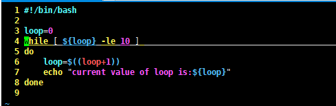