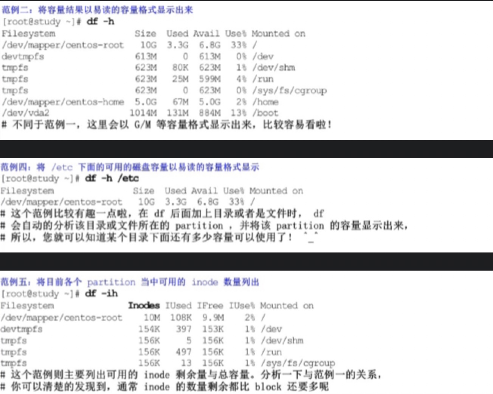
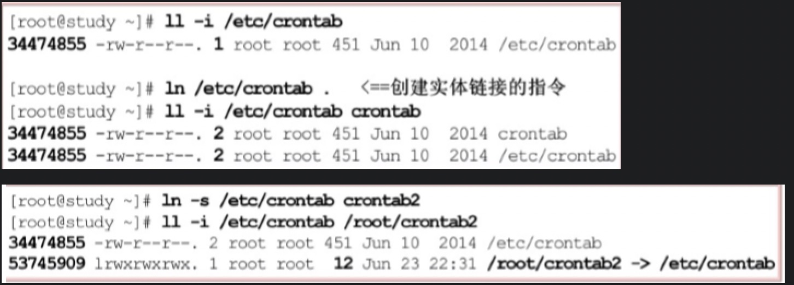

### Linux文件系统

Linux系统是`Ext2`,采用的是`inoce/block`的数据存储方式，这种数据存储的方法我们称为`索引式文件系统`。Window系统采用的是`FAT`。

###### Linux EXT2文件系统特性

EXT2文件系统示意图:

| Boot sector| Block group1  | Block group2 |... |
|  ----  | ----  | ----| ---- |
| 开机扇区 | 区块群组1 | 区块群组2 | ... |

其中开机扇区可以安装开机管理程序.每个区块群组包含六个主要内容:

* data block(数据区块):每个block内最多放置一个文件的数据

* inode table(inode表格):每个inode记录文件的相关属性（文件存取模式、文件的拥有者与群组、文件的容量等信息）；每个文件都仅占用一个inode而已。

* block bitmap(区块对照表):从block bitmap当中可以知道哪些block是空的

* inode bitmap(inode对照表):从inode bitmap则是记录使用与未使用的inode号码

* Filesystem Description(文件系统描述说明):这个区段描述每个block group的开始与结束的block号码，以及说明每个区段分别介于哪一个block号码之间。

* superblock(超级区块):记录整个Filesystem相关信息，包括block与inode的总量，block与inode的大小等.

###### 磁盘容量查询

> df [-hi] 【目录或文件名】(不加则显示的是整个文件系统的容量)

> 选项与参数：

> -h:以人们较易阅读的Gbytes,MBytes,KBytes等格式自行显示

> -i: 不用磁盘容量，而以可用的inode的数量来显示

###### 链接

在Linux中链接文件有两种，一种是类似windows的捷径功能的文件，这种称为**符号链接**；另一种则是通过文件系统的inode链接来产生新文件名，这种也称为**实体链接**。

> ln [-sf] 来源文件 目标文件

> 选项与参数：

> -s: 如果不加任何参数就进行链接，那就是实体链接，至于加-s就是符号链接

> -f:如果目标文件存在时，就主动的将目标文件直接移除后再创建。

###### 符号链接（软链接）与实体链接（硬链接）的区别

在本质上硬链接文件和原文件是完全平等关系；建立软链接就是建立了一个新文件，当访问软链接文件时，系统会发现他就是个链接文件，它读取链接文件找到真正要访问的文件。
****
**硬链接节省空间
软链接灵活**

硬链接的缺点:

1.不可以在不同文件系统的文件间建立链接

2.只有超级用户才可以为用户创建硬链接

软链接的缺点：
当原文件从一个目录下移到其他目录中，再访问软链接文件时，系统就找不到了，而硬链接就没有这个缺陷。（但它克服了硬链接的缺点，它具有更大的灵活性，甚至可以跨越不同机器、不同网络对文件进行链接。）

###### 链接例子

### 

