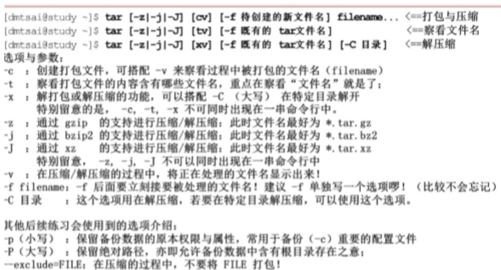

### Linux文件系统

Linux系统是`Ext2`,采用的是`inoce/block`的数据存储方式，这种数据存储的方法我们称为`索引式文件系统`。Window系统采用的是`FAT`。


###### Linux EXT2文件系统特性

EXT2文件系统示意图:

| Boot sector| Block group1  | Block group2 |... |
|  ----  | ----  | ----| ---- |
| 开机扇区 | 区块群组1 | 区块群组2 | ... |

其中开机扇区可以安装开机管理程序.每个区块群组包含六个主要内容:

* data block(数据区块):每个block内最多放置一个文件的数据

* inode table(inode表格):每个inode记录文件的相关属性（文件存取模式、文件的拥有者与群组、文件的容量等信息）；每个文件都仅占用一个inode而已。

* block bitmap(区块对照表):从block bitmap当中可以知道哪些block是空的

* inode bitmap(inode对照表):从inode bitmap则是记录使用与未使用的inode号码

* Filesystem Description(文件系统描述说明):这个区段描述每个block group的开始与结束的block号码，以及说明每个区段分别介于哪一个block号码之间。

* superblock(超级区块):记录整个Filesystem相关信息，包括block与inode的总量，block与inode的大小等.

###### 磁盘容量查询

> df [-hi] 【目录或文件名】(不加则显示的是整个文件系统的容量)

> 选项与参数：

> -h:以人们较易阅读的Gbytes,MBytes,KBytes等格式自行显示

> -i: 不用磁盘容量，而以可用的inode的数量来显示


###### 链接

在Linux中链接文件有两种，一种是类似windows的捷径功能的文件，这种称为**符号链接**；另一种则是通过文件系统的inode链接来产生新文件名，这种也称为**实体链接**。

> ln [-sf] 来源文件 目标文件

> 选项与参数：

> -s: 如果不加任何参数就进行链接，那就是实体链接，至于加-s就是符号链接

> -f:如果目标文件存在时，就主动的将目标文件直接移除后再创建。

###### 符号链接（软链接）与实体链接（硬链接）的区别

在本质上硬链接文件和原文件是完全平等关系；建立软链接就是建立了一个新文件，当访问软链接文件时，系统会发现他就是个链接文件，它读取链接文件找到真正要访问的文件。
****
**硬链接节省空间
软链接灵活**

硬链接的缺点:

1.不可以在不同文件系统的文件间建立链接

2.只有超级用户才可以为用户创建硬链接

软链接的缺点：
当原文件从一个目录下移到其他目录中，再访问软链接文件时，系统就找不到了，而硬链接就没有这个缺陷。（但它克服了硬链接的缺点，它具有更大的灵活性，甚至可以跨越不同机器、不同网络对文件进行链接。）

###### 链接例子


### 压缩打包

##### 打包指令: tar

###### Linux常见的压缩文件格式
|文件后缀| 压缩指令|
| ---- | ---- |
|*.Z |compress 程序压缩的文件;
|*.zip |zip 程序压缩的文件; 
|*.gz |gzip 程序压缩的文件; 
|*.bz2 |bzip2 程序压缩的文件;
|*.xz| xz程序压缩的文件;
|*.tar| tar程序打包的数据,**并没有压缩**
|*.tar.gz| tar程序打包的数据，并且经过gzip的压缩 |
|*.tar.bz2| tar程序打包的数据，并且经过bzip2的压缩|
|*.tar.sz| tar程序打包的文件，并且经过xz的压缩|

```
识记要点:
> 压缩: cv
> 查询: tv
> 解压: xv
> tar.gz:-z
> tar.bz2:-j
```



```shell
打包压缩tar.bz2文件
tar -jcv -f filename.tar.bz2 待压缩的文件<=压缩
tar -jtv -f filename.tar.bz2 <=查看压缩包内部文件名
tar -jxv -f filename.tar.bz2 -C 欲解压到的目录 <=解压缩
打包压缩tar.gz文件
tar -zcv -f filename.tar.gz 待压缩的文件<=压缩
tar -ztv -f filename.tar.gz <=查看
tar -zxv -f filename.tar.gz -C 欲解压到的目录 <=解压
```

##### vi/vim的使用

vi/vim分为三种模式:命令模式，输入模式和底层命令模式

###### vi/vim常用按键

| 按键组合 | 说明 |
| --- | --- |
| h | 光标向左移动一个字符 |
| j | 光标向下移动一个字符 |
| k | 光标向上移动一个字符 |
| l | 光标向右移动一个字符 |
| /word | 向光标之下寻找一个名称为 word 的字符串。例如要在档案内搜寻 vbird 这个字符串，就输入 /vbird 即可！ (常用) |
| ?word | 向光标之上寻找一个字符串名称为 word 的字符串。 |
| :n1,n2s/word1/word2/g | n1 与 n2 为数字。在第 n1 与 n2 行之间寻找 word1 这个字符串，并将该字符串取代为 word2 ！(常用) |
| :1,$s/word1/word2/g | 从第一行到最后一行寻找 word1 字符串，并将该字符串取代为 word2 ！(常用) |
| dd | 删除游标所在的那一整行(常用)|
| x | 删除光标所在位置处的字符(常用) |
| yy | 复制游标所在的那一行(常用) |
| ndd | n 为数字。删除光标所在的向下 n 行，例如 20dd 则是删除 20 行 (常用) |
| nyy |n 为数字。复制光标所在的向下 n 行，例如 20yy 则是复制 20 行(常用) |
| u | 复原前一个动作。（即撤销）(常用) |
| i | 进入输入模式,从当前光标所在出输入 |
| a | 进入输入模式，从光标所在的下一个字符处输入 |
| o | 进入输入模式，从光标所在的下一行输入新的一行 |
| :w | 保存 |
| :q | 离开vi |
| :set nu | 显示行号 |
| :set nonu | 取消行号 |


